# Project Audit Report

> **Project**: Claude Office Visualizer (claude-office)
> **Date**: 2026-07-06
> **Stack**: Python 3 / FastAPI + SQLite (backend), Next.js / React 19 / TypeScript / PixiJS / Zustand / XState (frontend), Python CLI (hooks), Bun / TypeScript (opencode-plugin)
> **Audited by**: Claude Code Audit System (4 parallel Fable expert agents)

---

## Executive Summary

The project is in **good overall health** with genuinely strong foundations — an event-sourced backend with deterministic replay, careful concurrency discipline, an enforced backend→frontend type-generation pipeline, and a security posture well above the norm for a localhost dev tool. The most critical finding is systemic rather than a single defect: **no CI workflow runs tests, lint, or typecheck for any component** (ARC-001), and the local `make checkall` neither runs tests (despite three documents claiming it does — DOC-001) nor covers `hooks/` and `opencode-plugin/` at all; this has already allowed a broken scenario module (ImportError) and a drifted OpenCode event contract to ship undetected. Remediating the two critical issues plus the 18 high-priority items is roughly 2–3 focused sprints, with the largest single effort being the frontend agent-state ownership refactor (ARC-004/017) and its prerequisite characterization tests. A standout strength: the CHANGELOG and the backend's concurrency/locking discipline are exemplary — root-cause-documented entries and explicitly reasoned lock scopes are rare at any project scale.

### Issue Count by Severity

| Severity | Architecture | Security | Code Quality | Documentation | Total |
|----------|:-----------:|:--------:|:------------:|:-------------:|:-----:|
| 🔴 Critical | 1 | 0 | 0 | 1 | **2** |
| 🟠 High     | 9 | 0 | 3 | 6 | **18** |
| 🟡 Medium   | 12 | 3 | 7 | 6 | **28** |
| 🔵 Low      | 9 | 3 | 6 | 3 | **21** |
| **Total**   | **31** | **6** | **16** | **16** | **69** |

---

## 🔴 Critical Issues (Resolve Immediately)

### [ARC-001] No CI enforcement of correctness for any component
- **Area**: Architecture
- **Location**: `Makefile:44-60`, `.github/workflows/type-drift.yml`, `.github/workflows/frontend-audit.yml`, `hooks/` (no Makefile), `opencode-plugin/` (no Makefile)
- **Description**: Only two GitHub Actions workflows exist — type-drift check and an npm vulnerability scan. Neither runs `pytest`, `ruff`, `pyright`, `vitest`, or `eslint`. The root `Makefile`'s `lint`/`fmt`/`typecheck`/`test`/`checkall` targets only invoke `make -C backend` and `make -C frontend`; `hooks/` and `opencode-plugin/` have no Makefile and are never covered, despite having real test suites/typecheck scripts. CLAUDE.md's claim that `make checkall` covers "all components" is false for two of four.
- **Impact**: Nothing prevents a broken PR from merging. This has already happened twice: `scripts/scenarios/teams.py` has a confirmed ImportError (ARC-009), and the OpenCode plugin's event union is missing 3 of 23 backend event types (ARC-010).
- **Remedy**: Add `hooks` and `opencode-plugin` sub-targets (with Makefiles) to root `lint`/`typecheck`/`test`; add a `scripts/` lint pass; add a CI workflow running `make checkall` (including tests) on every PR.

### [DOC-001] `make checkall` is documented as running tests, but it does not
- **Area**: Documentation
- **Location**: `README.md` (Available Commands), `CONTRIBUTING.md` (Full Suite + PR Checklist), `CLAUDE.md` (Commands), vs. `Makefile`
- **Description**: The root Makefile defines `checkall: fmt lint typecheck` — no `test` dependency (verified 2026-07-07). The component Makefiles do run tests in their own `checkall` targets (`backend/Makefile:21` chains `test`; `frontend/Makefile:36-38` runs `test` in the recipe), but the root `checkall` invokes the components' individual `fmt`/`lint`/`typecheck` targets — never their `checkall` or `test` — so from the repo root no tests ever run. Yet README, CONTRIBUTING, and CLAUDE.md all state that root `checkall` runs tests, and the PR checklist gates on it.
- **Impact**: Every contributor following CONTRIBUTING from the repo root believes the full test suite passed before opening a PR when it never ran. This is the project's primary verification gate.
- **Remedy**: Decide direction first (recommended: add `test` to the root `checkall` chain, matching documented behavior, the component Makefiles' own convention, and the project owner's global standard), then align all three documents. Must be resolved together with ARC-001.

---

## 🟠 High Priority Issues

### Architecture

### [ARC-002] Dual event dispatch through two parallel systems (backend)
- **Location**: `backend/app/core/event_processor.py:332-555`, `backend/app/core/state_machine.py:470-486`
- **Description**: `_process_event_internal` first calls `sm.transition(event)` (dispatched via `_DISPATCH_TABLE`), then re-dispatches the same event through a ~225-line chain of sequential `if event.event_type ==` blocks into `core/handlers` functions.
- **Impact**: Adding an event type requires touching six places; easy to update one path and silently miss the other (Open/Closed violation).
- **Remedy**: Collapse to a single `EventType -> (sync mutation, async enrichment)` dispatch table.

### [ARC-003] Blocking synchronous file I/O on the async event loop (backend)
- **Location**: `backend/app/core/state_machine.py:362,802`, `backend/app/core/token_tracker.py:161-166,257-262`, `backend/app/core/handlers/conversation_handler.py:139`, `backend/app/core/handlers/agent_handler.py:319,357`, `backend/app/core/jsonl_parser.py:56`, `backend/app/core/task_file_poller.py:204-215,247`, `backend/app/api/routes/sessions.py:37`
- **Description**: Multiple async paths perform synchronous `open()`/`read()`/`glob`/`stat` — including a worst-case 50 MB transcript read inside `sm.transition()`. `kill_simulation()` blocks on `Popen.wait(timeout=5)` inside async `clear_database`.
- **Impact**: A single large-transcript event stalls the entire event loop — every WebSocket connection and poller freezes, exactly under busy-session conditions.
- **Remedy**: Wrap in `asyncio.to_thread`, matching the pattern already used correctly in `transcript_poller.py:213`, `beads_poller.py:241`, `git_service.py:204`.

### [ARC-004] Distributed agent-state ownership with no single source of truth (frontend)
- **Location**: `frontend/src/stores/gameStore.ts:141`, `frontend/src/machines/agentMachine.ts:55-65`, `frontend/src/machines/queueManager.ts:25-38`, `frontend/src/systems/queuePositions.ts:47-50`, `frontend/src/systems/agentCollision.ts:224`, `frontend/src/systems/navigationGrid.ts:414`, `frontend/src/machines/agentMachineService.ts:426,474,516,535,570,609`, `frontend/src/systems/animationSystem.ts:375-409`, `frontend/src/systems/hmrCleanup.ts`
- **Description**: Agent lifecycle state is co-owned by four independent mechanisms — Zustand `agents` Map, XState machine context, `QueueManager`'s private reservation maps, and module-level mutable singletons — synchronized via callbacks plus six `setTimeout(0)` re-entrancy escapes. A watchdog force-releases a "stuck boss lock" after 3 seconds; `hmrCleanup.ts` exists solely to hand-reset four singletons across HMR.
- **Impact**: Desync bugs (the project's history includes a queue-slot-collision bug), unreproducible stuck states, high cost of change to queue choreography.
- **Remedy**: Designate one writer for queue membership/occupancy; fold `QueueManager`'s maps into it; replace `setTimeout(0)` with an explicit per-tick event queue; delete the watchdog once ownership is single-sourced. Fix together with ARC-017.

### [ARC-005] `gameStore.ts` is a god store (~9 concerns)
- **Location**: `frontend/src/stores/gameStore.ts` (1,196 lines; interface at 139-268, debug/persistence 298-327/958-1012, bubbles 712-891, three reset variants 1018-1064)
- **Description**: One store owns agent animation state, arrival/departure queues, boss state, a full speech-bubble subsystem, office/session state, event log, conversation history, whiteboard, replay, connection state, and debug settings — 40+ actions and three subtly different reset functions.
- **Impact**: Every consumer imports the whole interface; unrelated features churn the same file; the bubble subsystem can't be tested in isolation.
- **Remedy**: Split into slices along the boundaries already marked by section comments — extract bubbles, replay, and debug/persistence first.

### [ARC-006] Per-frame Zustand writes with O(n) Map copies drive React re-renders at 60fps
- **Location**: `frontend/src/systems/animationSystem.ts:163-207`, `frontend/src/stores/gameStore.ts:469-477`, `frontend/src/components/game/OfficeGame.tsx:204,489,529,541,635,649,717`, `frontend/src/app/page.tsx:146`
- **Description**: The rAF tick calls a store action per moving agent per frame, each cloning the entire agents Map. `OfficeGame.tsx` subscribes to the whole Map with six `Array.from(...).filter(...)` passes per render; `page.tsx` subscribes the root page to the same Map.
- **Impact**: CPU cost scales with agent count × frame rate; GC pressure; header/sidebars/modals re-render at animation rate during any movement.
- **Remedy**: Batch all position updates into one `set()` per tick; keep interpolated per-frame positions out of Zustand (write to Pixi objects imperatively); narrow `page.tsx`'s selector.

### [ARC-007] Frontend test coverage gap — the most complex logic has zero tests
- **Location**: `frontend/tests/{smoke,cron,i18n,overviewStore,commandCenterPath}.test.ts`, `frontend/src/systems/exitAnimation.test.ts`, `frontend/vitest.config.ts`
- **Description**: Six test files for ~28,400 LOC. `gameStore`, `agentMachineService`, the XState machines, `animationSystem`, and `useWebSocketEvents` have no tests — including `queueManager.ts`, whose own header says it was extracted "so that queue logic can be … tested independently."
- **Impact**: The riskiest, most bug-prone code (state synchronization, WebSocket reconciliation) has no regression safety net.
- **Remedy**: Test `createAgentMachine` via its injected `AgentMachineActions` interface; add store tests for bubble queueing and the three reset variants; add a Playwright smoke test loading a simulated session. Overlaps QA-001.

### [ARC-008] Hooks installer can silently wipe the user's `settings.json`
- **Location**: `hooks/manage_hooks.py:32-48,134-137`
- **Description**: `load_settings()` returns `{}` when `settings.json` fails to parse (only a warning); `install_hooks()` then writes that near-empty dict back over the original. `save_settings()` writes in place with no temp-file+rename and no backup.
- **Impact**: A momentarily malformed `settings.json` causes `hooks/install.sh` to destroy all unrelated user configuration — permissions, env, model config, statusline.
- **Remedy**: Abort with a clear error on `JSONDecodeError`; write via temp file + `os.replace()`; keep a `.bak` before first mutation.

### [ARC-009] `scripts/scenarios/teams.py` is broken (confirmed ImportError); `teams` and `quick` scenarios orphaned
- **Location**: `scripts/scenarios/teams.py:15,28`, `scripts/scenarios/_base.py`, `scripts/simulate_events.py:31-40`, `scripts/scenarios/__init__.py:14-18`
- **Description**: `teams.py` imports `TeamSimulationContext` from `_base.py`, which defines no such class (verified ImportError). Neither `teams` nor `quick` is registered in `SCENARIOS` or `__init__.py`, so neither is reachable from the CLI even if fixed.
- **Impact**: Zero coverage from the scenario meant to exercise the room-orchestrator merge path; a direct symptom of ARC-001.
- **Remedy**: Restore/reimplement `TeamSimulationContext` (or delete `teams.py`); register `quick` and `teams`; build `SCENARIOS` from `scenarios/__init__.py` instead of duplicating.

### [ARC-010] Event contract hand-duplicated across 4+ places; OpenCode plugin has already drifted
- **Location**: `backend/app/models/events.py:17-42` (canonical), `opencode-plugin/src/index.ts:45-93`, `hooks/src/claude_office_hooks/event_mapper.py:101,116,182,214,275`, `scripts/scenarios/_base.py:180`, `frontend/src/types/generated.ts:116-139`, `hooks/tests/test_event_mapper.py`
- **Description**: The backend's 23-value `EventType` enum is re-expressed by hand in the plugin's TS union and as bare string literals in the hook mapper and simulation scripts. The plugin is verified missing `task_created`, `task_completed`, `teammate_idle`. No contract test validates producer output against the backend `Event` model.
- **Impact**: Schema changes reach the two event producers only by human memory — already causing silent event loss for OpenCode users.
- **Remedy**: Add a hooks contract test validating `map_event()` output against the backend Pydantic model; generate the plugin's types from the same JSON schema `gen_types.py` produces, or add a CI diff check. Sequence together with ARC-001.

### Code Quality

### [QA-001] Frontend test coverage is near-zero relative to its complexity
- **Location**: `frontend/` (tests: `frontend/tests/`, `frontend/src/systems/exitAnimation.test.ts`)
- **Description**: 28,429 LOC of source, 6 test files totaling 466 lines. Zero tests for `gameStore.ts` (1,196 lines), `agentMachineService.ts` (620 lines with documented deadlock-avoidance logic), `useWebSocketEvents.ts` (579 lines of reconnection/dedup/spawn logic), and the pathfinding stack. The tests that do exist are high quality — this is a coverage problem, not a skill problem.
- **Impact**: The queue-slot-collision and agent-stuck-at-A0 bug classes this project has already hit live exactly in the untested layer; regressions are only caught visually.
- **Remedy**: Prioritize pure-logic units needing no canvas: `gameStore` queue actions, the `handleStateUpdate` 4-branch spawn decision table, and A* pathfinding. Vitest is already configured. Write characterization tests **before** the ARC-004/005 and QA-003 refactors.

### [QA-002] opencode-plugin has zero tests and its "lint" script is just the type checker
- **Location**: `opencode-plugin/src/index.ts`, `opencode-plugin/package.json`
- **Description**: A single 715-line file implements order-dependent session-linking heuristics — 7 module-level Map/Set structures with FIFO callID matching the code itself calls approximate. No tests; `"lint": "tsc --noEmit"` is identical to `"typecheck"` — no ESLint runs at all.
- **Impact**: The duplicate-suppression state machine silently breaks when OpenCode changes event ordering, and nothing will catch it.
- **Remedy**: Extract session-tracking state into a testable class (constructor-injected `sendEvent`), add bun tests for the documented event-ordering scenarios, add a real ESLint config.

### [QA-003] `gameStore.ts` heavy copy-paste duplication
- **Location**: `frontend/src/stores/gameStore.ts` (lines 459-542, 548-630)
- **Description**: The pattern `const newAgents = new Map(state.agents); … set` appears 20 times; seven `updateAgentX` actions are byte-for-byte identical except the patched field; `enqueueArrival`/`enqueueDeparture` and `dequeueArrival`/`dequeueDeparture` are duplicate pairs.
- **Impact**: Every queue-behavior fix must be applied twice (project memory notes a prior queue-slot collision bug).
- **Remedy**: Introduce one `patchAgent(agentId, partial)` helper (removes ~150 lines); parameterize queue actions by `queueType`; split the store into slices (also ARC-005). Apply QA-006 first as a small verified fix.

### Documentation

### [DOC-002] Static-serving docs omit the required `SERVE_STATIC=1` gate
- **Location**: `backend/README.md` ("With Static Frontend"), `docs/guides/deployment.md`
- **Description**: Since v0.15.0 static file serving requires `SERVE_STATIC=1`, but the backend README claims the server "automatically serves" a built frontend, and the deployment guide's `docker run` example omits the variable (only `docker-compose.yml` sets it). `SERVE_STATIC` appears in no env-var table anywhere.
- **Impact**: Standalone deployments (uvicorn or raw `docker run`) get a blank page with no error and no documented explanation.
- **Remedy**: Add `SERVE_STATIC` to env tables; add `-e SERVE_STATIC=1` to the `docker run` example; correct the "With Static Frontend" instructions.

### [DOC-003] API authentication model (`X-API-Key`) is completely undocumented
- **Location**: `backend/README.md`, `docs/architecture/ARCHITECTURE.md`, `docs/guides/deployment.md`, `hooks/README.md`
- **Description**: Since v0.17–0.19 the backend has a real auth layer (optional `CLAUDE_OFFICE_API_KEY`, per-launch auto-generated token protecting state-changing endpoints, keyless-WebSocket restrictions). None of this exists outside CHANGELOG.md.
- **Impact**: Users scripting against the API get unexplained 401s; secured deployments can't be configured from the docs.
- **Remedy**: Add an "Authentication" section to the backend README (key sources, header, gated endpoints, `/api/v1/status` discovery); add `CLAUDE_OFFICE_API_KEY` to config tables; document in hooks README. Do before DOC-006.

### [DOC-004] Command Center (v0.20 headline feature) has no architecture or component documentation
- **Location**: `docs/architecture/ARCHITECTURE.md`, `backend/README.md`, `frontend/README.md`
- **Description**: The subsystem spans `/ws/overview`, `OverviewEntry`/`OverviewState`, `build_overview()`, ten components under `frontend/src/components/command/`, `overviewStore.ts`, `useOverviewWebSocket.ts`, and two systems modules — documented only in CHANGELOG and a README blurb.
- **Impact**: No design reference for the second-largest frontend subsystem; backend WebSocket table incomplete.
- **Remedy**: Add a "Command Center" section to ARCHITECTURE.md mirroring the Multi-Floor section; add `/ws/overview` to the backend README; update component tables.

### [DOC-005] ai-summary.md documents an API method removed in v0.17.0
- **Location**: `docs/reference/ai-summary.md` (section 1)
- **Description**: `summarize_tool_call()` and `_get_tool_fallback` were deleted in v0.17.0 but remain documented as the first API method.
- **Impact**: Readers are handed a nonexistent API.
- **Remedy**: Delete section 1 and renumber, or replace with a "Removed in 0.17.0" note.

### [DOC-006] Environment-variable references incomplete across all four components
- **Location**: `docs/architecture/ARCHITECTURE.md`, `backend/README.md`, `frontend/README.md`, `hooks/README.md`
- **Description**: ARCHITECTURE.md's table omits `CLAUDE_OFFICE_API_KEY`, `SERVE_STATIC`, `EVENT_RATE_LIMIT`, `ZOMBIE_SUBAGENT_TIMEOUT_SECONDS`, `BACKEND_CORS_ORIGINS`; backend README omits `BEADS_POLL_INTERVAL`; frontend README documents no env vars though the code reads `NEXT_PUBLIC_API_URL`, `NEXT_PUBLIC_WS_URL`, `NEXT_PUBLIC_I18N_DEBUG`; hooks README omits `CLAUDE_OFFICE_API_URL` (with localhost-only validation) and `CLAUDE_OFFICE_API_KEY`.
- **Impact**: Operators cannot discover tuning/security knobs without reading source.
- **Remedy**: Complete all four tables; treat ARCHITECTURE.md as canonical; component READMEs cover only their own additions. Do after DOC-003.

### [DOC-007] `backend/app/config.py` VERSION stale at 0.14.0 and missing from the version-sync procedure
- **Location**: `backend/app/config.py` (`VERSION: str = "0.14.0"`), `CLAUDE.md` (Version Management table)
- **Description**: All seven documented version locations are at 0.22.0, but `config.py`'s `VERSION` (surfaced via OpenAPI docs) says 0.14.0. This exact field was fixed once before (v0.15.0) and drifted again because it isn't in the sync table.
- **Impact**: `/docs` and `/redoc` display a version eight minors behind; the procedure is structurally guaranteed to regress.
- **Remedy**: Bump to current version and add `backend/app/config.py` to CLAUDE.md's table — or better, derive `VERSION` from `importlib.metadata`.

---

## 🟡 Medium Priority Issues

### Architecture

- **[ARC-011] Layering inversion — `core/` and `services/` import the API layer's WebSocket singleton.** `event_processor.py:21`, `broadcast_service.py:14`, `git_service.py:11` all do `from app.api.websocket import manager`. Domain layer can't be tested without the transport stack; directly causes ARC-012. Remedy: move `ConnectionManager` to `core/` or inject a broadcaster interface. **Fix before ARC-012.**
- **[ARC-012] DI seams don't work — overrides rebind a module attribute, not the captured reference.** `override_manager`/`override_engine`/`get_event_processor` exist "for testability," but consumers bind the singleton at import time; `routes/sessions.py:15` bypasses the `Depends()` seam; `db/database.py:103` has a stale `engine` alias. Tests believing they injected a mock exercise the real singleton. Remedy: call `get_manager()`/`get_event_processor()` at use time or take constructor/route dependencies; delete the stale alias.
- **[ARC-013] Three pollers are structural copy-paste with no shared abstraction.** `transcript_poller.py`, `task_file_poller.py`, `beads_poller.py` each reimplement the identical skeleton and drift inconsistently (`stop_all` doesn't await cancelled tasks in any; `beads_poller` reads raw `os.environ`). Remedy: generic `BasePoller[TState]` with `_check(state)` abstract, shared singleton-factory helper.
- **[ARC-014] `EventData` is a 40-field optional-everything god model.** `backend/app/models/events.py:45-91`. Forces defensive `if event.data and event.data.X` guards throughout; adding a field for one event type widens the contract for all 23. Remedy: discriminated union (`Field(discriminator="event_type")`) or per-event payload models; incremental adoption possible (wire format unaffected). **Sequence before handler-level cleanup.**
- **[ARC-015] Unbounded growth and O(N·state) hot spots.** In-memory `sessions` registry only shrinks on explicit user action; `EventRecord` rows persist indefinitely; every event triggers full `GameState` serialization (up to 500+500 entries) to every client; replay materializes a full per-event state dump in one response. Remedy: LRU/idle eviction, retention sweep, delta or throttled broadcasts, paginated/streamed replay.
- **[ARC-016] Global rate limiter throttles the wrong dimension.** `events.py:20-48`: one module-level deque limits ALL ingestion to 300 req/60s regardless of source; `EVENT_RATE_LIMIT` read via raw `os.environ`. Concurrent busy sessions trip 429s and silently lose events (hooks don't retry). Remedy: raise default, key per `session_id`, move knob into `Settings`.
- **[ARC-017] Import cycles between `machines/` and `systems/`.** Confirmed: `agentMachineService.ts` ↔ `animationSystem.ts`, and via `queueManager.ts`. The animation tick both notifies machines and is commanded by them. Same underlying flaw as ARC-004 — **fix together**. Remedy: listener/port interface on `AnimationSystem`, wired in one composition root; move boss-availability policy out of the render tick.
- **[ARC-018] `useWebSocketEvents` mixes transport and domain logic.** 579-line hook couples connect/reconnect, agent diffing/spawn policy, typing timers, toast filtering, compaction triggering to three stores + service + queue positions. Remedy: extract a plain-TS `WebSocketController` and a `reconcileState()` module; keep the hook as a thin lifecycle binding. (Reconnect mechanics themselves are solid.)
- **[ARC-019] `gen_types.py` uses a manually curated model registry — silent omission risk.** `scripts/gen_types.py:36-60`. A forgotten model is never exported and type-drift CI can't catch it. Remedy: discover models by introspection with an exclusion list, or add a completeness test.
- **[ARC-020] Remote-backend support inconsistent between hooks and OpenCode plugin.** Hooks silently clamp any non-localhost `CLAUDE_OFFICE_API_URL` back to default (contradicting `main.py`'s own docstring); the plugin honors any URL and its installer advertises the override. Remedy: pick one policy, log when clamping, correct the docstring.
- **[ARC-021] Version synchronization fully manual across 7 locations, no bump script.** (= QA-010.) Remedy: `make bump VERSION=x.y.z` rewriting all locations, or a CI check comparing them; derive `hooks` `__version__` via `importlib.metadata`.
- **[ARC-022] Unused/unverified `httpx2` dependency in backend dev group.** `backend/pyproject.toml:83`. Zero imports anywhere; the name closely resembles `httpx` — unaudited supply-chain surface. Remedy: confirm intent or remove and re-lock.

### Security

- **[SEC-001] Effective API key disclosed to any unauthenticated localhost client.** CWE-522. `backend/app/main.py:240-254` (`get_status`) returns `settings.effective_api_key` in cleartext to any process reaching `127.0.0.1:8000` — collapsing the sole protection on destructive endpoints on any shared/multi-user host. Remedy: don't return the raw key over HTTP; deliver the frontend key via env/config file at launch, or gate `/status` behind the key, or use an origin-checked `HttpOnly` cookie. **Restructures the key-delivery flow — do before any QA/refactor work on `get_status`, `ApiKeyMiddleware`, or the frontend key fetch.**
- **[SEC-002] Clipboard poisoning and terminal activation via unauthenticated `focus_session`.** `backend/app/api/routes/sessions.py:317-399`: `POST /sessions/{id}/focus` is not in `_is_state_changing`, so no key required; it activates Terminal via `osascript` and writes attacker-controlled text to the OS clipboard (paste-jacking chain; CSRF-able via non-preflighted `text/plain` POST). Remedy: add focus/clipboard to `_is_state_changing`; consider dropping the clipboard write. **Land before QA edits to `focus_session`/`test_security_hardening.py`.**
- **[SEC-003] Git commands executed in an attacker-influenceable working directory.** CWE-426. `git_service.py:36-49` runs `git` with `cwd` from DB `project_root`, populated from the open `POST /events` endpoint and never validated. A hostile repo's `.git/config` (`core.fsmonitor`, `core.hooksPath`, `core.pager`) is a code-execution vector. Remedy: validate `project_root` (exists, is dir, matches known session cwd); run with `git -c core.fsmonitor=false -c core.hooksPath=/dev/null` or `GIT_CONFIG_GLOBAL=/dev/null`. **Land before GitService refactors (ARC-011/012).**

### Code Quality

- **[QA-004] 229-line event-processing method with sequential if-dispatch.** `event_processor.py:332-555`. Same code as ARC-002 — consolidate via dispatch map, preserving documented broadcast ordering. **Blocked by ARC-002.**
- **[QA-005] `useWebSocketEvents` handlers overly long and deeply nested.** `useWebSocketEvents.ts:73-277,280-442`: inlined typing-duration timer state machine (5 levels deep), toast filtering, 4-way spawn decision. Remedy: extract pure `resolveSpawn()`, `TypingTracker`, `shouldShowToast()` — all unit-testable. Overlaps ARC-018.
- **[QA-006] Dequeue actions issue two separate `set()` calls, creating transient inconsistent state.** `gameStore.ts:592-630`: between the two sets, subscribers observe a shifted queue with stale `queueIndex` values — consistent with past queue-slot glitches. Remedy: single combined `set()`. **Apply before QA-003's refactor.**
- **[QA-007] ~120 lines of backward-compat property boilerplate in StateMachine.** `state_machine.py:561-687`: 14 alias property pairs delegating to `WhiteboardTracker` (= ARC-025, which also counts TokenTracker forwards). Remedy: migrate call sites, delete the alias block. **Coordinate with ARC-014/WhiteboardTracker moves.**
- **[QA-008] Silently swallowed exception in simulation-process cleanup.** `sessions.py:40-41`: `except Exception: pass` — the only unlogged broad except in the backend; function still returns `True` ("killed"). Remedy: log with `exc_info=True`, return `False` on failure.
- **[QA-009] `setTimeout(…, 0)` used as ordering mechanism in agent state machine service.** `agentMachineService.ts:426,474,516,535,570,609`: six zero-delay timeouts sequence XState notifications to avoid re-entrant sends. Fragile under React batching changes; untestable. Remedy: XState v5 deferred/raised events or an explicit flushable microtask queue. **Write QA-001 characterization tests first; part of the ARC-004/017 refactor.**
- **[QA-010] Version string manually synchronized across 7 files.** (= ARC-021.) `hooks/main.py:36` hardcodes `__version__`. Remedy: bump script + `importlib.metadata` fallback.

### Documentation

- **[DOC-008] ARCHITECTURE.md Related Documentation links broken or stale.** Four of four links fail or mislead (`../README.md`, `../CLAUDE.md`, "not yet created" annotations on docs that exist). Remedy: fix paths, drop stale annotations.
- **[DOC-009] ai-summary.md relative links broken.** `ARCHITECTURE.md` and `../PRD.md` both 404. Remedy: fix both relative paths.
- **[DOC-010] Backend README inventory drift.** Structure tree omits `beads_poller.py`, `product_mapper.py`, `token_tracker.py`; tests list shows 10 of 23 files; event-type table omits 6 types; preferences list omits `language`. Remedy: sync; replace exhaustive test list with "see `tests/`".
- **[DOC-011] Frontend README inventory drift and missing test documentation.** Tree omits seven component directories, `utils/`, `overviewStore`, four hooks, `tests/`; Testing section doesn't mention the vitest suite. Remedy: add `make test`, prune tree to top-level directories.
- **[DOC-012] OpenCode plugin's incompatibility with `CLAUDE_OFFICE_API_KEY` undocumented.** Plugin sends no `X-API-Key`; with an explicit key set, all plugin events silently 401 (also SEC-005). Remedy: "Known limitations" note + issue for key support.
- **[DOC-013] PRD.md is stale but linked as current requirements.** Header claims "Production Ready, all features implemented" ~15 releases ago. Remedy: historical-snapshot banner or move to archives, relabel inbound links.

---

## 🔵 Low Priority / Improvements

### Architecture

- **[ARC-023]** `main.py` (443 lines) retains middleware classes, inline SQLite migration, session reaper, three WS endpoints, one REST route (hardcoded prefix), static serving — split into `api/routes/websockets.py`, `api/middleware.py`, `db/migrate.py`.
- **[ARC-024]** Seven identical `except Exception -> logger.exception -> HTTPException(500)` blocks in `sessions.py`; no app-level exception handler; two PATCH endpoints where one would do.
- **[ARC-025]** `StateMachine` carries ~120 lines of alias plumbing forwarding to `WhiteboardTracker`/`TokenTracker` (superset of QA-007) — migrate call sites, delete aliases.
- **[ARC-026]** React StrictMode disabled globally (`next.config.ts:13`) to work around a `@pixi/react` v8 double-mount race — notable given reliance on manual singleton cleanup; scope the workaround when possible.
- **[ARC-027]** Inconsistent dependency pinning (`next`/`react` exact, others caret; 11 unexplained `@typescript-eslint/*` overrides) — pick a policy, date-comment the overrides.
- **[ARC-028]** `components/game/` mixes canvas and DOM-panel components (`EventLog`, `GitStatusPanel`, `ConversationHistory` consumed only by layout) — move to `layout/` or `panels/`.
- **[ARC-029]** `hooks/install.sh` regenerates the config file wholesale, discarding user edits (e.g. `CLAUDE_OFFICE_DEBUG=1` silently reset) — read-modify-write per key or require `--force`.
- **[ARC-030]** Orphaned untracked `desktop/` and `tui/` build-artifact directories — delete locally; gitignore if they recur.
- **[ARC-031]** `simulate_events.py` dead unknown-scenario guard and `dict[str, object]` typing forcing a `type: ignore`.

### Security

- **[SEC-004]** Docker publishes the API on all host interfaces (`docker-compose.yml:16-17`); bind `127.0.0.1:8000:8000` (also verify the loopback allowlist works under bridge networking).
- **[SEC-005]** `POST /events` unauthenticated/spoofable; OpenCode plugin cannot send a key (silent 401s when a key is set). Accept the auto-key on `/events`; add key support to the plugin's `sendEvent`.
- **[SEC-006]** Broad `logger.exception` + `rich_tracebacks=True` may write sensitive paths/content to local logs; client responses are already generic (good) — consider disabling rich tracebacks in production and scrubbing paths.

### Code Quality

- **[QA-011]** Unconditional `console.log` in production path (`agentMachineService.ts:527`) — gate behind `debugMode`.
- **[QA-012]** `||` vs `??` inconsistency in `updateAgentMeta` (`gameStore.ts:519`) — empty-string task can never clear the previous task.
- **[QA-013]** Magic numbers in domain logic: desks-per-row `4`, history cap `500` duplicated backend/frontend with no shared source, inline color palette, `tool_icons` dict rebuilt per call — name constants, hoist dicts.
- **[QA-014]** Hardcoded WebSocket origin allowlist couples security check to default ports 3000/8000 (`websocket.py:16-23`) — derive from settings, keep localhost-only.
- **[QA-015]** Broadcast send-and-prune loop implemented three times in `websocket.py` — generalize the extracted helper.
- **[QA-016]** `OfficeGame.tsx` (748) and `page.tsx` (577) approaching God-component size — extract `usePixiApp()` and inline widgets when next touched.

### Documentation

- **[DOC-014]** Working artifacts clutter the repo root (`GEMINI_UPDATE.md`, two release-announcement drafts, stale `TODO.md`, empty `todos.md`) — move under `docs/`, reconcile or delete.
- **[DOC-015]** `docs/README.md` index omits the three research docs — add a Research table.
- **[DOC-016]** Minor consistency nits: preferences endpoint list incomplete, `DATABASE_URL` documented default differs from actual, repeated release-history line, no CI/version badge.

---

## Detailed Findings

### Architecture & Design
- **Overall Architecture Health**: Fair. Critical: 1 | High: 9 | Medium: 12 | Low: 9.
- **Key Concern**: The complete absence of CI enforcement (ARC-001) is why real defects — a broken scenario module (ARC-009) and a drifted OpenCode event contract (ARC-010) — already shipped undetected, and it will keep absorbing every future fix unless closed first.
- **Method**: Three parallel deep-dives (backend, frontend, integration layer) plus direct review of build tooling, CI, and dependency management.
- **Strengths noted**: genuine event-sourcing with deterministic replay (`event_processor.py:644-775`); a real, CI-enforced backend→frontend type contract (`gen_types.py` + `type-drift.yml`); unusually careful concurrency discipline (documented lock scopes, atomic upserts, WAL + busy-timeout, debounced overview flush); security posture well above the norm; cleanly designed XState machine layer (injected `AgentMachineActions`) and a defense-in-depth hooks CLI ("never block Claude Code": stdout/stderr swap, whole-module try/except, 0.5s timeout, redacted debug logs).

### Security Assessment
- **Overall Security Posture**: Good (for the stated single-user localhost threat model). Critical: 0 | High: 0 | Medium: 3 | Low: 3.
- **Highest Risk Area**: The auto-generated API key is the sole gate on destructive endpoints, yet `GET /api/v1/status` hands it to any unauthenticated localhost client (SEC-001) — collapsing that protection on any shared/multi-user machine. All Medium items become High on shared hosts.
- **Verified clean**: no hardcoded secrets, no `shell=True`/`os.system`/`eval`/`exec`/`pickle`/`yaml.load`, zero XSS sinks (`dangerouslySetInnerHTML`/`innerHTML` absent), CORS locked to specific localhost origins with `allow_credentials=False`, dependencies pinned to current non-vulnerable floors.
- **Strengths noted**: constant-time key comparison (`hmac.compare_digest`) in HTTP middleware and WS origin check; resolve-and-re-anchor path-traversal defenses for static files and transcript reads (`~/.claude/*.jsonl` confinement); prompt-injection hardening in the summarizer (`<data>` wrapping, delimiter-stripping, length caps); regex-constrained session/room IDs; WS origin allowlist; overview connection cap with closed TOCTOU window; sliding-window rate limiter; secrets hygiene (`*.env` gitignored, `detect-private-key` pre-commit, `bun audit` CI).

### Code Quality
- **Overall Code Health**: Good. Critical: 0 | High: 3 | Medium: 7 | Low: 6.
- **Primary Concern**: The most complex, historically bug-prone logic — frontend agent/queue state machinery and the OpenCode plugin's session-linking heuristics — has essentially no automated test protection, while the well-tested backend is not where regressions occur.
- **Technical Debt**: 0 genuine TODO/FIXME markers; all 9 disabled-lint locations justified; 11 source files >500 lines (worst: `gameStore.ts` 1,196; `event_processor.py` 1,099; `state_machine.py` 914). Debt is Low-to-Moderate, concentrated in file size/duplication and the frontend/plugin test gap — not correctness or hygiene.
- **Test Coverage**: Backend Good (>70%: 23 files, ~317 test functions; state machine, pollers, security hardening, simulation, regression suites). Frontend Low (<10%: 466 test lines vs 28,429 LOC). Hooks Moderate (`event_mapper` tested; `main.py` transport not). opencode-plugin: none.
- **Strengths noted**: exceptional Python hygiene (full type annotations, zero mutable defaults, zero `datetime.utcnow`, ruff+pyright enforced); thoughtful documented concurrency; real TypeScript strictness (zero `any` in source); behavior-focused regression-aware tests (`overviewStore.test.ts` auto-covers future fields; dedicated regression files); prior refactors landed well (dispatch table, `agentMachineCommon.ts`, `core/handlers/` split).

### Documentation Review
- **Overall Documentation Health**: Good. Critical: 1 | High: 6 | Medium: 6 | Low: 3.
- **Most Impactful Gap**: The primary verification command (`make checkall`) is documented in three places as running tests, but runs none (DOC-001).
- **Inventory**: README Excellent; API docs Partial (missing auth + `/ws/overview`); Architecture docs Good (790 lines, Mermaid; missing Command Center, four broken links); Changelog Excellent (Keep-a-Changelog, root-cause entries); Contributing Good; Deployment guide Good (missing `SERVE_STATIC` and auth). Docstring coverage: backend ~80% functions / ~97% classes; hooks 9/9.
- **Strengths noted**: exemplary CHANGELOG (symptom → root cause → fix, PR references); docs tree matches the style-guide layout exactly with consistent H1/TOC/related-docs structure; every monorepo component has a genuine README with architecture diagram; type drift documented and CI-enforced; troubleshooting follows symptom → cause → fix → verify throughout.

---

## Remediation Roadmap

### Immediate Actions (Before Next Deployment)
1. **ARC-001 + DOC-001** — Stand up CI running the full `checkall` (including tests) across all four components; align Makefiles and docs on what `checkall` does. Fix ARC-009 in the same change so the new CI passes.
2. **SEC-001** — Stop returning the effective API key from `/api/v1/status`.
3. **SEC-002** — Require the key for `focus_session`/clipboard writes.
4. **ARC-008** — Make the hooks installer fail-safe (no more silent `settings.json` wipes).

### Short-term (Next 1–2 Sprints)
1. **SEC-003** — Validate `project_root` and harden git invocations.
2. **QA-001 (characterization slice)** — Lock in `gameStore` queue behavior with tests, then **QA-006** (single-set dequeue).
3. **ARC-002 → QA-004** — Consolidate the dual event dispatch.
4. **ARC-003** — Move blocking file I/O off the event loop.
5. **ARC-010 + SEC-005 + DOC-012** — Contract tests + plugin event-type/key support.
6. **DOC-002/003/006/007** — Deployment + auth + env-var documentation, version field fix.
7. **ARC-011 → ARC-012** — Fix layering, then make DI seams real.

### Long-term (Backlog)
1. **ARC-004 + ARC-017 + QA-009** — Single-writer agent-state ownership refactor (after characterization tests).
2. **ARC-005 + QA-003** — Split `gameStore` into slices; dedupe actions.
3. **ARC-006** — Frame-batched commits / imperative Pixi position writes.
4. **ARC-014** — `EventData` discriminated union.
5. **ARC-013**, **ARC-015**, **ARC-016**, **ARC-018**, **QA-002**, **QA-005**, **QA-007/ARC-025**, **QA-010/ARC-021**, remaining Medium/Low items.
6. **DOC-004/005/008–011/013–016** — Remaining documentation syncs.

---

## Positive Highlights

1. **Genuine event-sourcing with deterministic replay** — events persist per session and the state machine rebuilds from the DB, powering crash recovery and time-travel replay (`event_processor.py:644-775`).
2. **A real, enforced cross-language type contract** — `gen_types.py` generates `generated.ts` from Pydantic JSON schema and `type-drift.yml` fails the build on drift; an automated gate, not a convention.
3. **Exemplary CHANGELOG discipline** — every entry explains symptom, root cause, and fix with PR references and clean semver.
4. **Security consciousness rare for a localhost tool** — constant-time key comparison, path-traversal re-anchoring, prompt-injection wrapping of untrusted transcript text, regex-constrained IDs, origin allowlists, rate limiting.
5. **Documented concurrency reasoning** — lock-scope tradeoffs are explained in comments; atomic `INSERT ... ON CONFLICT` upserts; TOCTOU windows explicitly closed.
6. **Exceptional Python hygiene** — full type annotations, zero mutable defaults, zero stray prints, every broad except (save one) logged and justified.
7. **The hooks CLI's "never block Claude Code" defense-in-depth** — stdout/stderr swapped before any fallible import, whole-module try/except, 0.5s HTTP timeout, redacted debug logs.
8. **High-quality existing tests** — `overviewStore.test.ts` iterates entry keys to auto-detect new-field regressions; the backend keeps dedicated regression suites (`test_pr44_critical_regressions.py`, `test_security_hardening.py`).

---

## Audit Confidence

| Area | Files Reviewed | Confidence |
|------|---------------|-----------|
| Architecture | ~60 (incl. 3 parallel deep-dives) | High |
| Security | ~30 | High |
| Code Quality | ~30 (largest files + core logic + tests) | High |
| Documentation | ~40 (all docs + cross-checks vs source) | High |

*All four agents ran on the Fable model with direct code verification (imports executed, greps confirmed); no low-confidence areas identified.*

---

## Remediation Plan

> This section is generated by the audit and consumed directly by `/fix-audit`.
> It pre-computes phase assignments and file conflicts so the fix orchestrator
> can proceed without re-analyzing the codebase.

### Phase Assignments

#### Phase 1 — Critical Security (Sequential, Blocking)

*No critical security issues found. Phase 1 is empty — proceed to Phase 2.*

#### Phase 2 — Critical Architecture (Sequential, Blocking)

| ID | Title | File(s) | Severity | Blocks |
|----|-------|---------|----------|--------|
| ARC-001 | No CI enforcement for any component (fix with DOC-001 decision; include ARC-009 fix so CI passes) | `Makefile`, `.github/workflows/*`, `hooks/Makefile` (new), `opencode-plugin/Makefile` (new) | Critical | DOC-001, ARC-009, ARC-010 |
| DOC-001 | Root `checkall` documented as running tests but doesn't (promoted: shares `Makefile` with ARC-001; decision required first) | `Makefile`, `README.md`, `CONTRIBUTING.md`, `CLAUDE.md` | Critical | DOC-fixes touching command docs |
| ARC-002 | Dual event dispatch consolidation (promoted: blocks QA-004 and handler cleanup) | `backend/app/core/event_processor.py`, `backend/app/core/state_machine.py`, `backend/app/core/handlers/*` | High | QA-004 |
| ARC-014 | `EventData` discriminated union (promoted: changes handler signatures across `core/`) | `backend/app/models/events.py`, `backend/app/core/state_machine.py`, `backend/app/core/handlers/*` | Medium | QA-007, handler QA work |
| ARC-011 | Move `ConnectionManager` out of API layer (promoted: blocks ARC-012's correct wiring) | `backend/app/api/websocket.py`, `backend/app/core/event_processor.py`, `backend/app/core/broadcast_service.py`, `backend/app/services/git_service.py` | Medium | ARC-012, QA-014, QA-015 |
| ARC-004 + ARC-017 | Single-writer agent-state ownership + break machines↔systems cycles (one combined refactor; precondition: QA-001 characterization tests) | `frontend/src/machines/agentMachineService.ts`, `frontend/src/machines/queueManager.ts`, `frontend/src/systems/animationSystem.ts`, `frontend/src/stores/gameStore.ts` | High | QA-003, QA-006, QA-009, ARC-006 |
| ARC-005 | Split `gameStore` into slices (promoted: changes the store's public import surface) | `frontend/src/stores/gameStore.ts` | High | QA-003, QA-012, QA-013 |

> Phase 2 ordering: ARC-001+DOC-001 first (they gate verification of everything after), then backend chain ARC-002 → ARC-014 → ARC-011, then frontend chain [QA-001 tests] → ARC-004/017 → ARC-005.

#### Phase 3 — Parallel Execution

**3a — Security (remaining)** — *run each before Phase 3c work on the same files (see File Conflict Map)*

| ID | Title | File(s) | Severity |
|----|-------|---------|----------|
| SEC-001 | Effective API key disclosed via `/api/v1/status` | `backend/app/main.py`, `frontend/src/utils/api.ts`, `frontend/src/app/page.tsx` | Medium |
| SEC-002 | Unauthenticated `focus_session` clipboard/terminal activation | `backend/app/api/routes/sessions.py`, `backend/app/main.py`, `backend/tests/test_security_hardening.py` | Medium |
| SEC-003 | Git executed in attacker-influenceable cwd | `backend/app/services/git_service.py`, `backend/app/core/event_processor.py`, `backend/app/api/routes/events.py` | Medium |
| SEC-004 | Docker publishes API on all interfaces | `docker-compose.yml` | Low |
| SEC-005 | `/events` unauthenticated; plugin can't send key | `backend/app/api/routes/events.py`, `opencode-plugin/src/index.ts` | Low |
| SEC-006 | Exception logging may leak paths/content to logs | `backend/app/main.py`, `backend/app/api/routes/sessions.py`, `backend/app/api/routes/preferences.py` | Low |

**3b — Architecture (remaining)**

| ID | Title | File(s) | Severity |
|----|-------|---------|----------|
| ARC-003 | Blocking sync file I/O on event loop | `backend/app/core/{state_machine,token_tracker,jsonl_parser,task_file_poller}.py`, `backend/app/core/handlers/{conversation_handler,agent_handler}.py`, `backend/app/api/routes/sessions.py` | High |
| ARC-006 | Per-frame Zustand writes / 60fps re-renders (after ARC-004/017) | `frontend/src/systems/animationSystem.ts`, `frontend/src/stores/gameStore.ts`, `frontend/src/components/game/OfficeGame.tsx`, `frontend/src/app/page.tsx` | High |
| ARC-007 | Frontend test coverage gap (= QA-001; do characterization slice first in Phase 2 precondition) | `frontend/tests/*`, `frontend/vitest.config.ts` | High |
| ARC-008 | Hooks installer can wipe `settings.json` | `hooks/manage_hooks.py` | High |
| ARC-009 | Broken `teams.py` scenario; orphaned scenarios (bundle with ARC-001) | `scripts/scenarios/*`, `scripts/simulate_events.py` | High |
| ARC-010 | Event contract duplication/drift (bundle contract test with ARC-001 CI) | `backend/app/models/events.py`, `opencode-plugin/src/index.ts`, `hooks/src/claude_office_hooks/event_mapper.py`, `hooks/tests/test_event_mapper.py`, `scripts/gen_types.py` | High |
| ARC-012 | Broken DI seams (after ARC-011) | `backend/app/api/websocket.py`, `backend/app/core/event_processor.py`, `backend/app/api/routes/sessions.py`, `backend/app/db/database.py` | Medium |
| ARC-013 | Poller copy-paste → `BasePoller` | `backend/app/core/{transcript_poller,task_file_poller,beads_poller}.py` | Medium |
| ARC-015 | Unbounded growth / broadcast hot spots | `backend/app/core/event_processor.py`, `backend/app/core/broadcast_service.py`, `backend/app/api/routes/sessions.py`, `backend/app/main.py` | Medium |
| ARC-016 | Global rate limiter mis-keyed | `backend/app/api/routes/events.py`, `backend/app/config.py` | Medium |
| ARC-018 | `useWebSocketEvents` transport/domain split | `frontend/src/hooks/useWebSocketEvents.ts` | Medium |
| ARC-019 | `gen_types.py` manual registry | `scripts/gen_types.py` | Medium |
| ARC-020 | Remote-backend policy inconsistency | `hooks/src/claude_office_hooks/{config,main}.py`, `opencode-plugin/src/index.ts`, `opencode-plugin/install.sh` | Medium |
| ARC-021 | Version sync automation (= QA-010) | 7 version locations + `Makefile` | Medium |
| ARC-022 | Unused `httpx2` dev dependency | `backend/pyproject.toml`, `backend/uv.lock` | Medium |
| ARC-023..031 | Low-priority structural cleanups | see issue entries | Low |

**3c — Code Quality (all)**

| ID | Title | File(s) | Severity |
|----|-------|---------|----------|
| QA-001 | Frontend test coverage (characterization slice is a Phase 2 precondition; remainder here) | `frontend/tests/*`, `frontend/src/stores/gameStore.ts`, `frontend/src/hooks/useWebSocketEvents.ts`, `frontend/src/systems/astar.ts` et al. | High |
| QA-002 | Plugin tests + real ESLint (extract injectable session-tracking class first) | `opencode-plugin/src/index.ts`, `opencode-plugin/package.json` | High |
| QA-003 | `gameStore` dedup (`patchAgent`, queue param) — after QA-006 and ARC-005 | `frontend/src/stores/gameStore.ts` | High |
| QA-004 | Event-processor dispatch map — after ARC-002 | `backend/app/core/event_processor.py` | Medium |
| QA-005 | Extract pure helpers from `useWebSocketEvents` | `frontend/src/hooks/useWebSocketEvents.ts` | Medium |
| QA-006 | Single-`set()` dequeue — **before QA-003** | `frontend/src/stores/gameStore.ts` | Medium |
| QA-007 | Remove StateMachine alias block — after ARC-014 | `backend/app/core/state_machine.py` | Medium |
| QA-008 | Log swallowed exception in `_kill_simulation_process` — after SEC-002 on same file | `backend/app/api/routes/sessions.py` | Medium |
| QA-009 | Replace `setTimeout(0)` ordering — inside ARC-004/017 refactor | `frontend/src/machines/agentMachineService.ts` | Medium |
| QA-010 | Version bump automation (= ARC-021) | 7 locations | Medium |
| QA-011..016 | Low-priority cleanups | see issue entries | Low |

**3d — Documentation (all)**

| ID | Title | File(s) | Severity |
|----|-------|---------|----------|
| DOC-002 | Document `SERVE_STATIC` gate (land with DOC-006's table row) | `backend/README.md`, `docs/guides/deployment.md` | High |
| DOC-003 | Document API authentication — **before DOC-006** | `backend/README.md`, `docs/architecture/ARCHITECTURE.md`, `docs/guides/deployment.md`, `hooks/README.md` | High |
| DOC-004 | Command Center architecture docs | `docs/architecture/ARCHITECTURE.md`, `backend/README.md`, `frontend/README.md` | High |
| DOC-005 | Remove deleted `summarize_tool_call` docs | `docs/reference/ai-summary.md` | High |
| DOC-006 | Complete env-var tables — after DOC-003 | all four READMEs + ARCHITECTURE.md | High |
| DOC-007 | Fix stale `config.py` VERSION + sync table (code change — review as code) | `backend/app/config.py`, `CLAUDE.md` | High |
| DOC-008 | Fix ARCHITECTURE.md related-doc links | `docs/architecture/ARCHITECTURE.md` | Medium |
| DOC-009 | Fix ai-summary.md links | `docs/reference/ai-summary.md` | Medium |
| DOC-010 | Backend README inventory sync | `backend/README.md` | Medium |
| DOC-011 | Frontend README inventory + test docs | `frontend/README.md` | Medium |
| DOC-012 | Plugin API-key limitation note | `opencode-plugin/README.md` | Medium |
| DOC-013 | PRD staleness banner | `PRD.md` + inbound links | Medium |
| DOC-014 | Root working-artifact cleanup | `GEMINI_UPDATE.md`, `hacker_news_release.md`, `reddit_release.md`, `TODO.md`, `todos.md` | Low |
| DOC-015 | docs index: add Research table | `docs/README.md` | Low |
| DOC-016 | Minor consistency nits | `docs/architecture/ARCHITECTURE.md`, `README.md` | Low |

### File Conflict Map

| File | Domains | Issues | Risk |
|------|---------|--------|------|
| `Makefile` | Architecture + Documentation | ARC-001, DOC-001 | ⚠️ Single decision, single change |
| `backend/app/core/event_processor.py` | Architecture + Security + Code Quality | ARC-002, ARC-003, ARC-011, ARC-012, ARC-015, SEC-003, QA-004, QA-013 | ⚠️ Read before edit — highest-traffic file |
| `backend/app/core/state_machine.py` | Architecture + Code Quality + Documentation | ARC-002, ARC-003, ARC-014, ARC-025, QA-007, QA-013, docstring gaps | ⚠️ Read before edit |
| `backend/app/api/routes/sessions.py` | Security + Architecture + Code Quality | SEC-002, SEC-006, ARC-003, ARC-012, ARC-015, ARC-024, QA-008 | ⚠️ SEC-002 first, then QA-008 |
| `backend/app/main.py` | Security + Architecture | SEC-001, SEC-006, ARC-012, ARC-015, ARC-023 | ⚠️ SEC-001 first |
| `backend/app/services/git_service.py` | Security + Architecture | SEC-003, ARC-011, ARC-012 | ⚠️ SEC-003 first |
| `backend/app/api/routes/events.py` | Security + Architecture | SEC-003, SEC-005, ARC-016 | ⚠️ Read before edit |
| `backend/app/api/websocket.py` | Architecture + Code Quality | ARC-011, ARC-012, QA-014, QA-015 | ⚠️ ARC-011 first |
| `backend/app/config.py` | Architecture + Documentation | ARC-016, DOC-007 | ⚠️ Read before edit |
| `frontend/src/stores/gameStore.ts` | Architecture + Code Quality | ARC-004, ARC-005, ARC-006, QA-001, QA-003, QA-006, QA-012, QA-013 | ⚠️ Order: QA-001 tests → QA-006 → ARC-004/017 → ARC-005 → QA-003 |
| `frontend/src/machines/agentMachineService.ts` | Architecture + Code Quality | ARC-004, ARC-017, QA-001, QA-009, QA-011 | ⚠️ One combined refactor |
| `frontend/src/hooks/useWebSocketEvents.ts` | Architecture + Code Quality | ARC-018, QA-001, QA-005 | ⚠️ Extract helpers once |
| `frontend/src/app/page.tsx` | Architecture + Code Quality | ARC-006, ARC-021, QA-010, QA-016 | ⚠️ Read before edit |
| `opencode-plugin/src/index.ts` | Architecture + Security + Code Quality | ARC-010, ARC-020, SEC-005, QA-002 | ⚠️ QA-002's class extraction first, then contract/key changes target the new shape |
| `hooks/src/claude_office_hooks/main.py` | Architecture + Code Quality | ARC-010, ARC-020, ARC-021, QA-010 | ⚠️ Read before edit |
| `CLAUDE.md` | Documentation | DOC-001, DOC-007 | ⚠️ Single pass |
| `backend/README.md` | Documentation | DOC-002, DOC-003, DOC-004, DOC-006, DOC-010 | ⚠️ DOC-003 first, then one combined pass |
| `docs/architecture/ARCHITECTURE.md` | Documentation | DOC-003, DOC-004, DOC-006, DOC-008, DOC-016 | ⚠️ DOC-003 first, then one combined pass |

### Blocking Relationships

- ARC-001 → DOC-001: both change the root `Makefile`; the checkall-includes-tests decision must be made once, in one change.
- ARC-001 → ARC-009: CI covering `scripts/` fails immediately unless `teams.py` is fixed first — bundle them.
- ARC-001 → ARC-010: the shared/generated event contract only has teeth once a contract test is wired into CI — sequence together.
- ARC-002 → QA-004: consolidating dual dispatch changes the same call sites handler-level cleanup would touch.
- ARC-014 → QA-007 / handler QA work: discriminated-union conversion changes handler signatures across `core/handlers/*`.
- ARC-011 → ARC-012: moving `ConnectionManager` changes how the DI-seam fix should be wired.
- ARC-004/ARC-017 → QA-003, QA-006, QA-009, ARC-006: same four frontend files; ownership model and port interface must be settled first (QA-006 lands before as a small verified fix; QA-001 characterization tests land before everything).
- ARC-005 → QA-003, QA-012, QA-013: store slicing changes the public import surface those fixes touch.
- QA-001 → ARC-004/017, ARC-005, QA-003, QA-009: characterization tests must lock in behavior before refactors.
- QA-006 → QA-003: apply the single-set fix before the structural refactor so the behavior change isn't buried.
- QA-002 → SEC-005 (plugin part), ARC-010 (plugin part): extract the injectable session-tracking class first; contract/key changes then target the new shape.
- SEC-001 → any QA/refactor work on `get_status`, `ApiKeyMiddleware`, or the frontend key-fetch flow.
- SEC-002 → QA-008 and any QA edits to `focus_session`/`test_security_hardening.py`.
- SEC-003 → ARC-011/ARC-012 as they touch `git_service.py`: land the validation first so refactors don't lose it.
- DOC-003 → DOC-006: the auth section defines how key variables are described before table rows are written.
- DOC-002 ∥ DOC-006: land together so `SERVE_STATIC` is defined where the `docker run` example references it.
- QA-007 ↔ ARC-025: same alias block — treat as one issue.
- QA-010 ↔ ARC-021: same version-sync issue — treat as one issue.
- ARC-007 ↔ QA-001: same coverage gap — treat as one issue.

### Dependency Diagram

```mermaid
graph TD
    P1["Phase 1: Critical Security (empty)"]
    P2["Phase 2: Critical Architecture + Makefile/CI"]
    P3a["Phase 3a: Security (remaining)"]
    P3b["Phase 3b: Architecture (remaining)"]
    P3c["Phase 3c: Code Quality"]
    P3d["Phase 3d: Documentation"]
    P4["Phase 4: Verification"]

    P1 --> P2
    P2 --> P3a & P3b & P3c & P3d
    P3a & P3b & P3c & P3d --> P4

    ARC001["ARC-001 CI"] -->|bundles| DOC001["DOC-001 checkall"]
    ARC001 -->|bundles| ARC009["ARC-009 teams.py"]
    ARC001 -->|enables| ARC010["ARC-010 contract"]
    ARC002["ARC-002 dispatch"] -->|blocks| QA004["QA-004"]
    ARC014["ARC-014 EventData"] -->|blocks| QA007["QA-007"]
    ARC011["ARC-011 layering"] -->|blocks| ARC012["ARC-012 DI"]
    QA001["QA-001 char. tests"] -->|blocks| ARC004["ARC-004/017 ownership"]
    QA006["QA-006 single-set"] -->|blocks| QA003["QA-003 dedup"]
    ARC004 -->|blocks| ARC006["ARC-006 frame batching"]
    ARC004 -->|blocks| QA009["QA-009 setTimeout(0)"]
    ARC005["ARC-005 store slices"] -->|blocks| QA003
    SEC001["SEC-001 key disclosure"] -->|blocks| FEKEY["frontend key-flow refactors"]
    SEC002["SEC-002 focus auth"] -->|blocks| QA008["QA-008"]
    SEC003["SEC-003 git cwd"] -->|blocks| ARC012
    QA002["QA-002 plugin class"] -->|blocks| SEC005["SEC-005 plugin key"]
    DOC003["DOC-003 auth docs"] -->|blocks| DOC006["DOC-006 env tables"]
```

