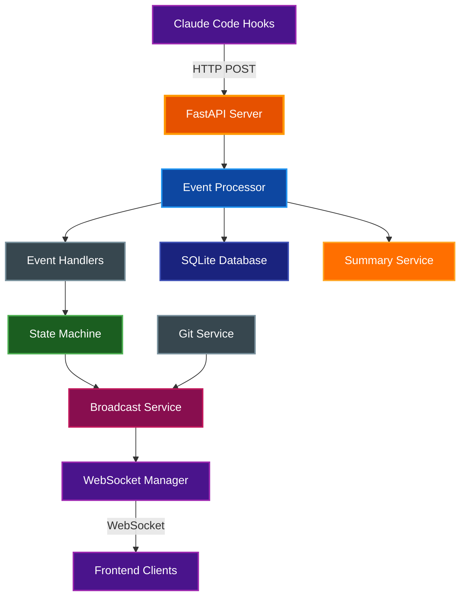

# Claude Office Visualizer Backend

FastAPI backend service that processes Claude Code hook events and broadcasts real-time state updates to connected frontend clients via WebSocket.

## Table of Contents

- [Overview](#overview)
- [Architecture](#architecture)
- [Prerequisites](#prerequisites)
- [Installation](#installation)
- [Running the Server](#running-the-server)
- [Configuration](#configuration)
- [Authentication](#authentication)
- [API Endpoints](#api-endpoints)
- [Project Structure](#project-structure)
- [Testing](#testing)
- [Related Documentation](#related-documentation)

## Overview

The backend serves as the central hub for the Claude Office Visualizer:

- **Event Ingestion**: Receives lifecycle events from Claude Code hooks via HTTP POST
- **State Management**: Maintains office state through an event-driven state machine
- **Real-time Updates**: Broadcasts state changes to frontend clients via WebSocket
- **Persistence**: Stores sessions and events in SQLite for replay functionality
- **AI Summaries**: Generates human-readable descriptions using Claude Haiku API
- **Git Integration**: Polls git status for connected sessions

## Architecture



### Data Flow

1. Claude Code hooks send events to `/api/v1/events`
2. Event processor validates and routes to appropriate handlers
3. Handlers enrich events (AI summaries, token usage) and update state machine
4. State machine updates office state (boss, agents, context)
5. Broadcast service orchestrates state changes to WebSocket manager
6. WebSocket manager broadcasts changes to connected clients
7. Events are persisted to SQLite for replay

### Task System Support

The backend supports two Claude Code task systems:

1. **TodoWrite Tool** (legacy): Tasks are sent via `pre_tool_use` events with `tool_name: "TodoWrite"`
2. **Task File System** (newer): Tasks are stored in `~/.claude/tasks/{session_id}/*.json`

Both systems are converted to the same `TodoItem` format for frontend display. The task file poller monitors the task directory and automatically syncs changes to the visualization.

**Task Persistence**: Tasks are persisted to the SQLite database when they change. This ensures tasks survive even if Claude Code removes them from the file system (e.g., when a session ends). When a session is restored, tasks are loaded from the database.

## Prerequisites

| Requirement | Version | Purpose |
|-------------|---------|---------|
| Python | 3.13+ | Runtime |
| uv | Latest | Package management |

## Installation

```bash
# From the backend directory
uv sync
```

This installs all dependencies defined in `pyproject.toml`.

## Running the Server

### Development Mode

```bash
# From the backend directory
make dev
```

Or directly with uv:

```bash
uv run uvicorn app.main:app --reload --host 0.0.0.0 --port 8000
```

### Production Mode

```bash
uv run uvicorn app.main:app --host 0.0.0.0 --port 8000
```

### With Static Frontend

To serve a built frontend from `backend/static/`, two conditions must hold: the
frontend must be built into `backend/static/` (via `make build-static` from the
project root), and the `SERVE_STATIC` environment variable must be truthy
(`1`, `true`, or `yes`).

```bash
# Build frontend and copy to backend/static (from project root)
make build-static

# Run backend (serves both API and frontend)
SERVE_STATIC=1 uv run uvicorn app.main:app --host 0.0.0.0 --port 8000
```

Without `SERVE_STATIC=1` the API still runs, but the root URL serves no frontend.

## Configuration

Configuration is managed via environment variables or a `.env` file in the backend directory.

### Environment Variables

| Variable | Default | Description |
|----------|---------|-------------|
| `DATABASE_URL` | `sqlite+aiosqlite:///<backend dir>/visualizer.db` | Database connection string (absolute path; `docker-compose` overrides to `/app/data/visualizer.db`) |
| `GIT_POLL_INTERVAL` | `5` | Git status polling interval (seconds) |
| `CLAUDE_CODE_OAUTH_TOKEN` | (empty) | OAuth token for AI summaries |
| `SUMMARY_ENABLED` | `True` | Enable/disable AI summaries |
| `SUMMARY_MODEL` | `claude-haiku-4-5-20251001` | Model for summaries |
| `SUMMARY_MAX_TOKENS` | `1000` | Max tokens for summary responses |
| `CLAUDE_PATH_HOST` | (empty) | Host path prefix for Docker translation |
| `CLAUDE_PATH_CONTAINER` | (empty) | Container path prefix for Docker translation |
| `BEADS_POLL_INTERVAL` | `3.0` | Beads issue tracker polling interval (seconds) |
| `EVENT_RATE_LIMIT` | `300` | Max event POSTs accepted per 60 s window |
| `ZOMBIE_SUBAGENT_TIMEOUT_SECONDS` | `90` | Seconds of inactivity before a subagent is assumed crashed and reaped |
| `CLAUDE_OFFICE_API_KEY` | (empty — auto-generated per launch) | Explicit API key; gates all state-changing endpoints when set (see [Authentication](#authentication)) |
| `SERVE_STATIC` | (unset) | Set to `1`/`true`/`yes` to serve the built frontend from `backend/static/` |
| `BACKEND_CORS_ORIGINS` | localhost origins | Allowed CORS origins (localhost only by default) |

### Docker Path Translation

When running in Docker, the backend needs to translate file paths from host to container:

```bash
CLAUDE_PATH_HOST=/Users/username/.claude
CLAUDE_PATH_CONTAINER=/claude-data
```

## Authentication

State-changing endpoints are protected by an API key sent in the `X-API-Key` header.
Keys are compared in constant time (`hmac.compare_digest`).

| Mode | How the key is set | What requires the key |
|------|--------------------|-----------------------|
| Auto-generated (default) | A random token is generated on every launch | State-changing operations: `DELETE /api/v1/sessions`, `POST /api/v1/sessions/simulate`, and `POST /api/v1/sessions/{id}/focus` (terminal activation + clipboard write) |
| Explicit | `CLAUDE_OFFICE_API_KEY` env var or `backend/.env` | All endpoints except `/health`, `/docs`, `/redoc`, the OpenAPI schema, and CORS preflight |

Example:

```bash
curl -X DELETE http://localhost:8000/api/v1/sessions \
  -H "X-API-Key: $CLAUDE_OFFICE_API_KEY"
```

**Discovery**: The auto-generated key is never sent over HTTP. At startup the server logs it to the console (visible only to the launching user) alongside a `?token=<key>` launch URL; the frontend reads `?token=` once on first load (stripped from the address bar via `replaceState`) and persists it to `sessionStorage` for reloads. An explicitly configured `CLAUDE_OFFICE_API_KEY` is never echoed. `GET /api/v1/status` reports AI-summary availability but does **not** return the key.

**Clients**: the Claude Code hooks send `X-API-Key` automatically when `CLAUDE_OFFICE_API_KEY` is set (env var or `~/.claude/claude-office-config.env`, with the env var taking precedence). The OpenCode plugin does not yet send a key — see its Known Limitations.

**WebSockets**: browser connections must come from an allowed localhost origin; non-browser clients (no `Origin` header) must present `X-API-Key` with the effective key, or the handshake is closed with code 4003.

## API Endpoints

### Health Check

| Method | Path | Description |
|--------|------|-------------|
| `GET` | `/health` | Server health status |

### Status

| Method | Path | Description |
|--------|------|-------------|
| `GET` | `/api/v1/status` | Server status including AI summary availability |

### Events

| Method | Path | Description |
|--------|------|-------------|
| `POST` | `/api/v1/events` | Receive events from Claude Code hooks |

### Sessions

| Method | Path | Description |
|--------|------|-------------|
| `GET` | `/api/v1/sessions` | List all sessions (supports `room_id` and `floor_id` query filters) |
| `DELETE` | `/api/v1/sessions` | Clear all sessions and events |
| `GET` | `/api/v1/sessions/{id}` | Get session details |
| `PATCH` | `/api/v1/sessions/{id}` | Update session display name |
| `DELETE` | `/api/v1/sessions/{id}` | Delete a single session |
| `GET` | `/api/v1/sessions/{id}/replay` | Get replay data for a session |
| `POST` | `/api/v1/sessions/{id}/focus` | Bring session terminal to foreground (macOS) and optionally copy message to clipboard |
| `PATCH` | `/api/v1/sessions/{id}/label` | Update session label |
| `POST` | `/api/v1/sessions/simulate` | Start background simulation |

### Floors

| Method | Path | Description |
|--------|------|-------------|
| `GET` | `/api/v1/floors` | Return building/floor configuration |

### Preferences

| Method | Path | Description |
|--------|------|-------------|
| `GET` | `/api/v1/preferences` | Get all user preferences |
| `GET` | `/api/v1/preferences/{key}` | Get a single preference |
| `PUT` | `/api/v1/preferences/{key}` | Set a preference value |
| `DELETE` | `/api/v1/preferences/{key}` | Delete a preference |

Preferences are stored as key-value pairs and persist across sessions. Current preferences:
- `clock_type`: `"analog"` or `"digital"`
- `clock_format`: `"12h"` or `"24h"` (for digital clock)
- `auto_follow_new_sessions`: `"true"` or `"false"` (auto-follow new sessions in current project)
- `language`: `"en"`, `"es"`, or `"pt-BR"` (UI language)

### WebSocket

| Path | Description |
|------|-------------|
| `/ws/{session_id}` | Real-time state updates for a session |
| `/ws/room/{room_id}` | Real-time state updates for all sessions in a room (team view) |
| `/ws/overview` | Cross-session Command Center feed (`OverviewState`, max 16 clients) |

## Supported Event Types

The backend processes the following event types from Claude Code hooks:

| Event Type | Description | State Machine Effect |
|------------|-------------|---------------------|
| `session_start` | New Claude Code session begins | Initialize office, boss arrives |
| `session_end` | Session terminates | Cleanup, boss leaves |
| `pre_tool_use` | Tool execution starting | Boss/agent shows working state |
| `post_tool_use` | Tool execution completed | Update tool usage stats, file edits |
| `user_prompt_submit` | User sends a prompt | Phone rings, boss receives task |
| `permission_request` | Tool needs user approval | Show waiting state |
| `notification` | System notification | Display notification |
| `stop` | Session completing | Boss shows completion message |
| `subagent_start` | Task tool spawns agent | Create employee agent |
| `subagent_info` | Native agent ID available | Link agent to Claude's ID |
| `subagent_stop` | Task agent completes | Agent returns work, departs |
| `context_compaction` | Context window compacted | Coffee break animation |
| `background_task_notification` | Background task completed | Update remote workers display |
| `agent_update` | Token-usage update emitted by transcript poller | Refresh agent token/thinking display (synthetic, not from hooks) |
| `reporting` | Agent reporting to boss | Show reporting animation (synthetic, persisted for replay) |
| `walking_to_desk` | Agent walking to desk | Animate agent walking to desk (synthetic, persisted for replay) |
| `waiting` | Agent waiting for work | Show waiting state (synthetic, persisted for replay) |
| `leaving` | Agent leaving office | Trigger departure animation (synthetic, persisted for replay) |
| `cleanup` | Logical removal of agent after departure | Remove agent from office; persisted so replay removes it correctly (synthetic) |
| `error` | Error event | Logged and persisted for replay (synthetic) |
| `task_created` | Agent Teams: new task assigned to the team | Create `KanbanTask` entry on the whiteboard |
| `task_completed` | Agent Teams: team task completed | Update `KanbanTask` status to `completed` |
| `teammate_idle` | Agent Teams: teammate session went idle | Set the teammate's boss state to `IDLE` |

## Project Structure

```
backend/
├── app/
│   ├── api/
│   │   ├── routes/
│   │   │   ├── events.py      # Event ingestion endpoint
│   │   │   ├── floors.py      # Building/floor configuration endpoint
│   │   │   ├── preferences.py # User preferences endpoints
│   │   │   └── sessions.py    # Session management endpoints
│   │   └── websocket.py       # WebSocket connection manager
│   ├── core/
│   │   ├── handlers/          # Event type handlers
│   │   │   ├── agent_handler.py       # Subagent lifecycle events
│   │   │   ├── conversation_handler.py # User conversation events
│   │   │   ├── session_handler.py     # Session start/end events
│   │   │   ├── team_handler.py        # Agent Teams events (task_created/completed, teammate_idle)
│   │   │   └── tool_handler.py        # Tool use events
│   │   ├── beads_poller.py     # Beads issue tracker polling
│   │   ├── broadcast_service.py   # State broadcast orchestration
│   │   ├── constants.py       # Shared constants
│   │   ├── event_processor.py # Event validation and processing
│   │   ├── floor_config.py    # Building/floor/room configuration models
│   │   ├── jsonl_parser.py    # Claude transcript parsing
│   │   ├── logging.py         # Logging configuration
│   │   ├── office_layout.py   # Office layout constants and zones
│   │   ├── path_utils.py      # File path utilities
│   │   ├── product_mapper.py  # Session-to-floor/room project mapping
│   │   ├── quotes.py          # Loading screen quotes
│   │   ├── room_orchestrator.py # Multi-session merge for team views
│   │   ├── state_machine.py   # Office state management
│   │   ├── summary_service.py # AI-powered summaries
│   │   ├── task_file_poller.py # Claude task file monitoring
│   │   ├── task_persistence.py # Task database persistence
│   │   ├── token_tracker.py   # Token usage and tool-use tracking
│   │   ├── transcript_poller.py # Token usage extraction
│   │   └── whiteboard_tracker.py # Whiteboard state tracking
│   ├── db/
│   │   ├── database.py        # SQLAlchemy async setup
│   │   └── models.py          # Database models
│   ├── models/
│   │   ├── agents.py          # Agent state models
│   │   ├── common.py          # Shared Pydantic models
│   │   ├── events.py          # Event type models
│   │   ├── git.py             # Git status models
│   │   ├── overview.py        # Command Center overview models
│   │   ├── sessions.py        # Session state models
│   │   └── ui.py              # UI-specific models
│   ├── services/
│   │   └── git_service.py     # Git status polling service
│   ├── config.py              # Settings management
│   └── main.py                # FastAPI application entry point
├── tests/                     # 21 test files + conftest.py (state machine, pollers, security, regression suites)
├── pyproject.toml             # Project dependencies
├── Makefile                   # Development commands
└── README.md                  # This file
```

## Testing

```bash
# Run all tests
make test

# Run with coverage
uv run pytest --cov=app

# Run specific test file
uv run pytest tests/test_state_machine.py

# Run specific test
uv run pytest tests/test_state_machine.py::test_agent_lifecycle
```

### Code Quality

```bash
# Run all checks (format, lint, typecheck, test)
make checkall

# Individual commands
make fmt        # Format with ruff
make lint       # Lint with ruff
make typecheck  # Type check with pyright
```

## Related Documentation

- [Project README](../README.md) - Project overview
- [Architecture](../docs/architecture/ARCHITECTURE.md) - System design details
- [Quick Start](../docs/guides/quickstart.md) - Getting started guide
- [Docker Guide](../docs/guides/deployment.md) - Container deployment
- [AI Summary](../docs/reference/ai-summary.md) - AI summary service documentation
