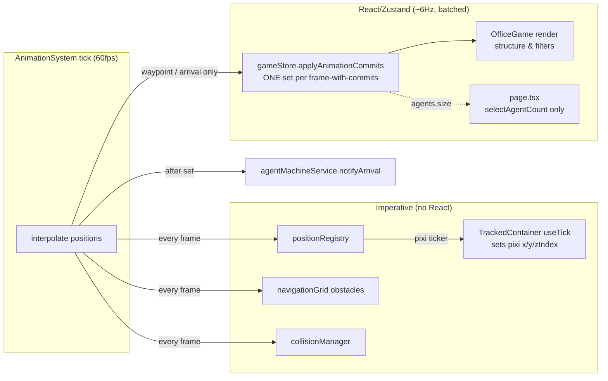

# ENH-001: Frame-Batched Animation Commits & Imperative Pixi Position Updates

> Status: Proposed | Date: 2026-07-06 | Related audit findings: ARC-006, QA-006 (context: ARC-004/017, QA-001)

## Overview

The requestAnimationFrame tick currently routes every interpolated agent position through Zustand — one `set()` per moving agent per frame, each cloning the entire agents Map — and root components subscribe to that Map, so React re-renders at animation rate whenever anything moves. This plan moves per-frame interpolated positions out of React entirely (written imperatively to Pixi display objects via a shared position registry) and commits only discrete state changes (waypoint crossed, arrival, path start/end) to Zustand in a single batched `set()` per tick. React render work becomes independent of agent count and frame rate, and the per-frame Map-clone GC pressure disappears.

## Motivation

All claims below verified against the current source:

- **One store write per moving agent per frame.** `frontend/src/systems/animationSystem.ts:191` calls `store.updateAgentPosition(agentId, newPosition)` inside the per-agent loop of `updateAgentPositions()` (lines 163–207), which runs from the rAF `tick` (line 151). Lines 201/204 additionally call `store.updateAgentPath(...)` every frame while a path is active (the `progress` float changes each frame).
- **Each write clones the whole agents Map.** `frontend/src/stores/gameStore.ts:469-477` (`updateAgentPosition`) and `gameStore.ts:489-497` (`updateAgentPath`) each do `new Map(state.agents)` and a full object spread. With N moving agents at 60 fps that is `2 × N × 60` Map clones per second, all garbage.
- **Root components subscribe to the whole Map.** `frontend/src/components/game/OfficeGame.tsx:204` (`useGameStore(useShallow(selectAgents))`) re-renders on every clone, then performs six separate `Array.from(agents.values()).filter(...)` passes per render (lines 489, 529, 541, 635, 649, 717). `frontend/src/app/page.tsx:146` subscribes the *root page* to the same Map — so the header, sidebars, and modals re-render at 60 fps during any movement, even on desktop where the Map is only used for `agents.size` (line 456) and the mobile-only `MobileAgentActivity` (line 488).
- **`useShallow` does not help:** the Map reference and every changed entry's object identity change on each frame, so shallow equality always fails during movement.

Consequences (per audit ARC-006): CPU cost scales with agent count × frame rate, sustained GC pressure, and DOM-side UI (header/sidebars) re-rendering at animation rate.

## Current State

Data flow today (all per frame, per moving agent):

1. `AnimationSystem.tick()` (`animationSystem.ts:142-157`) — a singleton rAF loop started by `useAnimationSystem()` from `OfficeGame.tsx:191`.
2. `updateAgentPositions(deltaSeconds)` (`animationSystem.ts:163-207`) iterates `store.agents`, computes the interpolated position via `updatePathProgress()` (pure function, lines 209–299), then:
   - `store.updateAgentPosition(agentId, newPosition)` — Zustand write, full Map clone (`gameStore.ts:469-477`).
   - `updateAgentObstacle(agentId, newPosition)` — imperative, writes into the `navigationGrid` singleton (`pathfinding.ts:92` → `navigationGrid.ts:345`).
   - `collisionManager.updatePosition(agentId, newPosition)` — imperative singleton.
   - On arrival: `store.updateAgentPath(agentId, null)` + `agentMachineService.notifyArrival(...)`; otherwise `store.updateAgentPath(agentId, newPath)` every frame (lines 200–205).
3. React re-renders `OfficeGame` (subscribed at line 204) and `page.tsx` (line 146); `@pixi/react` reconciles the declarative `pixiContainer x/y/zIndex` props (`OfficeGame.tsx:498-517`, labels at 635–646, char-type overlays at 649–714, bubbles at 717–734).

Discrete (non-frame) writers of position that must keep working unchanged: `agentMachineService.ts:294, 319, 342, 510` call `store.updateAgentPosition` for teleports (spawn placement, elevator departure). `animationSystem.setAgentPath()` (lines 79–122) sets `targetPosition`/`path` at path start.

Precedent for imperative per-frame updates already exists: `AgentSprite.tsx:268` and `BossSprite.tsx:212` use `useTick` from `@pixi/react` to animate without React state. HMR-reset of module singletons is centralized in `frontend/src/systems/hmrCleanup.ts` (resets `animationSystem`, `collisionManager`, `navigationGrid`, `agentMachineService`).

### Dependency on ARC-004/017 (blocking relationship)

AUDIT.md's blocking graph states **ARC-004/017 (single-writer agent-state ownership refactor) blocks ARC-006**, because both touch `animationSystem.ts`, `gameStore.ts`, `agentMachineService.ts`. **Preferred sequencing: land QA-001 characterization tests, then ARC-004/017, then this plan.** If this plan must land first, it is designed to be compatible: it does not change queue membership, phase ownership, or machine-notification semantics — it only changes *where interpolated positions live* and *how often the store is written*. Phases 1–2 (registry + imperative rendering) are safe in either order; Phase 3 (batched commits) touches the same lines ARC-004/017 will restructure and must be rebased if that refactor is in flight. Call this out in the PR description either way.

## Proposed Design

### 1. Position registry (per-frame truth, outside React)

A new module-level singleton holding the live interpolated position of every entity. Plain mutable data — no subscriptions, no cloning.

```ts
// frontend/src/systems/positionRegistry.ts
import type { Position } from "@/types";

class PositionRegistry {
  private positions = new Map<string, Position>(); // keyed by agentId; "boss" reserved for future use
  /** Monotonic frame counter — lets consumers detect "changed since last read" cheaply. */
  frameVersion = 0;

  set(id: string, pos: Position): void { this.positions.set(id, { x: pos.x, y: pos.y }); }
  get(id: string): Position | undefined { return this.positions.get(id); }
  remove(id: string): void { this.positions.delete(id); }
  clear(): void { this.positions.clear(); this.frameVersion = 0; }
}

export const positionRegistry = new PositionRegistry();
```

Seeding: `addAgent`/spawn paths write the initial position into the registry as well as the store; `removeAgent`/cleanup remove it. `hmrCleanup.ts` gains `positionRegistry.clear()`.

### 2. Imperative rendering via a tracked container

Leaf Pixi containers stop taking `x/y/zIndex` from React props for moving agents. Instead a small wrapper component drives them from the registry on the Pixi ticker:

```tsx
// frontend/src/components/game/TrackedContainer.tsx
import { useRef } from "react";
import { useTick } from "@pixi/react";
import type { Container } from "pixi.js";
import { positionRegistry } from "@/systems/positionRegistry";

interface TrackedContainerProps {
  agentId: string;
  fallback: Position;            // store position — used until registry has an entry
  zIndexFromY?: boolean;         // agents layer: zIndex = y
  zIndexOffset?: number;         // char-type overlays: y + 20
  children: ReactNode;
}

export function TrackedContainer({ agentId, fallback, zIndexFromY, zIndexOffset = 0, children }: TrackedContainerProps): ReactNode {
  const ref = useRef<Container>(null);
  useTick(() => {
    const c = ref.current;
    if (!c) return;
    const pos = positionRegistry.get(agentId) ?? fallback;
    c.position.set(pos.x, pos.y);
    if (zIndexFromY) c.zIndex = pos.y + zIndexOffset;
  });
  return <pixiContainer ref={ref} x={fallback.x} y={fallback.y} zIndex={zIndexFromY ? fallback.y + zIndexOffset : undefined}>{children}</pixiContainer>;
}
```

`OfficeGame.tsx` wraps the agent sprite pass (line 498), labels pass (line 641), char-type overlay pass (line 656), and bubble pass (line 724) in `TrackedContainer`, with children positioned relative to `(0,0)` instead of absolute `agent.currentPosition` coordinates. `AgentSprite` receives its position via the parent container (its internal `position` prop becomes the container-relative origin).

**Structural membership stays React-driven.** Which agents render, phase filters (`agent.phase === "idle"` for arms/headsets at lines 529–549), elevator-zone filters (`isAgentInElevator` at 489–496, `isInElevatorZone` at 635–639/717–722), and occupied-desk memos (lines 234–254) keep reading store state — which after this change updates at *waypoint granularity* (see below), roughly every 32 px of travel ≈ 6–7 Hz at `MOVEMENT_SPEED = 200` px/s, instead of 60 Hz. Zone/phase transitions coincide with waypoint or arrival commits, so filters stay visually correct.

### 3. Batched discrete commits

The animation tick accumulates all discrete changes for the frame and applies them in **one** `set()`:

```ts
// gameStore.ts — new action
interface AnimationCommit {
  agentId: string;
  position?: Position;          // committed at waypoint crossings and arrival
  path?: PathState | null;      // committed when currentIndex changes or on arrival (null)
}
applyAnimationCommits: (commits: AnimationCommit[]) =>
  set((state) => {
    if (commits.length === 0) return state;
    const newAgents = new Map(state.agents);       // ONE clone per frame, only on frames with commits
    for (const c of commits) {
      const agent = newAgents.get(c.agentId);
      if (!agent) continue;
      newAgents.set(c.agentId, {
        ...agent,
        ...(c.position !== undefined && { currentPosition: c.position }),
        ...(c.path !== undefined && { path: c.path }),
      });
    }
    return { agents: newAgents };
  }),
```

`updateAgentPositions()` changes to:

```ts
const commits: AnimationCommit[] = [];
for (const [agentId, agent] of store.agents) {
  // ...compute result as today...
  positionRegistry.set(agentId, newPosition);        // every frame
  updateAgentObstacle(agentId, newPosition);         // unchanged (imperative singletons)
  collisionManager.updatePosition(agentId, newPosition);
  if (arrived) {
    commits.push({ agentId, position: newPosition, path: null });
    arrivals.push({ agentId, phase: agent.phase });
  } else if (newPath.currentIndex !== agent.path.currentIndex) {
    // waypoint crossed — discrete commit; per-frame `progress` stays out of the store
    commits.push({ agentId, position: newPosition, path: newPath });
  }
  // NOTE: live currentIndex/progress needed to resume interpolation next frame is kept
  // in a private animationSystem map, not read back from the store.
}
if (commits.length) store.applyAnimationCommits(commits);
for (const a of arrivals) this.handleArrival(a.agentId, a.phase); // after the single set(), same ordering guarantee as today
positionRegistry.frameVersion++;
```

Key invariant preserved: `handleArrival` → `agentMachineService.notifyArrival` still runs *after* the store reflects the final position and cleared path, exactly as today (store write precedes `handleArrival` at `animationSystem.ts:200-202`).

The store's `PathState.progress` becomes coarse (updated per waypoint, not per frame). Verified consumers of `path`: `checkQueueAdvancement` only checks `path === null` (`animationSystem.ts:425,441`) — unaffected; `DebugOverlays` draws waypoints — waypoint-granularity is acceptable for a debug view; `setAgentPath`'s "already heading to same destination" check uses `targetPosition`, not progress (lines 96–103) — unaffected. The live interpolation cursor (`currentIndex`, `progress`) moves into a private `Map<string, {currentIndex, progress}>` inside `AnimationSystem`, reset whenever `updateAgentPath` sets a new path.

### 4. Narrow root subscriptions

- `page.tsx`: replace `useGameStore(useShallow(selectAgents))` (line 146) with a new `selectAgentCount` selector (`(s) => s.agents.size`) for the mobile header badge; move the agents/boss subscription needed by `MobileAgentActivity` *into* that component so the desktop tree never subscribes to the Map.
- `OfficeGame.tsx`: consolidate the six `Array.from(agents.values())` passes into a single memoized derivation (one pass producing `{visibleAgents, idleAgents, labeledAgents, charTypeAgents, bubbleAgents}`) — cheap now that renders are ~6 Hz, but it halves per-render work and documents intent.

### Data flow after the change



## Implementation Phases

Each phase is independently landable and touches ≤5 files. Run phases in order.

### Phase 1 — Position registry with dual-write (no behavior change)

Tasks:
1. Create `frontend/src/systems/positionRegistry.ts` as sketched above.
2. `frontend/src/systems/animationSystem.ts`: in `updateAgentPositions`, write every computed position to `positionRegistry` **in addition to** the existing store calls (dual-write); seed the registry in `setAgentPath`/`registerAgent`; remove entries in `unregisterAgent`.
3. `frontend/src/systems/hmrCleanup.ts`: add `positionRegistry.clear()` to `performFullCleanup()` and the soft-reset path.
4. Create `frontend/src/systems/positionRegistry.test.ts` (vitest): set/get/remove/clear, fallback behavior, frameVersion monotonicity.

Verify: `cd frontend && make checkall && make test` (or `bun run test`); `make dev-tmux` + `make simulate` from repo root — visuals identical (dual-write means no rendering change yet).

### Phase 2 — Imperative Pixi position updates

Tasks:
1. Create `frontend/src/components/game/TrackedContainer.tsx` as sketched.
2. `frontend/src/components/game/OfficeGame.tsx`: wrap the four moving-agent passes (sprites line ~498, labels ~641, char-type overlays ~656, bubbles ~724) in `TrackedContainer`; convert children to container-relative coordinates.
3. `frontend/src/components/game/AgentSprite.tsx`: accept container-relative origin (position prop becomes `{x:0,y:0}` when wrapped) — keep the prop for the Elevator path, which renders agents inside the elevator at store positions (elevator occupants aren't pathing).

Verify: `cd frontend && make checkall`; visual smoke via `make dev-tmux` + `make simulate`: agents glide smoothly, labels/bubbles/crowns track their agent with no lag, Y-sorting (walk-behind) still correct, debug overlay `D`+`P` unaffected. During this phase the store still updates per frame, so `fallback` and registry agree — any drift indicates a wiring bug.

### Phase 3 — Batched discrete commits (the payoff)

Precondition: Phases 1–2 merged; QA-001 characterization tests for queue/agent actions exist (audit Phase-2 precondition) or are added here for `applyAnimationCommits`.

Tasks:
1. `frontend/src/stores/gameStore.ts`: add `applyAnimationCommits` (single-`set()`, one Map clone) + `selectAgentCount` selector. Do **not** remove `updateAgentPosition` — `agentMachineService.ts:294/319/342/510` still use it for teleports.
2. `frontend/src/systems/animationSystem.ts`: replace per-frame `store.updateAgentPosition`/`store.updateAgentPath` calls with the commit-accumulator pattern above; add the private interpolation-cursor map; keep `handleArrival` ordering (after the single `set()`).
3. Ensure teleport writers also update the registry: in `agentMachineService.ts`, mirror the four `updateAgentPosition` teleport calls with `positionRegistry.set(...)` (or wrap both in a tiny helper in `animationSystem`).
4. Create `frontend/tests/animationCommits.test.ts`: (a) `applyAnimationCommits` with N commits performs exactly one state emission (count via `subscribe`); (b) waypoint-crossing commit updates `currentPosition` and `path.currentIndex`; (c) arrival commit nulls path; (d) unknown agentId is a no-op.

Verify: `cd frontend && make checkall && make test`; visual smoke with `make simulate` — walking, queueing at boss, departures, elevator entry all behave as before; store-write rate check (Phase 5 instrumentation, or temporarily log in dev) shows ≤ ~7 writes/s per moving agent instead of ~120.

### Phase 4 — Narrow root subscriptions

Tasks:
1. `frontend/src/app/page.tsx`: drop the `useShallow(selectAgents)`/`selectBoss` subscriptions (lines 146–147); use `selectAgentCount` for the mobile badge; render `<MobileAgentActivity />` without props.
2. `frontend/src/components/layout/MobileAgentActivity.tsx`: subscribe to `selectAgents`/`selectBoss` internally (and only mount on mobile, as today).
3. `frontend/src/components/game/OfficeGame.tsx`: consolidate the six `Array.from` filter passes into one memoized single-pass derivation.

Verify: `cd frontend && make checkall`; React DevTools Profiler while `make simulate` runs: `page.tsx` (header/sidebars) records **zero** re-renders attributable to agent movement; mobile viewport (devtools emulation) still shows live agent count/activity.

### Phase 5 — Instrumentation & measurement

Tasks:
1. `frontend/src/systems/positionRegistry.ts` (or a tiny `perfCounters.ts`): dev-only counter of store emissions per second (via `useGameStore.subscribe`) surfaced in the existing debug overlay text (`OfficeGame.tsx` debug-mode indicator, line ~621).
2. Record before/after numbers (procedure in Testing Strategy) in the PR description and CHANGELOG entry.

Verify: `make checkall` from repo root; debug overlay shows commit rate; numbers captured.

## Testing Strategy

- **Unit (vitest, already configured):** `positionRegistry.test.ts` (Phase 1), `animationCommits.test.ts` (Phase 3). Add a characterization test asserting `notifyArrival` fires only after the store reflects `path: null` (mock `agentMachineService`).
- **Existing suites:** `frontend/tests/*` and `frontend/src/systems/exitAnimation.test.ts` must stay green — exit animation and queue choreography are the highest-risk neighbors.
- **Visual/E2E:** `make dev-tmux` + `make simulate`; manually verify arrivals → queue → boss → desk → departure → elevator loop, plus `D`/`P`/`Q` debug overlays.
- **Measuring the improvement (before vs. after, same simulate scenario):**
  1. Chrome DevTools → Performance, 20 s capture during `make simulate` with ≥6 concurrent agents: compare *Scripting* total, minor-GC count, and long-task count.
  2. React DevTools Profiler: render counts for `V2TestPage` and `OfficeGame` during movement — target: `V2TestPage` ≈ 0 movement-driven renders; `OfficeGame` ≤ ~7/s per moving agent (waypoint rate) vs ~60/s.
  3. Debug-overlay commit counter (Phase 5): store emissions/s during movement.

## Files to Create / Modify

| Path | Change |
|---|---|
| `frontend/src/systems/positionRegistry.ts` | **New** — per-frame position singleton |
| `frontend/src/systems/positionRegistry.test.ts` | **New** — unit tests |
| `frontend/src/systems/animationSystem.ts` | Registry dual-write (P1); batched commits + private interpolation cursor (P3) |
| `frontend/src/systems/hmrCleanup.ts` | Clear registry on HMR reset (P1) |
| `frontend/src/components/game/TrackedContainer.tsx` | **New** — useTick-driven container (P2) |
| `frontend/src/components/game/OfficeGame.tsx` | Wrap agent passes in TrackedContainer (P2); single-pass filters (P4) |
| `frontend/src/components/game/AgentSprite.tsx` | Container-relative rendering (P2) |
| `frontend/src/stores/gameStore.ts` | `applyAnimationCommits` action + `selectAgentCount` (P3) |
| `frontend/src/machines/agentMachineService.ts` | Mirror teleport writes into registry (P3) |
| `frontend/tests/animationCommits.test.ts` | **New** — batched-commit tests (P3) |
| `frontend/src/app/page.tsx` | Drop Map subscription; count selector (P4) |
| `frontend/src/components/layout/MobileAgentActivity.tsx` | Self-subscribe (P4) |

## Risks & Mitigations

- **Conflict with ARC-004/017 ownership refactor (audit-declared blocker).** Mitigation: land after ARC-004/017 where possible; Phases 1–2 are orthogonal; Phase 3 is the only overlapping surface and is small enough to rebase. Coordinate in the PR.
- **Visual desync between registry (per-frame) and store (per-waypoint).** Zone/phase filters could briefly disagree with on-screen position (≤ one waypoint, ~160 ms). Mitigation: commits fire on *every* waypoint crossing and on arrival; elevator/queue logic keys off arrival events which are committed synchronously before machine notification. Verify visually in Phase 3.
- **`@pixi/react` reconciliation fighting imperative writes.** If React re-renders a `TrackedContainer` it re-applies `fallback` props. Mitigation: `fallback` is the last committed store position (max one waypoint stale); the very next ticker frame re-applies the registry value — a ≤16 ms snap of ≤32 px, imperceptible. If it ever shows, set position only in `useTick` and pass no `x/y` props after mount.
- **StrictMode/HMR double-mount leaks stale registry entries.** StrictMode is globally disabled (ARC-026) and `hmrCleanup` already hand-resets singletons; the registry joins that list in Phase 1.
- **Replay mode** drives the same store actions; since commits still land in the store at waypoint granularity, replay visuals are unchanged. Verify replay during Phase 3 smoke.

## Acceptance Criteria

- [ ] During continuous movement of ≥6 agents, `gameStore` emits ≤ 10 state updates/second total (measured via subscription counter), vs ≥ 360/s today.
- [ ] `V2TestPage` (`page.tsx`) records 0 re-renders attributable to agent movement in React Profiler.
- [ ] Exactly one `new Map(state.agents)` clone per frame-with-commits (code inspection + `applyAnimationCommits` test asserting one emission for N commits).
- [ ] Agent sprites, labels, bubbles, and char-type overlays visibly track agents smoothly at 60 fps (manual smoke with `make simulate`).
- [ ] Arrival ordering preserved: store shows `path === null` before `notifyArrival` fires (unit test).
- [ ] Teleport paths (`agentMachineService` spawn/elevator) still position agents correctly (visual smoke: spawn, departure).
- [ ] `cd frontend && make checkall` and the full vitest suite pass; no new lint/type suppressions.
- [ ] Chrome Performance capture shows reduced Scripting time and minor-GC count vs a pre-change capture of the same scenario (numbers recorded in PR).

## Estimated Effort

| Phase | Effort |
|---|---|
| 1 — Registry + dual-write | S |
| 2 — Imperative rendering | M |
| 3 — Batched commits | M |
| 4 — Narrow subscriptions | S |
| 5 — Instrumentation | S |
| **Total** | **M–L** |
