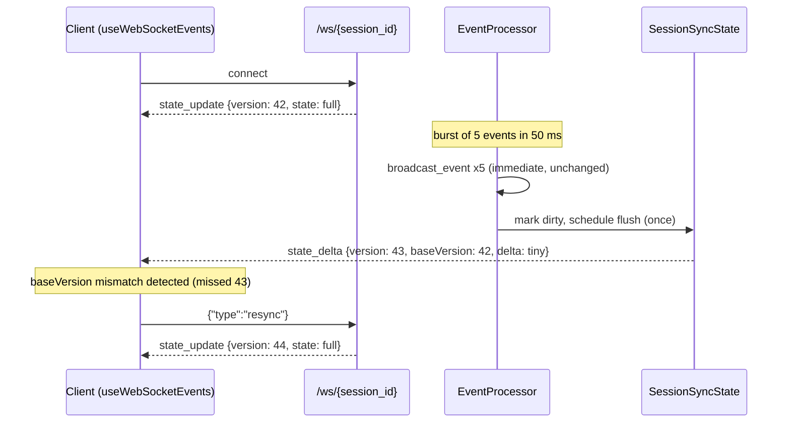

# ENH-002: Delta-Based WebSocket State Sync

> Status: Proposed | Date: 2026-07-06 | Related audit findings: ARC-015 (context: ARC-011/012, ARC-018, ARC-019)

## Overview

Every processed event currently triggers a full `GameState` serialization — including up to 500 history entries and 500 conversation entries — broadcast to every WebSocket client of the session. This plan introduces versioned delta sync: clients receive one full snapshot on connect, then structured diffs (changed agents, appended history/conversation entries, changed sections) with per-session coalescing so event bursts collapse into one frame, plus a client-initiated resync path when a version gap is detected. Broadcast cost becomes proportional to what changed instead of to total session size.

## Motivation

All claims verified against current source:

- **Full snapshot per event.** `backend/app/core/event_processor.py:475-476`: `_process_event_internal` ends every event with `await broadcast_state(event.session_id, sm)` followed by `broadcast_event(...)`. `broadcast_state` (`backend/app/core/broadcast_service.py:30-45`) calls `sm.to_game_state(session_id)` and `model_dump(mode="json", by_alias=True)` — a complete re-serialization — then sends it to every connection for the session.
- **The snapshot is dominated by capped-but-large lists.** `to_game_state` (`backend/app/core/state_machine.py:704-772`) embeds `history` (capped at 500 entries, `event_processor.py:431-433`), `conversation.copy()` (capped at 500 via `append_capped`, `state_machine.py:690-702`), full whiteboard data, all agents, todos, and queues. On a busy session a single tool event — which changes one bubble and appends one history entry — re-serializes and re-transmits hundreds of KB per connected client.
- **Additional full-state broadcasters:** todo updates (`event_processor.py:219`), beads updates (`event_processor.py:236`), and agent-state updates (`event_processor.py:928`) all call the same `broadcast_state`.
- **No coalescing on the session channel.** Bursts (e.g. transcript-poller emitting several events in one poll, `transcript_poller.py:157-159`) produce one full serialization + broadcast *each*. The Command Center overview channel already solves this with a ~50 ms debounced flush (`event_processor.py:561-584`) — precedent exists in-repo, but the far hotter session channel has none.
- **Frontend already reconciles snapshots idempotently.** `frontend/src/hooks/useWebSocketEvents.ts:73-277` (`handleStateUpdate`) diffs the incoming full state against the store — meaning the client does client-side delta derivation from a full payload the server just paid to build.

Impact (per ARC-015): O(N·state) serialization CPU per event on the event loop, network payloads orders of magnitude larger than the underlying change, and per-client amplification.

## Current State

Data flow today:

1. **Connect** — `/ws/{session_id}` (`backend/app/main.py:304-349`) validates origin/id, registers via `manager.connect`, sends one full `state_update` (lines 318–327) plus `git_status`, then loops on `receive_text()` **discarding** all client messages (lines 345–346).
2. **Per event** — `_process_event_internal` mutates the `StateMachine`, appends a `HistoryEntry` (`event_processor.py:423-433`), then `broadcast_state` + `broadcast_event` (lines 475–476). `ConnectionManager.broadcast` (`backend/app/api/websocket.py:122-132`) snapshots the connection list and sends the JSON to each socket.
3. **Client** — `useWebSocketEvents.ts:295-300` routes `state_update` → `handleStateUpdate(message.state)`, which reconciles agents (spawn/remove/update), boss, office fields, queues (initial sync only), todos, whiteboard, and conversation against the Zustand store. `event` messages independently drive the event log, typing animations, and toasts (lines 302–404). Reconnect uses exponential backoff (lines 501–523) and re-receives a full snapshot by design.

Message types on this channel today: `state_update`, `event`, `git_status`, `reload`, `session_deleted`, `error` (switch at `useWebSocketEvents.ts:295-436`).

Type contract: backend Pydantic models are exported to `frontend/src/types/generated.ts` via the hand-curated `MODELS` registry in `scripts/gen_types.py` (lines ~39–60; ARC-019), regenerated with `make gen-types` and CI-enforced by `type-drift.yml`. `HistoryEntry`/`ConversationEntry` are TypedDicts maintained manually on the frontend.

### Sequencing constraints (from AUDIT.md)

- **ARC-011/012** (move `ConnectionManager` out of the API layer; fix DI seams) restructure `broadcast_service.py` / `websocket.py` imports. Recommended order: land ARC-011 first, then this plan targets the new import shape. If this plan lands first, the delta layer must be rebased when ARC-011 moves the manager.
- **ARC-018 / QA-005** refactor `useWebSocketEvents.ts`. Phase 4 below touches the same file — coordinate; the delta-application logic is deliberately placed in a standalone module (`stateSync.ts`) so the hook change is a thin switch-case either way.
- This plan implements the *broadcast hot-spot* portion of ARC-015; session-registry eviction and replay pagination are ENH-004's scope.

## Proposed Design

### Wire protocol

Two changes, both backward compatible:

1. Snapshots gain a `version` field (existing `state_update` type):
   ```json
   { "type": "state_update", "version": 42, "timestamp": "...", "state": { ...full GameState... } }
   ```
2. A new `state_delta` message carries only changes:
   ```json
   {
     "type": "state_delta",
     "version": 43,
     "baseVersion": 42,
     "timestamp": "...",
     "delta": {
       "boss": { ... },                         // present only if changed
       "office": { ... },                       // present only if changed
       "agentsUpserted": [ {Agent}, ... ],      // added or changed agents (full Agent objects)
       "agentsRemoved": [ "agent-id", ... ],
       "historyAppended": [ {HistoryEntry}, ... ],
       "conversationAppended": [ {ConversationEntry}, ... ],
       "todos": [ ... ],                        // replace-whole-list only when changed
       "whiteboardData": { ... },               // replace-whole-object only when changed
       "arrivalQueue": [...], "departureQueue": [...],
       "floorId": "...", "roomId": "..."
     }
   }
   ```
   `version` is per-session and monotonic; a client whose `lastVersion + 1 !== baseVersion... `— strictly, whose `baseVersion !== lastVersion` — has missed a delta and must resync.
3. Resync request (client → server; the receive loop currently discards text): client sends `{"type":"resync"}`; server replies with a personal versioned full snapshot.

Full `Agent` objects (not field-level patches) are used in `agentsUpserted`: agents are small, and this keeps client application trivial and self-healing.

### Server: `SessionSyncState` + delta computation

New module `backend/app/core/state_delta.py`:

```python
@dataclass
class SessionSyncState:
    version: int = 0
    # Last-broadcast serialized forms (mode="json", by_alias=True) for cheap comparison:
    boss: dict | None = None
    office: dict | None = None
    agents: dict[str, dict] = field(default_factory=dict)     # keyed by agent id
    todos: list | None = None
    whiteboard: dict | None = None
    queues: tuple[list, list] | None = None
    floor_room: tuple[str | None, str | None] | None = None
    history_seq_sent: int = 0        # cumulative appended-entry counters (see below)
    conversation_seq_sent: int = 0

def compute_delta(sm: StateMachine, sync: SessionSyncState) -> dict | None:
    """Serialize only the small sections, diff against last-broadcast forms,
    pull appended history/conversation entries via seq counters.
    Returns None when nothing changed. Mutates sync to the new baseline
    and increments sync.version when a delta is produced."""
```

Cost model: boss/office/queues/floor are tiny; agents are bounded by desk count; todos/whiteboard are medium and compared via their serialized forms. The two big lists (history/conversation) are **never diffed** — they are append-only with caps, so `StateMachine` gains monotonic counters:

- `StateMachine.history_seq: int` — incremented by a new `sm.append_history(entry)` helper that replaces the direct `sm.history.append(...)` + cap at `event_processor.py:431-433`.
- `StateMachine.conversation_seq: int` — incremented inside the existing `append_capped` (`state_machine.py:690-702`).

New entries since last broadcast = `history[-(history_seq - history_seq_sent):]` (clamped to the 500-entry cap; if more than 500 accumulated since last flush, fall back to a full snapshot for that client set).

### Server: coalesced flush per session

Mirror the proven overview debounce (`event_processor.py:561-584`): `broadcast_state(session_id, sm)` becomes `schedule_state_broadcast(session_id, sm)` — it marks the session dirty and, if no flush task is pending, schedules one after `STATE_FLUSH_INTERVAL` (default 50 ms). The flush computes one delta from the *final* state of the burst and sends it once. `broadcast_event` stays immediate and per-event (the event log, typing animation, and toasts depend on seeing every event — `useWebSocketEvents.ts:302-404`).

First-ever broadcast for a session (no `SessionSyncState`) and any client that just connected get full snapshots; the tracker then baselines. `SessionSyncState` entries are dropped on session delete/clear and on server shutdown.

Feature flag: `Settings.DELTA_SYNC_ENABLED` (env `DELTA_SYNC_ENABLED`, default `true` once Phase 4 ships in the same release — the monorepo ships backend+frontend together; the flag exists for rollback, restoring today's full-snapshot-per-event behavior including no coalescing).

### Client: mirror + reuse of existing reconciliation

To keep behavioral risk near zero, the client maintains a plain-object mirror of the latest full `GameState` and applies deltas to it, then feeds the *reconstructed full state* through the existing, battle-tested `handleStateUpdate`:

```ts
// frontend/src/systems/stateSync.ts
export class GameStateMirror {
  private state: GameState | null = null;
  private version = -1;

  applySnapshot(state: GameState, version: number): GameState { ... }
  /** Returns the merged full state, or null if a version gap requires resync. */
  applyDelta(delta: GameStateDelta, version: number, baseVersion: number): GameState | null {
    if (this.state === null || baseVersion !== this.version) return null; // gap → resync
    // merge sections; append historyAppended/conversationAppended with 500-caps;
    // upsert/remove agents; bump this.version = version;
    return this.state;
  }
  reset(): void { ... }
}
```

`useWebSocketEvents` changes: `state_update` → `mirror.applySnapshot` then `handleStateUpdate`; new `state_delta` case → `mirror.applyDelta`; on `null` (gap) send `{"type":"resync"}` over the socket and ignore further deltas until the next snapshot; `mirror.reset()` on reconnect/session switch. Network payload and server CPU drop immediately; a later optimization can apply deltas directly to store actions, but that is explicitly out of scope.

### Data flow after the change



## Implementation Phases

Each phase is independently landable and touches ≤5 files.

### Phase 1 — Delta core + sequence counters (backend, no wire change)

Tasks:
1. Create `backend/app/models/deltas.py`: `GameStateDelta` Pydantic model (camelCase aliases matching existing `model_config` conventions), fields as in the wire-protocol sketch.
2. Create `backend/app/core/state_delta.py`: `SessionSyncState`, `compute_delta(sm, sync)`, and `build_versioned_snapshot(sm, sync, session_id)`.
3. `backend/app/core/state_machine.py`: add `history_seq` / `conversation_seq` counters, `append_history()` helper; increment in `append_capped`.
4. `backend/app/core/event_processor.py`: replace the direct history append (lines 423–433) with `sm.append_history(event_dict)`.
5. Create `backend/tests/test_state_delta.py`: no-change → `None`; agent add/change/remove; history append across the 500 cap; conversation append; whiteboard/todos change detection; version monotonicity; >500-appended fallback signal.

Verify: `cd backend && uv run pytest tests/test_state_delta.py -q && make checkall`. Full backend suite green (`make -C backend test`).

### Phase 2 — Wire the broadcast path (backend)

Tasks:
1. `backend/app/core/broadcast_service.py`: add `schedule_state_broadcast(session_id, sm)` with per-session 50 ms coalescing + delta emission (full snapshot when no baseline or flag off); keep `broadcast_state` for the snapshot path.
2. `backend/app/core/event_processor.py`: switch the four `broadcast_state` call sites (lines 219, 236, 475, 928) to `schedule_state_broadcast`; extend `shutdown()` to cancel pending session flush tasks (mirroring the overview flush cleanup at lines 586–596); drop `SessionSyncState` on session removal/clear.
3. `backend/app/main.py`: `/ws/{session_id}` connect sends the versioned snapshot; replace the discard-only `receive_text()` loop (lines 345–346) with parsing that answers `{"type":"resync"}` with a personal versioned snapshot (all other messages still ignored).
4. `backend/app/config.py`: add `DELTA_SYNC_ENABLED: bool = True` and `STATE_FLUSH_INTERVAL_MS: int = 50` to `Settings`.
5. Create `backend/tests/test_delta_broadcast.py`: FastAPI `TestClient` WebSocket test — connect → versioned snapshot; POST event → exactly one `state_delta` for a burst of 3 events; resync request → snapshot; flag off → legacy full `state_update` per event.

Verify: `cd backend && uv run pytest tests/test_delta_broadcast.py -q && make checkall`. Existing WebSocket/security tests (`backend/tests/test_security_hardening.py` et al.) stay green. Note: the frontend still only understands `state_update`, so until Phase 4 lands, run dev with `DELTA_SYNC_ENABLED=0` — or land Phases 2–4 in one release train (flag default `False` until Phase 5 flips it).

### Phase 3 — Type contract

Tasks:
1. `scripts/gen_types.py`: register `GameStateDelta` in `MODELS` (lines ~39–60).
2. Regenerate `frontend/src/types/generated.ts` via `make gen-types`.
3. `frontend/src/types/index.ts`: extend the `WebSocketMessage` union with the `state_delta` variant (`version`, `baseVersion`, `delta: GameStateDelta`) and add `version?: number` to the `state_update` variant, alongside the manually maintained `HistoryEntry`/`ConversationEntry` TypedDict mirrors.

Verify: `make gen-types` produces a clean diff; `cd frontend && make checkall`; the type-drift CI check (`.github/workflows/type-drift.yml`) passes locally by re-running gen-types and confirming no diff.

### Phase 4 — Client mirror + delta handling

Tasks:
1. Create `frontend/src/systems/stateSync.ts`: `GameStateMirror` as sketched (pure TS, no store imports — unit-testable).
2. `frontend/src/hooks/useWebSocketEvents.ts`: instantiate a mirror per connection (reset in `ws.onopen` and on session switch); `state_update` → `applySnapshot` + existing `handleStateUpdate`; new `state_delta` case → `applyDelta`, feeding the merged state to `handleStateUpdate`; on gap send `{"type":"resync"}` and set an `awaitingSnapshot` guard that drops deltas until the next snapshot.
3. Create `frontend/tests/stateSync.test.ts`: snapshot→delta merge correctness per section; history/conversation append with cap; agent upsert/remove; version-gap returns null; delta-before-snapshot returns null; reset semantics.

Verify: `cd frontend && make checkall && make test`. End-to-end: `make dev-tmux` with `DELTA_SYNC_ENABLED=1`, run `make simulate` — office behaves identically (agents spawn/work/depart, bubbles, event log, todos, whiteboard); kill the backend mid-run and restart — client resyncs via reconnect snapshot.

### Phase 5 — Measurement, default-on, docs

Tasks:
1. Add a payload-size assertion to `backend/tests/test_delta_broadcast.py`: build a session with 500 history + 500 conversation entries, fire one tool event, assert `len(json.dumps(delta_msg)) < 0.05 × len(json.dumps(snapshot_msg))` (expected ≫ 90% reduction).
2. Flip `DELTA_SYNC_ENABLED` default to `True` (if Phase 2 shipped with `False`).
3. Docs: backend README WebSocket section (message types incl. `state_delta` + resync), CHANGELOG entry (symptom → root cause → fix style).

Verify: `make checkall` at root; full backend + frontend test suites; recorded before/after payload sizes in the PR description.

## Testing Strategy

- **Unit (backend):** `test_state_delta.py` — exhaustive section-level delta cases, seq-counter/cap interactions, version arithmetic.
- **Integration (backend):** `test_delta_broadcast.py` — WebSocket lifecycle via `TestClient`: snapshot on connect, coalesced delta for bursts, resync round-trip, flag-off legacy behavior, multi-client fan-out.
- **Unit (frontend):** `stateSync.test.ts` — mirror merge correctness and gap detection; follows the auto-covering style of `overviewStore.test.ts` (iterate delta keys so new fields fail loudly).
- **End-to-end:** `make simulate` against a dev stack with the flag on; visual parity check of the office, event log, conversation panel, whiteboard.
- **Measuring the improvement:**
  - Payload: the Phase 5 size assertion, plus `websocat`/browser devtools WS frame inspection on a busy simulated session (record median frame size before/after).
  - Server CPU: `py-spy top --pid <uvicorn>` during `make simulate` on a session with full history — `model_dump`/`to_game_state` samples should drop from dominant to marginal.
  - Burst behavior: assert exactly one `state_delta` frame for an N-event burst within the flush window (integration test above).

## Files to Create / Modify

| Path | Change |
|---|---|
| `backend/app/models/deltas.py` | **New** — `GameStateDelta` model (P1) |
| `backend/app/core/state_delta.py` | **New** — `SessionSyncState`, `compute_delta` (P1) |
| `backend/app/core/state_machine.py` | `history_seq`/`conversation_seq` counters, `append_history` (P1) |
| `backend/app/core/event_processor.py` | Use `append_history` (P1); scheduled broadcasts, shutdown, sync-state lifecycle (P2) |
| `backend/tests/test_state_delta.py` | **New** — delta unit tests (P1) |
| `backend/app/core/broadcast_service.py` | `schedule_state_broadcast` with coalescing + delta emission (P2) |
| `backend/app/main.py` | Versioned snapshot on connect; resync handling in receive loop (P2) |
| `backend/app/config.py` | `DELTA_SYNC_ENABLED`, `STATE_FLUSH_INTERVAL_MS` (P2) |
| `backend/tests/test_delta_broadcast.py` | **New** — integration + payload tests (P2/P5) |
| `scripts/gen_types.py` | Register delta model (P3) |
| `frontend/src/types/generated.ts` | Regenerated (P3) |
| `frontend/src/types/index.ts` | `WebSocketMessage` union extension (P3) |
| `frontend/src/systems/stateSync.ts` | **New** — `GameStateMirror` (P4) |
| `frontend/src/hooks/useWebSocketEvents.ts` | `state_delta` case, resync, mirror lifecycle (P4) |
| `frontend/tests/stateSync.test.ts` | **New** — mirror tests (P4) |
| `backend/README.md`, `CHANGELOG.md` | Protocol docs + entry (P5) |

## Risks & Mitigations

- **Client/server divergence (missed or misapplied delta).** Mitigation: strict `baseVersion` checking with automatic resync; agents transmitted as whole objects (self-healing); reconnects always start from a snapshot. Optional belt-and-braces: server sends a full snapshot every N deltas (not planned initially — resync covers it).
- **Coalescing hides intermediate states.** A bubble text replaced twice within one 50 ms window is broadcast once (final value). Today every intermediate is sent. Bubbles display for 3 s (`BUBBLE_DURATION_MS`, `animationSystem.ts:27`) and are also carried per-entity in state — practical impact nil; the `event` channel (uncoalesced) still delivers every event for the log/toasts/typing. Documented in the protocol section of the backend README.
- **Ordering between `event` and `state_delta` frames.** Events now arrive before the corresponding state flush. `handleStateUpdate` and the `event` handler are already independent (they were only incidentally ordered); the initial-connect path already tolerates state-before-events. Verified in the Phase 4 end-to-end check.
- **Conflict with ARC-011/012 refactors.** Same files (`broadcast_service.py`, `websocket.py`, `event_processor.py`). Mitigation: sequence after ARC-011 when possible; the delta tracker itself is transport-agnostic (pure module) so only the wiring phase rebases.
- **Contract drift (ARC-019's manual `MODELS` registry).** The delta model must be registered by hand. Mitigation: Phase 3 includes it explicitly; the type-drift CI catches a forgotten regeneration (though not a forgotten registration — noted as ARC-019/ENH-007 territory).
- **Room (`/ws/room/*`) and overview channels intentionally unchanged.** They keep full-state semantics; the room channel can adopt deltas later using the same tracker keyed by room id.

## Acceptance Criteria

- [ ] On connect, client receives a versioned full snapshot; subsequent changes arrive as `state_delta` frames (verified in integration test and browser devtools).
- [ ] A burst of ≥3 events within the flush window produces exactly one `state_delta` (integration test).
- [ ] For a session with 500 history + 500 conversation entries, a single tool event's delta payload is <5% of the snapshot payload (automated assertion, Phase 5).
- [ ] Version gap triggers exactly one resync request and recovery via snapshot, with no visible client desync (integration + manual kill/restart test).
- [ ] `DELTA_SYNC_ENABLED=0` restores byte-equivalent legacy behavior (full `state_update` per event, no coalescing) — regression test.
- [ ] `event`, `git_status`, `reload`, `session_deleted`, `error` message handling unchanged (existing tests green).
- [ ] `make gen-types` clean; type-drift check passes; `make checkall` and full backend+frontend test suites pass.
- [ ] Visual parity during `make simulate` with the flag on (manual smoke: spawns, bubbles, whiteboard, conversation, todos).

## Estimated Effort

| Phase | Effort |
|---|---|
| 1 — Delta core + counters | M |
| 2 — Broadcast wiring + resync | M |
| 3 — Type contract | S |
| 4 — Client mirror | M |
| 5 — Measurement + docs | S |
| **Total** | **L** |
