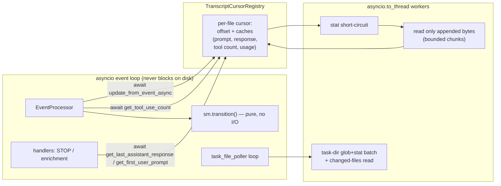

# ENH-003: Incremental Transcript Tailing & Threaded File I/O

> Status: Proposed | Date: 2026-07-06 | Related audit findings: ARC-003 (context: ARC-013/ENH-011)

## Overview

Several transcript/JSONL code paths re-read files from byte 0 — worst case a 50 MB read — *synchronously on the asyncio event loop*, stalling every WebSocket connection and poller exactly under busy-session conditions. This plan introduces per-file byte-offset cursors with cached derived values (last assistant response, first user prompt, tool-use count, latest token usage), executes all file I/O via `asyncio.to_thread`, and adds mtime/size short-circuits so polling cost is proportional to newly appended content rather than transcript size. The pattern generalizes what `transcript_poller.py` already does correctly.

## Motivation

All claims verified against current source:

- **50 MB synchronous read inside `sm.transition()`.** `backend/app/core/state_machine.py:361-366`: the sync `_handle_subagent_stop` dispatch handler calls `sm.token_tracker.count_tool_uses_from_jsonl(...)`, and `backend/app/core/token_tracker.py:147-170` implements it as a synchronous whole-file `f.read()` (line 161–162), bounded only by the 50 MB `_MAX_TRANSCRIPT_BYTES` cap (lines 28, 142–144). `transition()` runs on the event loop from `_process_event_internal` (`event_processor.py:388`). This is the audit's headline ARC-003 case.
- **Token extraction on every transition.** `state_machine.py:802`: `transition()` starts with `self.token_tracker.update_from_event(event)`; its slow path (`token_tracker.py:103-121` → `_extract_token_usage_from_jsonl`, lines 240–295) performs a synchronous 20 KB tail read plus `stat`/`exists` (`_prepare_transcript_path`, lines 123–145) — on the loop, for every event carrying a transcript path.
- **Full-file scans from byte 0, repeated.** `backend/app/core/jsonl_parser.py:36-88` (`get_last_assistant_response`) and `91-144` (`get_first_user_prompt`) iterate the entire file synchronously on each call. Verified call sites, all on async paths: `event_processor.py:730` (restore/replay loop, once per STOP event replayed), `core/handlers/conversation_handler.py:139` (every live STOP), `core/handlers/agent_handler.py:319` (`enrich_agent_from_transcript`) and `:357` (`extract_and_set_agent_speech`). A long session's STOP events repeatedly re-scan the same growing main transcript from the start.
- **Task-file poller does sync I/O in async methods.** `backend/app/core/task_file_poller.py:192-238` (`_check_for_changes`) runs `glob` (line 204) and per-file `stat` (line 214) synchronously every second per session; `_read_task_files` (lines 240–252) is `async` but does plain `open()`/`json.load` with no thread offload; and when *any* file changes, it re-reads **all** task files (line 229).
- **The correct pattern already exists in-repo.** `backend/app/core/transcript_poller.py:189-227` tracks a per-agent byte offset (`PolledAgent.file_position`), stat-short-circuits (`current_size <= position`), and reads only the appended bytes inside `asyncio.to_thread` (lines 204–213). ARC-003 explicitly names it as the model to copy.

Impact: a single large-transcript event freezes the entire backend — all WebSocket broadcasts, all pollers — for the duration of a multi-MB disk read and parse; repeated STOP events make cost quadratic in transcript length over a session's lifetime.

## Current State

Per-consumer behavior today:

| Consumer | Trigger | I/O performed | Sync on loop? |
|---|---|---|---|
| `token_tracker.update_from_event` (`state_machine.py:802`) | every event with a transcript path (incl. replay/restore) | `stat` + 20 KB tail read (`token_tracker.py:240-295`) | **Yes** |
| `token_tracker.count_tool_uses_from_jsonl` (`state_machine.py:361-366`) | every SUBAGENT_STOP | whole-file read ≤50 MB (`token_tracker.py:147-170`) | **Yes** |
| `token_tracker.extract_thinking_from_jsonl` (`token_tracker.py:172-234`) | no callers found outside `token_tracker` (grep of `app/`) | 50 KB tail read | latent |
| `jsonl_parser.get_last_assistant_response` | STOP (live: `conversation_handler.py:139`, `agent_handler.py:357`; replay: `event_processor.py:730`) | full scan from byte 0 | **Yes** |
| `jsonl_parser.get_first_user_prompt` | agent enrichment (`agent_handler.py:319`) | full scan from byte 0 (short-circuits at first match) | **Yes** |
| `task_file_poller._check_for_changes` | 1 Hz per session | `glob` + N×`stat`; on any change, re-read all N JSON files | **Yes** |
| `transcript_poller._read_new_content` | 1 Hz per subagent | offset tail read via `to_thread` | No — reference implementation |

Path-safety contract shared by all readers: `settings.translate_path(...)` (Docker host→container mapping) then `is_safe_transcript_path(...)` (confinement to `~/.claude/` + `.jsonl`), e.g. `token_tracker.py:123-145`, `jsonl_parser.py:45-51`, `transcript_poller.py:57-63`. Any new module must preserve this exactly.

### Sequencing constraints (from AUDIT.md)

- This plan **implements the ARC-003 remediation** for `state_machine.py`, `token_tracker.py`, `jsonl_parser.py`, `task_file_poller.py`, and the two handlers — and goes beyond it (incremental offsets, not just `to_thread`). ARC-003's remaining locations (`api/routes/sessions.py:37` glob, `kill_simulation`'s `Popen.wait`) are **out of scope** here; they are simple `to_thread` wraps that can land independently.
- **ARC-013 / ENH-011 (generic `BasePoller`)** will restructure `task_file_poller.py`'s skeleton. Phase 4 below only changes the *body* of `_check_for_changes`/`_read_task_files` — exactly the code that becomes the `_check(state)` hook in ENH-011 — so either landing order works with a small rebase.
- `transcript_poller.py` is intentionally untouched (already correct). Migrating it onto the shared cursor registry is a possible follow-up, noted in Risks, not planned here.

## Proposed Design

### 1. `TranscriptCursorRegistry` — one incremental reader per file

New module `backend/app/core/transcript_cursor.py`:

```python
@dataclass
class TranscriptCursor:
    path: Path                       # resolved, translated, safety-checked
    offset: int = 0                  # bytes consumed (complete lines only)
    remainder: bytes = b""           # trailing partial line awaiting its newline
    last_size: int = -1
    last_mtime_ns: int = -1
    bytes_read_total: int = 0        # instrumentation (Phase 5)
    # Derived caches, updated as lines stream through:
    first_user_prompt: str | None = None
    first_user_prompt_resolved: bool = False   # found OR file confirmed to lack one so far
    last_assistant_text: str | None = None
    tool_use_count: int = 0
    last_usage: TokenUsage | None = None       # input/output tokens + model

class TranscriptCursorRegistry:
    """Async facade over per-file cursors. All disk I/O in asyncio.to_thread."""
    def __init__(self, max_cursors: int = 128) -> None: ...

    async def poll(self, transcript_path: str) -> TranscriptCursor | None:
        """translate_path + is_safe_transcript_path; stat short-circuit;
        incremental read + parse of appended complete lines; returns the
        (updated) cursor, or None for unsafe/missing paths."""

    # Convenience accessors — each is `await poll(...)` then a cache read:
    async def get_last_assistant_response(self, path: str) -> str | None: ...
    async def get_first_user_prompt(self, path: str) -> str | None: ...
    async def get_tool_use_count(self, path: str) -> int: ...
    async def get_token_usage(self, path: str) -> TokenUsage | None: ...

    def evict(self, transcript_path: str) -> None: ...   # explicit, on session/agent end
    # LRU eviction beyond max_cursors happens inside poll().

transcript_cursors = TranscriptCursorRegistry()          # module singleton + get_/init_ helpers,
                                                         # matching the poller singleton pattern
```

`poll()` algorithm (the read/parse step runs in one `asyncio.to_thread` call):

1. **Short-circuit:** `stat` the file; if `st_size == last_size and st_mtime_ns == last_mtime_ns` → return cursor with **zero bytes read**. This makes repeated calls (every event, every replayed STOP) effectively free.
2. **Truncation/rotation:** if `st_size < offset` → reset offset/remainder/caches and rescan (matches how a rewritten transcript must be treated).
3. **Size cap:** if `st_size > _MAX_TRANSCRIPT_BYTES` (reuse the existing 50 MB constant) → log warning, mark cursor exhausted, return caches as-is (parity with today's skip behavior in `token_tracker._prepare_transcript_path`).
4. **Incremental read:** read `[offset, st_size)` in bounded chunks (4 MB per `poll` call; if more remains, the next poll continues — keeps worst-case thread time and memory bounded). Prepend `remainder`; split on `\n`; the trailing partial line becomes the new `remainder`; `offset` advances only past complete lines.
5. **Per complete line**, update caches:
   - `json.loads`; skip unparseable lines (parity with all current readers).
   - `type == "user"` / `role == "user"`: if `first_user_prompt` unresolved, apply the exact logic of `jsonl_parser.get_first_user_prompt` (text blocks only, skip tool_result-only messages, join with `\n`; `jsonl_parser.py:119-136`).
   - `type == "assistant"` / `role == "assistant"`: last text block wins → `last_assistant_text` (logic of `jsonl_parser.py:63-79`); `message.usage` present → `last_usage` (input + cache_creation + cache_read, output, model — logic of `token_tracker.py:269-288`).
   - Tool count: `line.count('"type":"tool_use"') + line.count('"type": "tool_use"')` added to `tool_use_count` — byte-for-byte parity with `token_tracker.py:164-165` (a JSONL line is complete JSON, so the pattern cannot span lines).

The line-level extraction helpers are factored as pure functions in `jsonl_parser.py` (parse-record → texts/usage) so the legacy sync functions and the cursor share one implementation.

**Cold-start cost:** the first `poll` of an existing large transcript scans it once, in a worker thread, in bounded chunks — then never again. That single scan also serves *all four* derived values, replacing today's N independent full scans.

### 2. Hoist transcript I/O out of the sync transition path

`sm.transition()` must become I/O-free. Two changes, both preserving broadcast-visible ordering (today: token update → transition mutations → `broadcast_state` at `event_processor.py:475`):

```python
# event_processor._process_event_internal, replacing the implicit I/O inside transition():
await sm.token_tracker.update_from_event_async(event, transcript_cursors)  # BEFORE transition (order parity with state_machine.py:802)
sm.transition(event)
...
if event.event_type == EventType.SUBAGENT_STOP and event.data and event.data.agent_transcript_path:
    count = await transcript_cursors.get_tool_use_count(event.data.agent_transcript_path)
    if count > 0:
        sm.tool_uses_since_compaction += count   # BEFORE broadcast_state → broadcast content unchanged
```

- `token_tracker.update_from_event_async(event, registry)`: fast path (embedded `input_tokens`/`output_tokens`, `token_tracker.py:92-101`) unchanged and synchronous-cheap; slow path awaits `registry.get_token_usage(...)` and applies the model→context-window mapping (`token_tracker.py:39-49`).
- The sync `update_from_event` is retained but reduced to the embedded-token fast path; if called with only a transcript path it logs a debug notice and does nothing (guards stragglers; per the no-semantic-search rule, grep `update_from_event` across `backend/` and `scripts/` during implementation to migrate every caller — the restore/replay loop in `event_processor.py` is a known second caller and switches to the async variant).
- `state_machine.py:361-366` loses the `count_tool_uses_from_jsonl` call (the credit moves to the processor as above); `state_machine.py:802` loses the `update_from_event` call. `transition()` becomes pure state mutation.
- Restore/replay (`_build_restored_state_machine`) awaits the async token update per replayed event; the stat short-circuit makes the repeated polls of an unchanged file free, so restore gets *faster* than today (which tail-reads per replayed event).

### 3. Migrate the JSONL parser call sites

`conversation_handler.py:139`, `agent_handler.py:319`, `agent_handler.py:357`, and `event_processor.py:730` switch from the sync `jsonl_parser` functions to `await transcript_cursors.get_last_assistant_response(...)` / `get_first_user_prompt(...)`. All four already run inside async functions, and all four currently pre-translate paths — the registry does its own translate+safety check, so call sites pass the *raw* path and drop their local translation (single responsibility; the double-translate is harmless but removed).

### 4. Task-file poller: threaded scan + per-file cache

`task_file_poller._check_for_changes` body becomes:

```python
def _scan() -> dict[str, float]:          # one to_thread call: glob + stat batch
    return {p.name: p.stat().st_mtime for p in state.task_dir.glob("*.json")}
current = await asyncio.to_thread(_scan)
changed = [n for n, m in current.items() if state.last_modified.get(n) != m]
removed = set(state.last_modified) - set(current)
if changed or removed:
    def _read_changed() -> dict[str, dict | None]:   # second to_thread call: only changed files
        ...open/json.load each changed file...
    raw = await asyncio.to_thread(_read_changed)
    # update state.todo_cache (name -> TodoItem | None), drop removed names,
    # rebuild the sorted list from cache values, invoke the callback (unchanged signature)
```

`TaskFileState` gains `todo_cache: dict[str, TodoItem | None]`. Sorting and `_convert_task_to_todo` are unchanged. Net effect: 1 Hz cost is one threaded `stat` batch; content reads happen only for files that actually changed, instead of all files whenever any changed (`task_file_poller.py:229`).

### 5. Lifecycle & bounds

- Explicit eviction: `transcript_cursors.evict(path)` on SUBAGENT_STOP (after the tool-count credit) and on SESSION_END (main transcript), wired in `event_processor.py`.
- LRU cap (default 128 cursors) covers leaked paths; each cursor holds only offsets + small strings (bubble/summary-sized), so worst-case memory is trivially bounded.

### Data flow after the change



## Implementation Phases

Each phase is independently landable and touches ≤5 files.

### Phase 1 — Cursor registry (new code only)

Tasks:
1. Create `backend/app/core/transcript_cursor.py` as designed (cursor, registry, singleton accessors, `TokenUsage` dataclass or reuse a dict shape matching `token_tracker._extract_token_usage_from_jsonl`'s return).
2. Refactor `backend/app/core/jsonl_parser.py` minimally: extract pure per-record helpers (`extract_user_prompt_texts(record)`, `extract_assistant_text(record)`) used by both the legacy sync functions and the new registry — behavior of the sync functions unchanged.
3. Create `backend/tests/test_transcript_cursor.py` (tmp_path fixtures writing real JSONL): incremental append between polls; stat short-circuit (assert `bytes_read_total` unchanged on second poll); partial-line remainder handling (write without trailing newline, then complete it); truncation reset; oversize-file skip; unsafe-path rejection; derived-value parity against the legacy functions on identical fixtures (first prompt, last response, tool count, usage incl. cache token summation and model detection); LRU eviction.

Verify: `cd backend && uv run pytest tests/test_transcript_cursor.py -q && make checkall`.

### Phase 2 — Token metrics off the transition path

Tasks:
1. `backend/app/core/token_tracker.py`: add `update_from_event_async(event, registry)`; reduce sync `update_from_event` to the embedded-token fast path (+ debug log when a transcript path is ignored); delete or thread-wrap `count_tool_uses_from_jsonl` / `_extract_token_usage_from_jsonl` bodies in favor of registry-backed equivalents (keep `extract_thinking_from_jsonl` as-is — no callers found; flag as dead-code candidate in the PR, do not delete).
2. `backend/app/core/state_machine.py`: remove the `update_from_event` call at line 802 and the `count_tool_uses_from_jsonl` block at lines 361–366.
3. `backend/app/core/event_processor.py`: await `update_from_event_async` before `sm.transition(event)` in `_process_event_internal`; add the SUBAGENT_STOP tool-count credit *before* `broadcast_state` (line 475); apply the same async token update in the restore/replay loop.
4. Update the existing backend tests that exercise token updates through `transition()` and SUBAGENT_STOP crediting (locate via `grep -rn "update_from_event\|count_tool_uses" backend/tests/`) to call/await the new seam; add an ordering test asserting the credit is visible in the `broadcast_state` payload for the same event.

Verify: `cd backend && make checkall && make test` — full suite green, including state-machine, poller, and regression suites.

### Phase 3 — JSONL parser call-site migration

Tasks:
1. `backend/app/core/handlers/conversation_handler.py`: line ~139 → `await transcript_cursors.get_last_assistant_response(transcript_path)` (drop local translate).
2. `backend/app/core/handlers/agent_handler.py`: lines ~319 and ~357 → registry accessors (drop local translate).
3. `backend/app/core/event_processor.py`: line ~730 (restore loop STOP handling) → registry accessor.
4. `backend/app/core/jsonl_parser.py`: mark the sync `get_last_assistant_response`/`get_first_user_prompt` as legacy (docstring note: kept for tests/scripts; no async-context callers remain — enforce with a grep in the PR checklist).

Verify: `cd backend && make checkall && make test`; run `make simulate` against a dev stack and confirm STOP events still produce boss speech bubbles and conversation entries, and mid-session ghost agents still get enriched names/tasks.

### Phase 4 — Task-file poller

Tasks:
1. `backend/app/core/task_file_poller.py`: threaded `_scan` batch, changed-files-only threaded read, `todo_cache` on `TaskFileState`, removed-file handling — callback signature and TodoItem conversion unchanged.
2. Update `backend/tests/` task-poller tests (locate via `grep -rln "task_file_poller\|TaskFilePoller" backend/tests/`): add a case asserting an unchanged file is not re-read when a sibling changes (count opens via monkeypatched `open`/read helper), and that deleting a task file removes its todo.

Verify: `cd backend && make checkall && make test`; live check: `make dev-tmux`, create/edit `~/.claude/tasks/<session>/*.json`, confirm whiteboard todos update within ~1 s.

### Phase 5 — Lifecycle, instrumentation, measurement

Tasks:
1. `backend/app/core/event_processor.py`: evict cursors on SUBAGENT_STOP (after credit) and SESSION_END.
2. `backend/app/core/transcript_cursor.py`: keep `bytes_read_total` and a debug-level log line per poll that read >0 bytes (path, bytes, duration).
3. Add `backend/tests/test_transcript_cursor_perf.py`: build a ~10 MB JSONL fixture; assert first poll reads ≈ file size (chunk-capped across polls), second poll reads 0 bytes, and an appended line reads only the appended bytes.
4. CHANGELOG entry (symptom → root cause → fix) and a note in the backend README's core-module list.

Verify: `cd backend && make checkall && make test`. Event-loop stall check (the headline metric): run the backend with `PYTHONASYNCIODEBUG=1` (asyncio logs any callback >0.1 s), point a synthetic SUBAGENT_STOP event (via `scripts/simulate_events.py` or a crafted POST) at a ~50 MB `.jsonl` fixture under `~/.claude/` — **before** this plan the log shows `Executing <Task ...> took N.NNN seconds`; **after**, no slow-callback warnings from event processing.

## Testing Strategy

- **Unit:** `test_transcript_cursor.py` (Phase 1) is the core suite — incremental correctness, boundary conditions (partial lines, truncation, rotation, oversize, unsafe paths), and *parity tests* pinning cursor-derived values to the legacy implementations on shared fixtures.
- **Behavioral parity:** Phase 2's broadcast-ordering test guarantees the SUBAGENT_STOP tool-use credit lands in the same broadcast as today; existing regression suites (`test_pr44_critical_regressions.py`, state-machine tests) guard the rest.
- **Poller:** changed-file-only reads and deletion handling (Phase 4).
- **Measuring the improvement:**
  - *Bytes read:* `bytes_read_total` assertions in `test_transcript_cursor_perf.py` — polling cost proportional to appended bytes, zero when unchanged.
  - *Loop stalls:* the `PYTHONASYNCIODEBUG=1` + 50 MB fixture procedure above (record before/after log excerpts in the PR).
  - *Restore latency:* time `_build_restored_state_machine` on a long recorded session (log timestamps) before/after — repeated STOP re-scans collapse to one initial scan plus free polls.

## Files to Create / Modify

| Path | Change |
|---|---|
| `backend/app/core/transcript_cursor.py` | **New** — cursor + registry, all I/O via `to_thread` (P1); instrumentation (P5) |
| `backend/tests/test_transcript_cursor.py` | **New** — core unit + parity tests (P1) |
| `backend/app/core/jsonl_parser.py` | Extract shared per-record helpers (P1); legacy notes (P3) |
| `backend/app/core/token_tracker.py` | `update_from_event_async`; sync path reduced to fast path (P2) |
| `backend/app/core/state_machine.py` | Remove I/O from `transition()` and `_handle_subagent_stop` (P2) |
| `backend/app/core/event_processor.py` | Await token update pre-transition; SUBAGENT_STOP credit pre-broadcast; replay path (P2); restore-loop parser migration (P3); cursor eviction (P5) |
| `backend/app/core/handlers/conversation_handler.py` | Registry-backed last-response lookup (P3) |
| `backend/app/core/handlers/agent_handler.py` | Registry-backed prompt/response lookups (P3) |
| `backend/app/core/task_file_poller.py` | Threaded scan/read, per-file todo cache (P4) |
| `backend/tests/` (existing token/state-machine/task-poller tests) | Seam + behavior updates (P2, P4) |
| `backend/tests/test_transcript_cursor_perf.py` | **New** — bytes-read proportionality (P5) |
| `CHANGELOG.md`, `backend/README.md` | Entry + module note (P5) |

## Risks & Mitigations

- **Behavioral drift in derived values.** The cursor computes prompt/response/count/usage with streaming logic instead of whole-file scans. Mitigation: shared per-record helpers (one parsing implementation) plus parity tests pinning cursor output to legacy output on identical fixtures, including the cache-token summation and model-window mapping.
- **`transition()` no longer updates tokens.** Any caller invoking `transition()` directly (tests, future code) silently skips transcript-based token updates. Mitigation: the sync fast path remains for embedded tokens; a debug log fires when a transcript path is ignored; implementation includes a full grep migration pass (`update_from_event`, `count_tool_uses`) per the repo's no-semantic-search rule.
- **Same-size-same-mtime rewrite defeats the short-circuit.** Mitigated by comparing `st_mtime_ns` (nanosecond granularity); a byte-identical rewrite is indistinguishable and harmless. Truncation/rotation (size decrease) triggers a full reset.
- **First poll of a huge transcript.** Bounded to 4 MB per poll in a worker thread; multi-poll catch-up spreads the initial scan. The 50 MB cap preserves today's skip semantics for pathological files.
- **Ordering regression on SUBAGENT_STOP credit.** The credit moves from inside `transition()` to just before `broadcast_state` — covered by an explicit broadcast-content test (Phase 2). All other `_handle_subagent_stop` mutations stay in the sync handler.
- **Interaction with ENH-011 (`BasePoller`).** Phase 4 edits live inside the future `_check(state)` body; whichever lands second rebases a self-contained function.
- **Cursor/`transcript_poller` duplication.** Two tailing implementations exist after this plan (the poller's event-oriented tail and the registry's derived-value tail). Accepted: the poller starts at EOF and parses different block types (`transcript_poller.py:77-79, 229-294`); unifying them is a follow-up once the registry is proven, noted for ENH-011's scope discussion.

## Acceptance Criteria

- [ ] No synchronous `open`/`read`/`glob`/`stat` remains on event-loop paths in `state_machine.py`, `token_tracker.py` (async path), `jsonl_parser` call sites (`conversation_handler.py`, `agent_handler.py`, `event_processor.py`), or `task_file_poller.py` — verified by targeted grep and code review.
- [ ] `sm.transition()` performs zero file I/O (code inspection; the two call sites at `state_machine.py:361-366` and `:802` removed).
- [ ] Second poll of an unchanged transcript reads 0 bytes; a poll after appending K bytes reads ~K bytes (automated `bytes_read_total` assertions).
- [ ] With a ~50 MB transcript fixture, processing a SUBAGENT_STOP under `PYTHONASYNCIODEBUG=1` produces no slow-callback warnings from event processing (before/after evidence recorded in the PR).
- [ ] SUBAGENT_STOP tool-use credit appears in the same `broadcast_state` payload as today (ordering test).
- [ ] Derived-value parity tests pass: first user prompt, last assistant response, tool-use count, and token usage (incl. cache tokens + model window) match the legacy implementations on shared fixtures.
- [ ] Task-file poller re-reads only changed files; deleting a task file removes its todo (tests).
- [ ] Cursor registry is bounded: LRU cap enforced, eviction on SUBAGENT_STOP/SESSION_END wired (test + code review).
- [ ] `cd backend && make checkall && make test` fully green; `make simulate` end-to-end smoke shows unchanged bubbles, conversation entries, todos, and context-utilization gauge.

## Estimated Effort

| Phase | Effort |
|---|---|
| 1 — Cursor registry + tests | M |
| 2 — Token metrics hoist | M |
| 3 — Parser call-site migration | S |
| 4 — Task-file poller | S |
| 5 — Lifecycle + measurement | S |
| **Total** | **M–L** |
