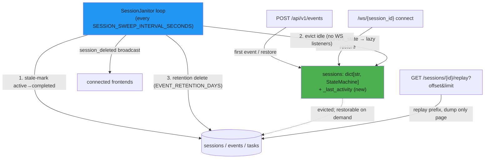

# ENH-004: Session Lifecycle & Memory Management

> Status: Proposed | Date: 2026-07-06 | Related audit findings: ARC-015 (primary); coordinates with ARC-011/ARC-012 (event_processor layering), ARC-023 (main.py size), ARC-003/ENH-003 (restore-path I/O cost)

## Overview

The backend holds one `StateMachine` per session in memory forever, persists `EventRecord` rows forever, and serves replay as a single response containing a full per-event state dump. This plan adds (1) idle/LRU eviction of in-memory state machines — safe because the event-sourcing design already restores any session from the DB on demand, (2) a periodic janitor task that generalizes today's one-shot startup reaper and adds configurable event-record retention, and (3) a paginated replay endpoint whose memory cost is O(page) instead of O(session history).

## Motivation

All of the following were verified directly in the code on 2026-07-06:

- **The in-memory registry never shrinks on its own.** `EventProcessor.__init__` declares `self.sessions: dict[str, StateMachine] = {}` (`backend/app/core/event_processor.py:165`). Entries are added at `event_processor.py:379` (first event for a session) and `event_processor.py:787` (lazy restore on WebSocket connect via `get_current_state`, `event_processor.py:271-279`, triggered from `backend/app/main.py:318`). The only removals are `remove_session` (`event_processor.py:250-264`, called solely by the `DELETE /sessions/{id}` route) and `clear_all_sessions` (`event_processor.py:266-269`, called solely by the clear-database route). A long-lived server that has seen N sessions holds N state machines — each with up to 500 history entries and 500 conversation entries — until a user manually deletes them.
- **The "reaper" is a one-shot startup pass, not a lifecycle mechanism.** `_reap_stale_sessions` (`backend/app/main.py:191-208`) runs exactly once from `lifespan` (`main.py:171`), uses a **hardcoded** 48-hour cutoff (`main.py:197`), and only flips DB `SessionRecord.status` from `"active"` to `"completed"`. It never touches `event_processor.sessions` or any other in-memory structure, and it is completely untested (zero matches for "reap" in `backend/tests/`).
- **EventRecords are never deleted** except when the same session restarts (SESSION_START deletes that session's prior events, `event_processor.py:871-874`) or a user explicitly deletes/clears. There is no retention policy, and `EventRecord.session_id` has **no index** (`backend/app/db/models.py:42-53`), so the restore/replay query `WHERE session_id = ? ORDER BY timestamp` degrades as the events table grows.
- **Replay materializes everything at once.** `GET /sessions/{session_id}/replay` (`backend/app/api/routes/sessions.py:402-470`) loads every `EventRecord` for the session with no limit (`sessions.py:412-418`), replays them through a throwaway `StateMachine`, and appends a **full `sm.to_game_state(...).model_dump(mode="json", by_alias=True)` snapshot per event** (`sessions.py:442-443, 463`) into one list returned in one response — O(events × full-state-size) in memory and on the wire.
- **Sibling registries leak alongside.** `clear_all_sessions` does not clear `self.orchestrators` (`event_processor.py:166`) or `self._beads_sessions` (`event_processor.py:171`, discarded only on SESSION_END at `event_processor.py:470`), and `GitService._last_status` (`backend/app/services/git_service.py:27`) is only emptied by `clear()`, never by per-session removal.

## Current State

Data flow today:

1. **Ingest**: `POST /api/v1/events` → `EventProcessor.process_event` → `_process_event_internal`. For an unknown session it first restores from the DB (`_build_restored_state_machine`, `event_processor.py:644-775` — loads *all* EventRecords ordered by `timestamp.asc()` at `656-662`, replays each through `sm.transition`, rebuilds conversation entries including transcript file reads at `727-758`), then inserts under `_sessions_lock` (`event_processor.py:377-386`).
2. **Activity tracking**: DB-only. `_persist_event` upserts `SessionRecord` with `on_conflict_do_update(..., set_={"updated_at": now})` (`event_processor.py:824-837`), so `SessionRecord.updated_at` is bumped on every event. **No in-memory last-activity timestamp exists anywhere.**
3. **WebSocket connect**: `/ws/{session_id}` (`main.py:304-349`) calls `get_current_state` (`main.py:318`), which lazily restores the session into the registry; disconnect removes the git-service entry (`main.py:349`) but never evicts the StateMachine.
4. **Locking**: one `asyncio.Lock` named `_sessions_lock` (`event_processor.py:167`), held in `remove_session` (256), `clear_all_sessions` (268), registry insert (377-386), `build_overview_snapshot` (607), `_restore_session` (786), and passed into `broadcast_overview_state(self.sessions, self._sessions_lock)` (580). The Command Center overview is built **from the in-memory registry only**.
5. **DB layer**: fully async SQLAlchemy + aiosqlite, WAL + `busy_timeout=5000` set per-connection (`backend/app/db/database.py:29-40`), `StaticPool` engine (`database.py:21-26`). Schema migration is an inline PRAGMA-based column-adder, `_migrate_schema` (`main.py:129-159`).
6. **Settings**: `backend/app/config.py` `Settings(BaseSettings)` with `model_config = SettingsConfigDict(env_file=".env")` and **no env prefix** (`config.py:64`) — env vars map 1:1 to UPPERCASE field names; cached via `@lru_cache get_settings()` (`config.py:87-89`).
7. **Replay consumers**: only `backend/tests/test_simulation_pipeline.py:52-54` (helper `get_replay_state`, used at lines 577, 586, 607, 626, 653, 677, 695). Grep-verified: no `"/replay"` fetch exists anywhere in `frontend/src` — the frontend's "replay" strings in `gameStore.ts` / `useWebSocketEvents.ts` / `useSessionSwitch.ts` are client-side replay UI state, not consumers of this endpoint. Changing the response shape is therefore low-risk.

## Proposed Design

Three cooperating pieces, all configurable through `Settings` (env vars map 1:1 to field names):

| New setting | Default | Meaning |
|---|---|---|
| `SESSION_IDLE_TTL_SECONDS` | `3600` | Evict a **completed** session's in-memory StateMachine after this much inactivity |
| `MAX_RESIDENT_SESSIONS` | `50` | Hard LRU cap on resident StateMachines (pressure valve; may evict idle *active* sessions) |
| `SESSION_SWEEP_INTERVAL_SECONDS` | `300` | How often the janitor loop runs |
| `STALE_SESSION_HOURS` | `48` | Replaces the hardcoded 48h in `_reap_stale_sessions` |
| `EVENT_RETENTION_DAYS` | `0` | `0` = keep forever (current behavior). `>0` = delete completed sessions (and their events/tasks) whose `updated_at` is older |

### 1. In-memory activity tracking + eviction (EventProcessor)

```python
# event_processor.py — additions
class EventProcessor:
    def __init__(self) -> None:
        ...
        self._last_activity: dict[str, datetime] = {}  # guarded by _sessions_lock

    def _touch(self, session_id: str) -> None:
        self._last_activity[session_id] = datetime.now(UTC)

    async def evict_idle_sessions(
        self,
        *,
        idle_ttl: timedelta,
        max_resident: int,
        has_listeners: Callable[[str], bool],
        session_status: Callable[[str], Awaitable[str | None]],
    ) -> list[str]:
        """Evict idle StateMachines. Never evicts a session with live WebSocket
        listeners. Completed sessions evict after idle_ttl; active sessions are
        evicted (oldest first) only to satisfy max_resident. Returns evicted ids.
        """
```

`_touch` is called wherever the registry is written or read on behalf of a session: registry insert (`event_processor.py:379`), `_restore_session` (787), and `get_current_state` (271-279). Eviction shares an internal `_evict_from_memory(session_id)` helper with `remove_session` that pops `sessions`, `_last_activity`, `_beads_sessions`, removes the session from its `RoomOrchestrator` (dropping the orchestrator if empty, mirroring `event_processor.py:258-263`), and calls the existing public `task_file_poller.stop_polling(session_id)` / `beads_poller.stop_polling(session_id)` (both pop-if-present: `task_file_poller.py:148-151`, `beads_poller.py:199-201`). The transcript poller needs nothing — it is keyed by agent id with its own zombie timeout (`ZOMBIE_SUBAGENT_TIMEOUT_SECONDS = 90`), which expires long before any idle TTL.

**Eviction is transparent by construction**: the very next event for an evicted session hits the existing restore path at `event_processor.py:373-379`, and the next WebSocket connect hits `get_current_state` → `_restore_session`. No new restore code is needed — that is the point of the event-sourced design.

`has_listeners` and `session_status` are **injected callables** (wired in `main.py` from `manager.active_connections` and a small DB query) rather than new imports, so this change does not deepen the ARC-011 layering inversion.

### 2. Session janitor (new `backend/app/core/session_janitor.py`)

A single periodic task owning all lifecycle maintenance, replacing the one-shot reaper call at `main.py:171` (and shrinking `main.py`, in the direction ARC-023 wants):

```python
class SessionJanitor:
    def __init__(
        self,
        processor: EventProcessor,
        *,
        has_listeners: Callable[[str], bool],
        notify_deleted: Callable[[str], Awaitable[None]] | None = None,
    ) -> None: ...

    def start(self) -> None: ...          # creates the asyncio task
    async def stop(self) -> None: ...     # cancels AND awaits it (unlike ARC-013's pollers)
    async def run_once(self) -> JanitorReport: ...  # the testable unit
```

`run_once()` performs, in order:
1. **Stale-mark** — the existing `UPDATE sessions SET status='completed' WHERE status='active' AND updated_at < cutoff` (logic moved verbatim from `main.py:191-208`), with `STALE_SESSION_HOURS` instead of the hardcoded 48.
2. **Evict** — `processor.evict_idle_sessions(...)` per the rules above.
3. **Retain** — when `EVENT_RETENTION_DAYS > 0`: select completed sessions with `updated_at < cutoff`, then delete rows explicitly in the same order as the existing delete route (`TaskRecord`, `EventRecord`, `SessionRecord` — `sessions.py:553-555`; explicit deletes because the ORM `cascade="all, delete-orphan"` on `SessionRecord.events` at `models.py:37-39` does not apply to bulk `delete()` statements), evict them from memory via `remove_session`, and invoke `notify_deleted(session_id)` so connected frontends receive the same `session_deleted` broadcast the manual route sends (`sessions.py:561-567`).

`lifespan` starts the janitor after the DB is ready and stops it during shutdown next to `event_processor.shutdown()` (`main.py:186`).

### 3. DB index for the restore/replay hot path

Add a composite index to `EventRecord` (`models.py`): `Index("ix_events_session_id_timestamp", "session_id", "timestamp")` via `__table_args__`. For existing databases, `_migrate_schema` (`main.py:129-159`) gains `CREATE INDEX IF NOT EXISTS ix_events_session_id_timestamp ON events (session_id, timestamp)`. New databases get it from `create_all`.

### 4. Paginated replay

```python
class ReplayPage(BaseModel):
    total: int      # total events in the session
    offset: int
    limit: int
    entries: list[ReplayEntry]  # existing shape: {"event": ReplayEvent, "state": dict}

@router.get("/{session_id}/replay")
async def get_session_replay(
    session_id: str,
    offset: int = Query(0, ge=0),
    limit: int = Query(200, ge=1, le=1000),
    db: ...,
) -> ReplayPage: ...
```

The endpoint still replays events `0..offset+limit` sequentially through a fresh local `StateMachine` (state is cumulative, so the prefix must be applied), but it only calls `model_dump` and accumulates `ReplayEntry` objects for indices in `[offset, offset+limit)`. Memory and payload become O(limit × state-size); prefix CPU stays O(offset) — acceptable for the sizes involved, and a future snapshot cache can remove it if ever needed. Unknown-event skipping (`sessions.py:428-435`) is preserved; skipped events do not consume result indices (they were never emitted as entries before either).



## Implementation Phases

Each phase is independently landable and touches ≤5 files.

### Phase 1 — Settings, activity tracking, DB index
1. `backend/app/config.py`: add the five settings from the table above (typed, defaulted; env vars map 1:1 since there is no prefix — `config.py:64`).
2. `backend/app/db/models.py`: add `__table_args__ = (Index("ix_events_session_id_timestamp", "session_id", "timestamp"),)` to `EventRecord`.
3. `backend/app/main.py`: add `CREATE INDEX IF NOT EXISTS ix_events_session_id_timestamp ON events (session_id, timestamp)` to `_migrate_schema`; replace the hardcoded `timedelta(hours=48)` at `main.py:197` with `settings.STALE_SESSION_HOURS`.
4. `backend/app/core/event_processor.py`: add `_last_activity` dict + `_touch()`; call it at the registry insert (~line 379), in `_restore_session` (~787), and in `get_current_state` (~271-279); pop it in `remove_session` and clear it in `clear_all_sessions`. While in `clear_all_sessions`, also clear `self.orchestrators` and `self._beads_sessions` (verified leak).
5. `backend/tests/test_session_lifecycle.py` (new): activity timestamp is set on event processing, restore, and state fetch; cleared on removal; `clear_all_sessions` empties all four structures; migration creates the index on a legacy DB file.

**Verify:** `cd /Users/probello/Repos/claude-office/backend && make checkall && uv run pytest tests/test_session_lifecycle.py -v`

### Phase 2 — Janitor task with eviction + stale-mark
1. `backend/app/core/session_janitor.py` (new): `SessionJanitor` with `start/stop/run_once` as sketched; `stop()` cancels **and awaits** the task; every sweep wrapped in try/except with logging so one failure never kills the loop.
2. `backend/app/core/event_processor.py`: add `evict_idle_sessions(...)` and the shared `_evict_from_memory(...)` helper; refactor `remove_session` to use it (behavior unchanged: DB-route callers still get orchestrator cleanup).
3. `backend/app/main.py`: delete `_reap_stale_sessions` (moved into the janitor); construct + start the janitor in `lifespan` with `has_listeners=lambda sid: bool(manager.active_connections.get(sid))` and `notify_deleted` wired to the existing broadcast helper; stop it in shutdown next to `event_processor.shutdown()` (`main.py:186`).
4. `backend/tests/test_session_lifecycle.py`: eviction tests — completed+idle evicts; live-WS session never evicts; active session survives TTL but yields to `MAX_RESIDENT_SESSIONS` LRU pressure; evicted session transparently restores on next event (assert state equivalence via `to_game_state`); stale-mark flips DB status (first-ever coverage of the reaper logic).

**Verify:** `cd /Users/probello/Repos/claude-office/backend && make checkall && uv run pytest tests/test_session_lifecycle.py -v` — then `make simulate` from the repo root against a running dev backend and confirm sessions still restore after forced eviction (set `SESSION_IDLE_TTL_SECONDS=1 SESSION_SWEEP_INTERVAL_SECONDS=2`).

### Phase 3 — Event-record retention
1. `backend/app/core/session_janitor.py`: add the retention step (`EVENT_RETENTION_DAYS > 0` gate; explicit `TaskRecord`/`EventRecord`/`SessionRecord` deletes; `remove_session` + `notify_deleted` per reaped id; log a summary line with counts).
2. `backend/tests/test_session_lifecycle.py`: retention deletes only completed-and-old sessions; `EVENT_RETENTION_DAYS=0` deletes nothing; deleted session ids are broadcast; rows in all three tables are gone.

**Verify:** `cd /Users/probello/Repos/claude-office/backend && make checkall && uv run pytest tests/test_session_lifecycle.py -v`

### Phase 4 — Paginated replay
1. `backend/app/api/routes/sessions.py`: convert `get_session_replay` (`sessions.py:402-470`) to the `ReplayPage` shape with `offset`/`limit` query params as sketched; fetch `total` via `select(func.count())` before replaying.
2. `backend/tests/test_simulation_pipeline.py`: update the `get_replay_state` helper (`lines 52-54`) to read `response.json()["entries"][-1]["state"]` (request with `limit=1000`; all pipeline scenarios are well under 1000 events).
3. `backend/tests/test_session_lifecycle.py` (or `test_api.py`): pagination tests — `total` correct; page 2 states equal the corresponding slice of a full replay; `limit` clamped at 1000; empty session → `total=0, entries=[]`.

**Verify:** `cd /Users/probello/Repos/claude-office/backend && make checkall && uv run pytest tests/test_simulation_pipeline.py tests/test_session_lifecycle.py -v`

## Testing Strategy

- **Unit**: all janitor logic is reachable via `run_once()` with injected callables and a test DB — no sleeping, no real task needed. Time control via injected `now: Callable[[], datetime]` on the janitor (default `datetime.now(UTC)`), so idle/stale/retention cutoffs are tested deterministically.
- **Restore-equivalence property**: process a scripted event sequence, snapshot `to_game_state()`, evict, send one more event, and assert the resulting state equals processing the full sequence on a never-evicted processor. This is the core safety guarantee of eviction.
- **Memory measurement**: a test drives 100 short sessions through the processor and asserts `len(event_processor.sessions) <= MAX_RESIDENT_SESSIONS` after `run_once()`. For manual profiling, run the backend with `SESSION_IDLE_TTL_SECONDS=60`, drive `make simulate` repeatedly, and compare RSS (`ps -o rss= -p <pid>`) and `len(ep.sessions)` (exposed on the existing debug logging) before/after — expect a plateau instead of monotonic growth.
- **Query performance**: `EXPLAIN QUERY PLAN SELECT * FROM events WHERE session_id=? ORDER BY timestamp` in a test asserts the new index is used (`USING INDEX ix_events_session_id_timestamp`).
- **Replay payload**: assert page response size is bounded — serialize `ReplayPage` for a 500-event session with `limit=50` and confirm it is an order of magnitude smaller than the pre-change full response.
- **Regression**: full backend suite (`uv run pytest`) — especially `test_pr44_critical_regressions.py` (restore path) and `test_simulation_pipeline.py` (replay consumers).

## Files to Create / Modify

| Path | Change |
|---|---|
| `backend/app/config.py` | Add 5 lifecycle settings (Phase 1) |
| `backend/app/db/models.py` | Composite index on `EventRecord(session_id, timestamp)` (Phase 1) |
| `backend/app/main.py` | Index migration; settings-driven cutoff; then janitor wiring replaces `_reap_stale_sessions` (Phases 1–2) |
| `backend/app/core/event_processor.py` | `_last_activity` + `_touch`; `evict_idle_sessions` + `_evict_from_memory`; `clear_all_sessions` leak fixes (Phases 1–2) |
| `backend/app/core/session_janitor.py` | **New** — periodic stale-mark / evict / retention loop (Phases 2–3) |
| `backend/app/api/routes/sessions.py` | Paginated `ReplayPage` replay endpoint (Phase 4) |
| `backend/tests/test_session_lifecycle.py` | **New** — lifecycle, eviction, retention, pagination tests (all phases) |
| `backend/tests/test_simulation_pipeline.py` | Update `get_replay_state` helper for the new shape (Phase 4) |

## Risks & Mitigations

- **Eviction races with in-flight processing.** `_process_event_internal` restores *outside* the lock and inserts under it (`event_processor.py:373-386`); an eviction between those steps is simply overwritten by the insert, and a handler holding a popped `StateMachine` reference finishes harmlessly (the object stays alive; the next event restores from the DB, which already has everything persisted). Mitigation: eviction takes `_sessions_lock`; add a regression test interleaving evict + concurrent event.
- **Command Center overview is built from the in-memory registry** (`build_overview_snapshot`, `event_processor.py:607`), so evicted sessions disappear from the overview. Mitigation: by design only *completed* sessions evict on TTL, active ones only under LRU pressure with a generous `MAX_RESIDENT_SESSIONS=50` default; document the behavior in the settings docstrings and README env table.
- **Restore cost is O(full event log) including transcript reads** (`event_processor.py:727-758`) — an aggressive TTL turns that cost recurrent. Mitigation: conservative defaults (1h TTL, 50 resident); the Phase-1 index cuts the DB portion; ENH-003 (threaded/incremental transcript I/O) removes the event-loop stall independently — note the interaction, don't couple the plans.
- **Retention deletes user data.** Default `EVENT_RETENTION_DAYS=0` preserves current behavior exactly; deletion is restricted to `status == "completed"` rows and logs what it removed; broadcast keeps connected UIs consistent.
- **File-conflict pressure**: `event_processor.py` is the audit's highest-traffic file (ARC-002, ARC-011, ARC-012, SEC-003 all touch it). Mitigation: keep the diffs additive and surgical (new methods, one dict, no dispatch-chain changes); re-read the file before each phase's edits; land phases as separate commits/PRs.
- **Bulk `UPDATE`/`DELETE` with aiosqlite under WAL** can contend with event writes. Mitigation: `busy_timeout=5000` is already set per connection (`database.py:29-40`); janitor batches are small and infrequent (5-minute cadence).

## Acceptance Criteria

- [ ] `Settings` exposes `SESSION_IDLE_TTL_SECONDS`, `MAX_RESIDENT_SESSIONS`, `SESSION_SWEEP_INTERVAL_SECONDS`, `STALE_SESSION_HOURS`, `EVENT_RETENTION_DAYS` with the defaults above, overridable via env vars.
- [ ] With `SESSION_IDLE_TTL_SECONDS=1`, a completed session with no WebSocket listeners is removed from `event_processor.sessions` within one sweep, and its orchestrator/beads/poller/activity entries are removed with it.
- [ ] A session with a connected `/ws/{session_id}` client is never evicted regardless of idle time.
- [ ] After eviction, the next event or WebSocket connect restores the session and `to_game_state()` equals the never-evicted baseline (automated test).
- [ ] `len(event_processor.sessions)` never exceeds `MAX_RESIDENT_SESSIONS` after a sweep (automated test with 100 sessions).
- [ ] The stale-mark pass runs periodically (not just at startup) and respects `STALE_SESSION_HOURS`; it has test coverage (currently zero).
- [ ] With `EVENT_RETENTION_DAYS=30`, completed sessions older than 30 days lose their `events`/`tasks`/`sessions` rows and a `session_deleted` broadcast is sent; with the default `0`, nothing is deleted.
- [ ] `EXPLAIN QUERY PLAN` for the restore query shows `ix_events_session_id_timestamp` in use.
- [ ] `GET /sessions/{id}/replay?offset=100&limit=50` returns `{total, offset, limit, entries}` with exactly the 50 correct cumulative states; `entries` for a paged request never exceeds `limit`.
- [ ] `cd backend && make checkall` passes and the full backend test suite (`uv run pytest`) is green.

## Estimated Effort

| Phase | Effort |
|---|---|
| Phase 1 — settings, activity tracking, index | S |
| Phase 2 — janitor + eviction | M |
| Phase 3 — retention sweep | S |
| Phase 4 — paginated replay | M |
