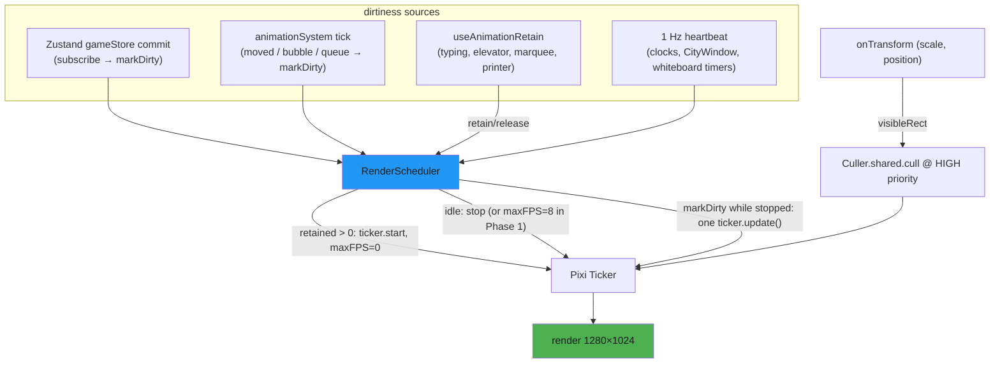

# ENH-005: Pixi Rendering Optimizations (Culling, Dirty Flags, Atlases)

> Status: Proposed | Date: 2026-07-06 | Related audit findings: ARC-006 (complementary — this plan is the render-layer counterpart to ENH-001's state-layer fix); touches files flagged in ARC-026 (StrictMode/HMR singletons) and QA-016 (OfficeGame.tsx size)

## Overview

The office renders continuously even when nothing on screen changes: Pixi's default ticker and the animation system's custom rAF loop both run unconditionally, 25 sprite textures load as 25 individual PNGs, and the renderer has no notion of what is visible when the user zooms. This plan introduces an on-demand render scheduler (dirty flags + activity handles) that drives idle CPU to near-zero, consolidates the sprite set into a build-time texture atlas to cut texture binds and HTTP requests, and adds zoom-aware culling for the zoomed-in case. It deliberately does **not** restructure how positions flow through Zustand — that is ENH-001 (ARC-006); the two land independently.

## Motivation

All of the following were verified directly in the code on 2026-07-06:

- **Two always-on render loops.** The `@pixi/react` `Application` (`frontend/src/components/game/OfficeGame.tsx:328-340`) never overrides `autoStart`, so Pixi's ticker renders the full 1280×1024 scene every frame forever. Independently, `AnimationSystem.tick` (`frontend/src/systems/animationSystem.ts:142-157`) re-schedules `requestAnimationFrame` unconditionally; with zero agents moving it still iterates every agent per frame and calls `updateAgentObstacle()` + `collisionManager.updatePosition()` for path-less agents (`animationSystem.ts:163-207`, `167-172`), and `checkQueueAdvancement` runs an `Array.from(store.agents.values()).some(...)` per frame while the boss is in use (`animationSystem.ts:393`). A dashboard users leave open all day burns CPU/GPU around the clock.
- **A grep across `frontend/src` for `cullable`, `renderable`, `cacheAsBitmap`, `autoStart`, `ticker.stop`, `.render()` returns zero Pixi-related hits** — no culling, no on-demand rendering, no ticker control exists today.
- **25 individual textures, no atlas.** `useOfficeTextures.ts` `TEXTURE_PATHS` maps 25 keys to 25 separate PNGs (`frontend/src/hooks/useOfficeTextures.ts:55-81`), loaded one `Assets.load` per path (`useOfficeTextures.ts:125-127`). `frontend/public/sprites/` holds exactly those 25 PNGs, 2.0 MB total, and `find -name "*.json"` confirms no spritesheet manifest exists anywhere. Every distinct texture is a potential batch break and a separate HTTP fetch.
- **Zoom is invisible to Pixi.** Pan/zoom is a DOM/CSS transform via `react-zoom-pan-pinch` (`OfficeGame.tsx:302-321`, `minScale=1 maxScale=3`); Pixi always renders the entire scene even when the user is zoomed 3× into one corner.
- **Per-frame React state churn inside the ticker.** `AgentArmsComponent` calls `setTypingTime` (a React setState) on every Pixi tick while an agent types (`frontend/src/components/game/AgentSprite.tsx:268-274`); `BossSprite.tsx:212-218` does the same. Elevator (`Elevator.tsx:60-77`), marquees — one per occupied desk (`MarqueeText.tsx:60-79`), and the printer (`PrinterStation.tsx:55-66`) each run their own rAF+setState loops.

One scoping correction to `ENHANCEMENTS.md`'s wording: **there are no "off-screen floors" to cull.** Exactly one `OfficeGame` (one Pixi canvas) is mounted at a time; floor identity is data-only (`floorId` from `useNavigationStore`, `OfficeGame.tsx:218-225`; `FloorView.tsx:142` mounts the single canvas; `BuildingView.tsx` is pure DOM). Culling value therefore concentrates on the zoomed-in case, and the dominant win is on-demand rendering.

## Current State

- **Application setup**: `@pixi/react` 8.0.5 over `pixi.js` 8.19.0 (`frontend/package.json:16,22`; lockfile-exact). `Application` at `OfficeGame.tsx:328-340` with `width=1280 height=1024` (`frontend/src/constants/canvas.ts:6-12`), `autoDensity`, `resolution=devicePixelRatio`, `onInit={(app) => { appRef.current = app; }}`, remount key `pixi-app-${hmrVersion}`. Components registered via `extend({ Container, Text, Graphics, Sprite })` (`OfficeGame.tsx:98`). A **second, separate** `Application` exists in `CommandCenterCanvas.tsx:118-126` (same dimensions, no `onInit`), mounted only in command view.
- **Scene contents** (`OfficeGame.tsx:345-741`): `OfficeBackground` — 104 individual floor-tile sprites (13×8 grid, per-tile rotation/tint; `OfficeBackground.tsx:75-116`) plus one walls Graphics; ~10 furniture/decoration containers; a y-sorted container (`sortableChildren`, line 464) holding desk chairs and agent capsules; desk surfaces (~5-6 display objects per desk, desk count from `OfficeGame.tsx:257-259`); then arms, headsets, boss, labels, overlays, and bubbles layers.
- **Agent rendering**: agents are procedurally drawn Graphics capsules — `drawAgent(g, color)` at `AgentSprite.tsx:54-75`, rendered via `<pixiGraphics draw>` inside a container positioned from `agent.currentPosition` (`AgentSprite.tsx:208-215`). **No sprite sheets or `AnimatedSprite` are used in game code** (the character-sheet PNGs referenced by the sprite-debug tool do not exist in `public/sprites/`). All agent-related components are `memo`-wrapped (`AgentSprite.tsx:314,340,370,372`).
- **Render-triggering data flow**: `OfficeGame` subscribes to the whole agents Map (`OfficeGame.tsx:204`) and runs six `Array.from(agents.values()).filter(...)` passes per render (lines 489, 529, 541, 635, 649 — with a nested O(n) parent `find` at 699-701 — and 717). While any agent walks, `updateAgentPosition` store writes (`animationSystem.ts:191`) re-render all of this every frame. That store-write problem is ENH-001's scope; this plan's scheduler only needs to know *when* those commits happen.
- **Loading**: `useOfficeTextures` is consumed by both canvases (`OfficeGame.tsx:188`, `CommandCenterCanvas.tsx:54`); `Assets` caches by URL so textures are shared. Load errors are swallowed and components fall back to Graphics (`useOfficeTextures.ts:139-142`).
- **Tooling**: vitest only (no Playwright; `frontend/package.json:11`); existing tests never touch `OfficeGame`/`animationSystem`/`AgentSprite`. `frontend/Makefile` `checkall` runs fmt, lint, typecheck, build, then tests.

## Proposed Design

### 1. Render scheduler (new `frontend/src/systems/renderScheduler.ts`)

One module-level singleton (matching the project's existing singleton + HMR-cleanup pattern) that owns render policy for a bound Pixi `Application`:

```ts
export type IdleMode = "throttle" | "stop";

export class RenderScheduler {
  bind(app: Application): () => void;   // returns unbind fn (HMR/remount safe)
  markDirty(): void;                    // one-shot: coalesced single render
  retain(handle: string): void;         // continuous animation begins (typing, tween, marquee)
  release(handle: string): void;        // continuous animation ends
  setIdleMode(mode: IdleMode): void;    // "throttle" (Phase 1) → "stop" (Phase 3)
  readonly stats: RenderStats;          // renders/sec, retained handles, draw calls (dev)
}
export const renderScheduler = new RenderScheduler();

// React helpers
export function useAnimationRetain(handle: string, active: boolean): void; // effect w/ guaranteed release
```

Semantics:
- **Active** (retained handles > 0): ticker runs normally (`ticker.maxFPS = 0`, started).
- **Idle, `"throttle"` mode**: `app.ticker.maxFPS = 8`. Safe interim state — everything still animates, at ~87% less render work.
- **Idle, `"stop"` mode**: `app.ticker.stop()`. `markDirty()` schedules one coalesced `app.ticker.update(performance.now())` via rAF (running the full tick — `useTick` consumers + render — exactly once). A **1 Hz heartbeat** (`setInterval` calling `ticker.update` while stopped) catches components that update via their own timers *without* store commits — the wall/digital clocks (`WallClock.tsx:21`, `DigitalClock.tsx:21`, 1 s intervals), `CityWindow.tsx:135-154`, and the whiteboard-mode intervals (`TodoListMode.tsx:68`, `StonksMode.tsx:23`, `NewsTickerMode.tsx:35`) — **without touching any of those files**: their setState updates the Pixi nodes through React, and the next heartbeat presents it. 1 render/sec of a static scene is effectively idle.

Dirtiness sources (belt and suspenders, so ENH-001 landing before or after does not matter):
- A single `useGameStore.subscribe(() => renderScheduler.markDirty())` registered at bind time — any game-state commit (agents, bubbles, whiteboard, connection) triggers exactly one scheduled render.
- `animationSystem` calls `markDirty()` from its tick only when it actually moved an agent, advanced a queue, or expired a bubble. (Post-ENH-001, when positions are written imperatively to Pixi objects instead of the store, this direct path keeps movement rendering correct.)

Continuous-animation call sites use `useAnimationRetain`: `AgentArms`/`BossSprite` while `isTyping`, `Elevator` during its 500 ms door tween, `MarqueeText` while scrolling, `PrinterStation` while printing.

### 2. Animation-loop idle work reduction (`animationSystem.ts`)

Within the existing loop (no ownership changes — that is ARC-004/ENH-001 territory):
- Skip the per-frame `updateAgentObstacle()`/`collisionManager.updatePosition()` calls for agents whose position did not change this frame (`animationSystem.ts:167-172`).
- Throttle `checkQueueAdvancement` (`animationSystem.ts:393` scan) to every 150 ms instead of every frame.
- Report movement/bubble/queue changes to `renderScheduler.markDirty()`.

### 3. Texture atlas (build-time)

A ~150-line Node script (`frontend/scripts/build-atlas.mjs`, using `sharp` as a devDependency) shelf-packs the 25 PNGs from `public/sprites/` into `public/sprites/atlas.png` + `public/sprites/atlas.json` in Pixi's standard spritesheet format (frame names = existing file basenames). It asserts the packed size fits 2048×2048 (falls back to 4096 with a warning; fails loudly otherwise). Wired as `bun run build-atlas`, invoked from `prebuild`; generated files are gitignored.

`useOfficeTextures.ts` changes to: try `Assets.load("/sprites/atlas.json")` first and resolve each `TEXTURE_PATHS` key to `sheet.textures[basename]`; on any failure (atlas not built — e.g. plain `bun dev`), fall back to the existing 25 individual `Assets.load` calls. Both canvases benefit since they share the hook.

Honest expectation-setting: agent capsules are **Graphics** interleaved with chair **Sprites** in the y-sorted container, so batches still break at Graphics↔Sprite boundaries. The atlas removes texture-switch batch breaks and texture binds among the ~130+ sprites (104 floor tiles already share one texture; desk surfaces/furniture/accessories are where the wins are), and collapses 25 HTTP fetches into 2. Converting capsules to atlas frames is a possible follow-up, not in scope.

### 4. Zoom-aware culling

`react-zoom-pan-pinch`'s `onTransform` (already handled at `OfficeGame.tsx:302-321`) reports `scale`, `positionX`, `positionY`. The visible sub-rect in scene coordinates is `(-positionX/scale, -positionY/scale, 1280/scale, 1024/scale)`. The scheduler stores this rect and, when `scale > 1`, runs `Culler.shared.cull(app.stage, visibleRect)` (pixi.js v8 built-in) in a ticker listener registered at `UPDATE_PRIORITY.HIGH` so it executes before the Application's render callback. Heavy leaf containers (agent sprites, arms, headsets, labels, overlays, desk chairs/surfaces, bubbles) get `cullable` set. At `scale === 1` the rect equals the full canvas and culling is a no-op — zero regression risk for the default view.



## Implementation Phases

Each phase is independently landable and touches ≤5 files.

### Phase 1 — Scheduler core (throttle mode) + idle-work reduction + instrumentation
1. `frontend/src/systems/renderScheduler.ts` (new): `RenderScheduler` as sketched, default `IdleMode = "throttle"`; `bind()` returns an unbind function and tolerates rebinding (the `pixi-app-${hmrVersion}` remount key at `OfficeGame.tsx:328` means bind/unbind must be idempotent); register the module in the existing HMR-cleanup pattern. Include `stats`: renders in the last second, currently retained handles, and a dev-only draw-call counter that wraps `gl.drawElements`/`gl.drawArrays` on `app.renderer.gl`, exposed as `window.__officeRenderStats` when `debugMode` is on.
2. `frontend/src/systems/renderScheduler.test.ts` (new): pure vitest tests against a stub app/ticker (`start/stop/update/maxFPS` spies) — retain/release transitions, markDirty coalescing (N calls → 1 update), heartbeat behavior in stop mode, unbind cleanup.
3. `frontend/src/components/game/OfficeGame.tsx`: `onInit` also calls `renderScheduler.bind(app)`; unmount cleanup (lines 194-201) calls the unbind fn.
4. `frontend/src/systems/animationSystem.ts`: markDirty on actual movement/bubble/queue changes; skip obstacle/collision updates for agents that did not move (`167-172`); throttle `checkQueueAdvancement` to 150 ms.

**Verify:** `make -C /Users/probello/Repos/claude-office/frontend checkall` — then run `make dev-tmux`, load a simulated session (`make simulate`), and with `debugMode` on confirm via `window.__officeRenderStats`: renders/sec ≈ 8 when quiescent, agents move smoothly during simulation. Capture before/after CPU% of the tab (Chrome Task Manager) as the baseline numbers for the changelog.

### Phase 2 — Activity handles on continuously animating canvas components
1. `frontend/src/components/game/AgentSprite.tsx`: `useAnimationRetain(\`typing:${agentId}\`, isTyping)` around the `useTick` arms animation (lines 268-274).
2. `frontend/src/components/game/BossSprite.tsx`: same for its typing tick (lines 212-218).
3. `frontend/src/components/game/Elevator.tsx`: retain for the duration of the door tween (lines 60-77).
4. `frontend/src/components/game/MarqueeText.tsx`: retain while scrolling (lines 60-79) — note there is one marquee per occupied desk, so handles must be unique per desk.
5. `frontend/src/components/game/PrinterStation.tsx`: retain while printing (lines 55-66).

**Verify:** `make -C /Users/probello/Repos/claude-office/frontend checkall`; manual: with the office idle but one agent typing, `__officeRenderStats.retained` lists exactly the typing handle and arms animate at full rate; when typing stops, retained set is empty (no leaked handles).

### Phase 3 — Flip idle mode to full stop
1. `frontend/src/systems/renderScheduler.ts`: default `IdleMode = "stop"`; 1 Hz heartbeat active only while stopped; keep `"throttle"` selectable as the documented rollback switch.
2. `frontend/src/components/command/CommandCenterCanvas.tsx`: add `onInit` binding of the second Application to a second scheduler instance (the class already supports instances; the command canvas has its own quiescence profile).
3. `frontend/src/systems/renderScheduler.test.ts`: extend for stop-mode semantics (ticker stopped when idle; markDirty triggers exactly one update; heartbeat cadence).

**Verify:** `make -C /Users/probello/Repos/claude-office/frontend checkall`; manual: quiescent office → renders/sec ≤ 1 (heartbeat only) and tab CPU ~0%; wall/digital clocks still advance within 1 s; whiteboard modes still cycle; typing/movement/elevator/marquee all animate smoothly; command view behaves the same.

### Phase 4 — Texture atlas
1. `frontend/scripts/build-atlas.mjs` (new): sharp-based shelf packer → `public/sprites/atlas.png` + `atlas.json` (Pixi spritesheet format, frames keyed by basename), deterministic output, size assertion.
2. `frontend/package.json`: add `sharp` devDependency, `"build-atlas"` script, `prebuild` hook.
3. `frontend/src/hooks/useOfficeTextures.ts`: atlas-first loading with per-PNG fallback as designed; keep the returned `Record<key, Texture>` shape identical so no consumer changes.
4. `frontend/.gitignore` (or root): ignore `public/sprites/atlas.png` / `atlas.json`.

**Verify:** `make -C /Users/probello/Repos/claude-office/frontend checkall` (build runs `prebuild` → atlas exists; production build serves it). Manual: network tab shows 2 sprite requests instead of 25; `__officeRenderStats.drawCalls` per frame recorded before/after with a populated office (expect a measurable drop; record numbers). Delete the atlas files and confirm `bun dev` still renders via fallback.

### Phase 5 — Zoom-aware culling
1. `frontend/src/systems/renderScheduler.ts`: `setVisibleRect(rect)`; HIGH-priority ticker listener running `Culler.shared.cull(app.stage, rect)` when `scale > 1`, plus `markDirty()` on rect change; expose culled-object count in stats.
2. `frontend/src/components/game/OfficeGame.tsx`: compute the rect in the existing `onTransform` handler (lines 302-321) and pass it to the scheduler; set `cullable` on the agent/label/overlay/desk/bubble containers.
3. `frontend/src/components/command/CommandCenterCanvas.tsx`: same wiring for its own TransformWrapper (lines 89-110).

**Verify:** `make -C /Users/probello/Repos/claude-office/frontend checkall`; manual: zoom to 3× into a corner of a busy office — `__officeRenderStats` shows culled count > 0 and draw calls drop; pan around and confirm no pop-in artifacts (objects reappear correctly); at 1× culled count is 0.

## Testing Strategy

- **Unit (vitest, no canvas needed)**: `renderScheduler.test.ts` covers the full policy state machine with stubbed ticker — the scheduler is deliberately a plain-TS class so this needs no WebGL. Add a small test for the visible-rect math (`(-x/scale, -y/scale, w/scale, h/scale)`) with the three interesting scales (1, 2, 3).
- **Atlas script test**: run `build-atlas.mjs` in CI/`make test` against the real `public/sprites/` and assert the JSON lists all 25 frames with nonzero rects (a plain node invocation in a vitest test is fine).
- **Measurement protocol** (manual, recorded in the PR description for each phase):
  - *Idle CPU*: Chrome Task Manager tab CPU% with a loaded but quiescent session, 60 s average — before, after Phase 1, after Phase 3. Target: near-zero after Phase 3.
  - *Renders/sec and draw calls*: `window.__officeRenderStats` (added in Phase 1) — quiescent, one-agent-typing, and full-simulation scenarios.
  - *Network*: sprite request count and bytes before/after Phase 4.
- **Regression**: full existing suite via `make -C frontend checkall`; manual smoke of `make simulate` through arrival → typing → departure, elevator use, bubble display, both office and command views. There is no Playwright harness today (ENH-010 builds one); when it lands, add a smoke assertion that `__officeRenderStats.rendersLastSecond ≤ 1` after 5 s of quiescence.

## Files to Create / Modify

| Path | Change |
|---|---|
| `frontend/src/systems/renderScheduler.ts` | **New** — render policy singleton: dirty flags, retain/release, idle modes, heartbeat, stats, culling hook (Phases 1, 3, 5) |
| `frontend/src/systems/renderScheduler.test.ts` | **New** — policy state-machine tests (Phases 1, 3) |
| `frontend/src/components/game/OfficeGame.tsx` | Bind scheduler in `onInit`; visible-rect wiring + `cullable` flags (Phases 1, 5) |
| `frontend/src/systems/animationSystem.ts` | markDirty integration; skip idle per-frame collision work; throttle queue scan (Phase 1) |
| `frontend/src/components/game/AgentSprite.tsx` | Typing retain handle (Phase 2) |
| `frontend/src/components/game/BossSprite.tsx` | Typing retain handle (Phase 2) |
| `frontend/src/components/game/Elevator.tsx` | Door-tween retain handle (Phase 2) |
| `frontend/src/components/game/MarqueeText.tsx` | Scroll retain handle, unique per desk (Phase 2) |
| `frontend/src/components/game/PrinterStation.tsx` | Printing retain handle (Phase 2) |
| `frontend/src/components/command/CommandCenterCanvas.tsx` | Bind second scheduler instance; culling wiring (Phases 3, 5) |
| `frontend/scripts/build-atlas.mjs` | **New** — atlas packer (Phase 4) |
| `frontend/package.json` | `sharp` devDep, `build-atlas` + `prebuild` scripts (Phase 4) |
| `frontend/src/hooks/useOfficeTextures.ts` | Atlas-first loading with per-PNG fallback (Phase 4) |
| `frontend/.gitignore` | Ignore generated atlas artifacts (Phase 4) |

## Risks & Mitigations

- **Stopping the shared ticker starves `useTick` consumers.** Any missed continuous animation freezes visibly. Mitigation: phased rollout — throttle mode first (nothing can freeze, everything just slows to 8 fps), full stop only after Phase 2's retain handles cover every `useTick`/rAF canvas animation; the 1 Hz heartbeat covers interval-driven components without code changes; `"throttle"` remains a one-line rollback.
- **Leaked retain handles keep the ticker running forever** (silent perf regression, not a visual bug). Mitigation: `useAnimationRetain` releases in its effect cleanup unconditionally; `stats.retained` lists live handles for diagnosis; a dev-mode console warning fires if a handle survives > 60 s.
- **HMR/StrictMode fragility.** The project already hand-manages singletons across HMR (`hmrCleanup.ts`, ARC-026 context) and remounts the Application via `pixi-app-${hmrVersion}`. Mitigation: `bind()` returns an unbind fn used in the existing unmount cleanup (`OfficeGame.tsx:194-201`); scheduler registered with the HMR cleanup module; rebind is idempotent.
- **Interaction with ENH-001 (ARC-006).** If ENH-001 lands first, per-frame positions bypass the store and the store-subscription dirtiness source goes quiet during movement — covered because `animationSystem` marks dirty directly. If ENH-005 lands first, nothing in ENH-001's design changes. The dual dirtiness sources are deliberate; do not "simplify" one away.
- **Culling artifacts** (objects with unusual bounds — labels, bubbles anchored off-center — vanishing at screen edges while zoomed). Mitigation: culling only activates at `scale > 1`; rect gets a 64 px margin; per-phase manual pan sweep; stats expose culled counts so a regression is observable.
- **Atlas packing edge cases** (a future large sprite overflowing 2048²). Mitigation: script asserts and falls back to 4096 with a warning; loader falls back to individual PNGs on any atlas failure, so a broken atlas can never blank the office.
- **`sharp` install weight in CI.** Mitigation: devDependency only; atlas build is skippable (fallback path) so `bun dev` and vitest never require it.

## Acceptance Criteria

- [ ] With a loaded, quiescent session (no movement, no typing, no bubbles), `window.__officeRenderStats.rendersLastSecond ≤ 1` (heartbeat only) and tab CPU is near-zero (Phase 3).
- [ ] Wall clock, digital clock, CityWindow, and whiteboard modes visibly update within ~1 s while idle-stopped.
- [ ] A typing agent's arms, the elevator doors, desk marquees, and the printer all animate at full frame rate, and the retained-handle set returns to empty when each animation ends.
- [ ] Agent walking remains visually smooth during `make simulate` (no dropped movement frames vs. baseline).
- [ ] The per-frame obstacle/collision updates no longer run for stationary agents, and `checkQueueAdvancement` runs at most ~7×/s (unit-verifiable via exported constants).
- [ ] Production build loads sprites via `atlas.json` + `atlas.png` (2 requests, verified in the network tab); dev without a built atlas still renders correctly via fallback.
- [ ] Draw calls per frame with a populated office are measurably lower after Phase 4 (before/after numbers recorded in the PR).
- [ ] Zoomed to 3×, `__officeRenderStats` reports culled objects > 0 and no visual pop-in during panning; at 1× culled count is exactly 0.
- [ ] `make -C frontend checkall` passes at every phase; `renderScheduler.test.ts` covers retain/release, coalescing, stop-mode, and heartbeat semantics.

## Estimated Effort

| Phase | Effort |
|---|---|
| Phase 1 — scheduler core (throttle) + idle-work cuts + stats | M |
| Phase 2 — activity handles on 5 components | S |
| Phase 3 — full-stop idle mode + command canvas | S |
| Phase 4 — texture atlas pipeline | M |
| Phase 5 — zoom-aware culling | M |
