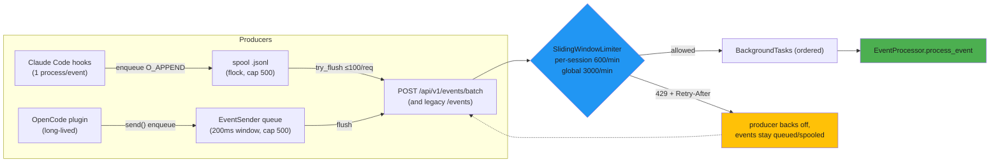

# ENH-006: Per-Session Rate Limiting & Producer-Side Event Batching

> Status: Proposed | Date: 2026-07-06 | Related audit findings: ARC-016 (primary — this plan implements and extends its remedy); interacts with SEC-005 (`/events` auth + plugin key), QA-002 (plugin testability), ARC-020 (producer URL policy, adjacent only)

## Overview

Event ingestion is throttled by one global 300-requests/minute sliding window, so two concurrently busy sessions falsely throttle each other, and both producers (Python hooks, OpenCode plugin) silently drop any event that gets a 429. This plan re-keys the limiter per session with a global backstop (both configured through `Settings`), adds a `POST /events/batch` endpoint, and upgrades both producers: bounded 429 retry plus a file-spool that coalesces rapid-fire hook events into batched POSTs, and an in-memory coalescing queue in the long-lived plugin — so throttling degrades to latency instead of data loss.

## Motivation

All of the following were verified directly in the code on 2026-07-06:

- **One global window for everything.** `backend/app/api/routes/events.py:20-23`: `_MAX_REQUESTS = int(os.environ.get("EVENT_RATE_LIMIT", "300"))` (raw `os.environ`, evaluated once at import — not in `Settings`, confirmed absent from `backend/app/config.py`), `_WINDOW = 60.0`, and a single module-level `deque` keyed on nothing. `_check_rate_limit()` (`events.py:31-48`) raises `HTTPException(429, "Rate limit exceeded. Try again later.")` with **no `Retry-After` header and no logging**. A busy Claude Code session (2 POSTs per tool call — see below) plus one or two teammates easily exceeds 300/min combined, and the limiter cannot tell them apart.
- **Hooks silently drop throttled events.** `hooks/src/claude_office_hooks/main.py:73-93` (`send_event`) does a single `urllib` POST with `TIMEOUT = 0.5` (`hooks/src/claude_office_hooks/config.py:25`) and a blanket `except Exception: log_error(...)` — a 429 is logged to the debug file and the event is gone. There is **no retry, no queue, no spool anywhere in the hooks package**, and each hook invocation is a fresh process (`claude-office-hook = "claude_office_hooks.main:main"`, `hooks/pyproject.toml:12`) emitting at most one event (`main.py:162-175`; `map_event` returns `dict | None`, never a list — `event_mapper.py:310-315`). Every tool call fires `pre_tool_use` **and** `post_tool_use` — 2 processes, 2 POSTs (`event_mapper.py:372-410`).
- **The plugin drops them too.** `opencode-plugin/src/index.ts:148-174` (`sendEvent`): one `fetch` per event with a 1500 ms abort (`index.ts:36`), `if (!resp.ok) debug(...)` — a 429 is a debug log. No retry, no queue, no `X-API-Key` header at all (the SEC-005 finding). Yet the plugin is a **long-lived process** with seven module-level Maps/Sets of session state (`index.ts:185-230`) — in-memory coalescing is trivially available and unused.
- **Zero test coverage of throttling.** The only limiter-related test code is the autouse reset fixture (`backend/tests/conftest.py:78-83`); grep for `429` across `backend/tests/` returns zero hits.

Net effect: under exactly the conditions this visualizer exists for — several busy concurrent sessions — the backend invisibly discards the events that drive it.

## Current State

- **Ingestion path**: `POST /api/v1/events` (`events.py:51-80`, the file's only route) → `_check_rate_limit()` as the first statement (line 74) → `background_tasks.add_task(ep.process_event, event)` (line 75; processing happens after the response, in order of addition) → `{"status": "accepted", "event_id": str(event.timestamp), "visual_action": "processing"}` (lines 76-80). The route takes `ep: Annotated[EventProcessor, Depends(get_event_processor)]`, so the DI seam works here (relevant for tests).
- **Auth**: `ApiKeyMiddleware` (`backend/app/main.py:94-118`) requires a key only when `settings.has_explicit_key or _is_state_changing(path, method)`; `_is_state_changing` (`main.py:68-81`) covers only `DELETE /api/v1/sessions*` and `POST /api/v1/sessions/simulate` — **`POST /api/v1/events` is keyless in the default auto-key mode**. With an explicit `CLAUDE_OFFICE_API_KEY` set, all routes including `/events` require `X-API-Key` (hmac-compared, `main.py:114-116`). Hooks already send the key when configured (`main.py:81-83` in hooks); the plugin cannot (SEC-005). `LocalhostOnlyMiddleware` (`main.py:41-59`) restricts callers to loopback.
- **Rate-limit key material**: the `Event` model (`backend/app/models/events.py:94-107`) carries `session_id: str` validated by `re.fullmatch(r"[a-zA-Z0-9_-]{1,128}", v)` (lines 102-107) — bounded and safe as a dict key. The limiter runs inside the route handler, i.e. after Pydantic validation, so `event.session_id` is available at the check site.
- **Settings**: `backend/app/config.py` `Settings(BaseSettings)` with `model_config = SettingsConfigDict(env_file=".env")` and no env prefix (line 64) — a field named `EVENT_RATE_LIMIT` would bind to the existing `EVENT_RATE_LIMIT` env var automatically.
- **Producer cadences**: hooks — one short-lived process per Claude Code hook event, 11 hook types registered (`hooks/manage_hooks.py:9-21`), highest frequency `pre_tool_use`/`post_tool_use`. Plugin — one long-lived process per OpenCode instance; senders include `tool.execute.before/after` per tool call plus per-step `step-finish`/`message.updated` reporting events (`index.ts:317, 550, 596, 648`), each `await`ing its own `sendEvent` POST.
- **Test infrastructure**: hooks tests cover only `event_mapper` (13 tests, no HTTP); opencode-plugin has no tests and no test script (confirmed); backend has `test_api.py::test_receive_event` and `test_security_hardening.py` exercising `/events` auth (`lines 74-168`).

## Proposed Design

### 1. Settings-backed, session-keyed limiter (backend)

New `Settings` fields (env vars bind 1:1 — the existing `EVENT_RATE_LIMIT` env var keeps working, now with a raised default):

| Setting | Default | Meaning |
|---|---|---|
| `EVENT_RATE_LIMIT` | `3000` | Global backstop: max events/min across all sessions (was a hardcoded-default 300 read from raw `os.environ`) |
| `EVENT_RATE_LIMIT_PER_SESSION` | `600` | Max events/min for any single `session_id` |

New `backend/app/api/rate_limit.py`:

```python
@dataclass(frozen=True)
class RateDecision:
    allowed: bool
    scope: Literal["session", "global"] | None = None
    retry_after: float = 0.0  # seconds until the oldest entry leaves the violated window

class SlidingWindowLimiter:
    """Per-session sliding windows + one global backstop window (monotonic time)."""
    def __init__(self, *, per_session: int, global_limit: int, window: float = 60.0) -> None: ...
    def check(self, session_id: str, n: int = 1) -> RateDecision: ...  # atomically reserves n slots or none
    def reset(self) -> None: ...
```

Bounded memory: per-session deques are pruned as they age out, empty deques delete their key, and a full sweep runs whenever the dict exceeds 256 keys (session ids are regex-bounded to 128 chars). `events.py` keeps its public `reset_rate_limiter()` name delegating to the new limiter, so the autouse conftest fixture (`conftest.py:78-83`) needs no change.

429 responses gain teeth: `headers={"Retry-After": str(math.ceil(decision.retry_after))}`, a detail that names the violated scope, and a `logger.warning` (rejections are currently invisible).

### 2. `POST /events/batch` (backend)

```python
@router.post("/events/batch")
async def receive_event_batch(
    events: list[Event],  # 422 via validation if > MAX_BATCH_SIZE (100)
    background_tasks: BackgroundTasks,
    ep: Annotated[EventProcessor, Depends(get_event_processor)],
) -> dict[str, int | str]:
    # group by session_id; limiter.check(sid, n=len(group)) per group — all-or-nothing:
    # if ANY group is denied, no slots are consumed and the whole batch 429s with the
    # max Retry-After. Accepted: add_task(ep.process_event, e) per event, in order.
    return {"status": "accepted", "accepted": len(events)}
```

All-or-nothing keeps producer retry logic trivial (retry the whole batch) and avoids partial-delivery bookkeeping in the fire-and-forget hooks. Ordering is preserved because Starlette runs background tasks in the order added. The route lives on the same router as `/events`, so **whatever auth policy SEC-005 settles for `/events` (its recorded decision: accept the auto-key) applies to `/batch` automatically** — this plan adds no auth logic of its own.

### 3. Hooks: bounded 429 retry, then spool-based batching

**Retry (Phase 3)** — in `send_event`: retry **only on HTTP 429** (backend alive but throttling; connection-refused stays fail-fast so a stopped backend never slows Claude Code), honoring `Retry-After` capped by a wall-clock budget. New env knobs parsed defensively in `hooks/config.py`: `CLAUDE_OFFICE_RETRY_MAX` (default 2) and `CLAUDE_OFFICE_RETRY_BUDGET_MS` (default 1500). Worst case added latency ≈ budget; everything stays inside the existing swallow-everything envelope (`main.py:16-18, 177-190`).

**Spool (Phase 4)** — new `hooks/src/claude_office_hooks/spool.py`. Because each hook is a separate process, cross-event coalescing needs shared state; a JSONL spool file provides it with two primitives:

```python
SPOOL_PATH = Path.home() / ".claude" / "claude-office-spool.jsonl"
MAX_SPOOL_EVENTS = 500  # drop-oldest beyond this

def enqueue(payload: dict[str, Any]) -> None: ...
    # single O_APPEND write of one JSON line — atomic for our line sizes

def try_flush(send_batch: Callable[[list[dict[str, Any]]], bool]) -> None: ...
    # non-blocking flock on SPOOL_PATH.with_suffix(".lock"):
    #   lock busy  -> return (another hook is flushing; our event is already spooled)
    #   acquired   -> read all lines, POST in chunks of <=100 to /events/batch;
    #                 2xx -> truncate; 429 -> leave spooled (latency, not loss);
    #                 404/405 -> legacy backend: send individually to /events, truncate
```

`main.py` flow becomes `enqueue(payload); try_flush(...)`, wrapped so that **any** spool failure (permissions, disk, lock errors) falls back to today's direct single-event `send_event` — the "never block Claude Code" guarantee is preserved by construction. Controlled by `CLAUDE_OFFICE_SPOOL` (default on, `0` disables). Rapid-fire tool events naturally coalesce: while one process holds the flush lock, concurrent hooks append and exit in microseconds, and the next hook flushes the accumulated batch.

### 4. Plugin: in-memory coalescing queue

New `opencode-plugin/src/eventSender.ts` — an injectable class (aligned with QA-002's direction of constructor-injected, testable units; QA-002 itself is not a hard precondition since this is additive):

```ts
export class EventSender {
  constructor(opts: {
    apiUrl: string;            // .../api/v1/events ; batch URL derived as `${apiUrl}/batch`
    timeoutMs: number;
    fetchFn?: typeof fetch;    // injected in tests
    apiKey?: string;           // header emitted when set — SEC-005 plumbs the value
    flushDelayMs?: number;     // default 200 (coalescing window)
    maxBatch?: number;         // default 100 (backend cap)
    maxQueue?: number;         // default 500, drop-oldest with debug log
  });
  send(event: BackendEvent): void;   // synchronous enqueue; arms/uses the flush timer
  flush(): Promise<void>;            // drain via POST /events/batch
}
```

Behavior: `send()` enqueues and schedules a flush after `flushDelayMs` (immediate at `maxBatch`). On 429, honor `Retry-After` (capped 5 s), requeue at the front, retry up to 3 times; on 404/405, latch a legacy mode that posts individually to `/events` (older backends); on network errors, drop the batch after retries so the queue cannot grow unbounded while the backend is down. `index.ts` keeps its `sendEvent(event)` signature as a thin delegate to a module singleton `EventSender`, so the ~15 call sites do not change shape. Note: the session-linking heuristics live entirely in module-level state mutated synchronously (`index.ts:185-230`) — nothing reads the HTTP response — so switching from awaited-fetch-per-event to synchronous enqueue cannot reorder that state machine (it removes await-interleaving, if anything).



## Implementation Phases

Each phase is independently landable and touches ≤5 files. Phases 3-5 each work against a Phase-1/2 backend but degrade gracefully without it (retry works against any backend; spool and sender fall back to `/events` on 404).

### Phase 1 — Backend: Settings-backed per-session limiter
1. `backend/app/config.py`: add `EVENT_RATE_LIMIT: int = 3000` and `EVENT_RATE_LIMIT_PER_SESSION: int = 600`.
2. `backend/app/api/rate_limit.py` (new): `SlidingWindowLimiter` + `RateDecision` as sketched, with the pruning rules; module is import-clean of FastAPI (plain class) for unit testing.
3. `backend/app/api/routes/events.py`: replace the module-level deque/`os.environ` block (lines 20-48) with a limiter built from `get_settings()`; call `check(event.session_id)` in the route; keep `reset_rate_limiter()` as a delegating function (conftest compatibility); 429 with `Retry-After` header, scope in detail, and a `logger.warning`.
4. `backend/tests/test_rate_limiting.py` (new): see Testing Strategy.

**Verify:** `cd /Users/probello/Repos/claude-office/backend && make checkall && uv run pytest tests/test_rate_limiting.py tests/test_security_hardening.py tests/test_api.py -v` (the security suite re-confirms `/events` auth semantics are untouched).

### Phase 2 — Backend: batch endpoint
1. `backend/app/api/routes/events.py`: add `POST /events/batch` with the 100-event cap, per-session-group all-or-nothing limiter check (`check(sid, n=len(group))`), ordered `add_task` dispatch, `{"status", "accepted"}` response.
2. `backend/tests/test_rate_limiting.py`: batch tests (cap, ordering, all-or-nothing 429, mixed-session batches, empty list → 422 or `accepted: 0` — pick and pin one).

**Verify:** `cd /Users/probello/Repos/claude-office/backend && make checkall && uv run pytest tests/test_rate_limiting.py -v`

### Phase 3 — Hooks: 429 retry with budget
1. `hooks/src/claude_office_hooks/config.py`: `RETRY_MAX` / `RETRY_BUDGET_MS` parsed from env with safe fallbacks (matching the file's defensive style).
2. `hooks/src/claude_office_hooks/main.py`: retry loop in `send_event` — 429 only, honor `Retry-After` capped by remaining budget, all inside the existing exception envelope; distinguish 429 via `urllib.error.HTTPError.code` (the current blanket except at `main.py:91-93` hides it).
3. `hooks/tests/test_send_event.py` (new): monkeypatched `_open_request` returning scripted 429/200 sequences; asserts retry count, budget adherence (injected clock/sleep), silence on exhaustion, no retry on `URLError` (connection refused).

**Verify:** `cd /Users/probello/Repos/claude-office/hooks && uv run pytest tests/ -v && uv run ruff check .` (hooks has no Makefile — ARC-001; use the direct commands until that lands).

### Phase 4 — Hooks: spool-based batching
1. `hooks/src/claude_office_hooks/spool.py` (new): `enqueue` / `try_flush` as designed (flock, chunked batch POSTs, 429-leaves-spooled, 404/405 legacy fallback, drop-oldest cap, every path exception-safe).
2. `hooks/src/claude_office_hooks/main.py`: `enqueue + try_flush` replaces the direct send when `CLAUDE_OFFICE_SPOOL != "0"`; any spool exception falls back to direct `send_event`.
3. `hooks/tests/test_spool.py` (new): tmp-dir spool — append/flush round trip; lock contention (second flusher exits immediately, events preserved); 429 leaves events spooled and a later flush delivers them; cap eviction; legacy 404 fallback; corrupted-line tolerance.

**Verify:** `cd /Users/probello/Repos/claude-office/hooks && uv run pytest tests/ -v && uv run ruff check .` — then end-to-end: run the dev backend, `export CLAUDE_OFFICE_DEBUG=1`, drive a few hook invocations (`echo '{"session_id":"t1"}' | uv run claude-office-hook pre_tool_use` style), and confirm batched delivery in `~/.claude/claude-office-hooks.log` and backend logs.

### Phase 5 — Plugin: EventSender queue
1. `opencode-plugin/src/eventSender.ts` (new): the class as sketched.
2. `opencode-plugin/src/index.ts`: instantiate one `EventSender` from the existing `API_URL`/`TIMEOUT_MS` config (`index.ts:32-36`); `sendEvent` becomes a delegate; no call-site shape changes.
3. `opencode-plugin/package.json`: add `"test": "bun test"`.
4. `opencode-plugin/tests/eventSender.test.ts` (new): injected `fetchFn` — 10 rapid `send()`s → one batch POST; splits at `maxBatch`; 429 with `Retry-After` → backoff then redelivery, order preserved; 404 latches legacy per-event mode; drop-oldest at `maxQueue`; network failure drops after retries without unbounded growth.

**Verify:** `cd /Users/probello/Repos/claude-office/opencode-plugin && bun run typecheck && bun run build && bun test`

## Testing Strategy

- **Backend (`tests/test_rate_limiting.py`)**, using `TestClient` + the working `Depends(get_event_processor)` override seam:
  - Session A posts `EVENT_RATE_LIMIT_PER_SESSION` events → all 200; the next → 429 with `Retry-After` header present and `scope: session` in the detail; **session B still gets 200** (the core ARC-016 fix).
  - Global backstop: spread events across many sessions past `EVENT_RATE_LIMIT` → 429 with `scope: global`.
  - Settings plumbing: env override (`EVENT_RATE_LIMIT_PER_SESSION=5`) honored via a fresh `Settings` instance.
  - Limiter unit tests (no HTTP): window expiry restores capacity; `check(n)` all-or-nothing atomicity; key pruning keeps the dict bounded.
  - Batch: ordering asserted via a stub processor recording `process_event` call order.
- **Hooks**: pure-Python tests with monkeypatched transport and injected sleep/clock — no real network, keeping the suite fast and deterministic; spool tests run against `tmp_path`, including a two-process-simulated lock contention case.
- **Plugin**: bun tests with fake timers (`Bun.sleep`/manual clock) and an injected `fetchFn` capturing requests — this is also the first test scaffold for the plugin (a down payment on QA-002).
- **Measuring the improvement** (recorded in the PR): run two concurrent `make simulate` scenarios against a dev backend with the *old* default (`EVENT_RATE_LIMIT=300`, per-session limits disabled) and count 429s in backend logs; repeat on the new defaults — expect zero 429s, and under a forced tiny limit (`EVENT_RATE_LIMIT_PER_SESSION=10`) expect throttled events to arrive late rather than never (verify final replay state completeness via `GET /api/v1/sessions/{id}/replay`).
- **Regression**: `test_security_hardening.py` (auth semantics on `/events` unchanged), `test_api.py`, and the hooks `test_event_mapper.py` suite must stay green untouched.

## Files to Create / Modify

| Path | Change |
|---|---|
| `backend/app/config.py` | Add `EVENT_RATE_LIMIT` (3000) + `EVENT_RATE_LIMIT_PER_SESSION` (600) (Phase 1) |
| `backend/app/api/rate_limit.py` | **New** — `SlidingWindowLimiter` + `RateDecision` (Phase 1) |
| `backend/app/api/routes/events.py` | Session-keyed check, `Retry-After` + logging, delegating `reset_rate_limiter`; then `POST /events/batch` (Phases 1-2) |
| `backend/tests/test_rate_limiting.py` | **New** — limiter, per-session/global 429, batch behavior (Phases 1-2) |
| `hooks/src/claude_office_hooks/config.py` | `RETRY_MAX`, `RETRY_BUDGET_MS` env knobs (Phase 3) |
| `hooks/src/claude_office_hooks/main.py` | 429 retry loop; spool integration with direct-send fallback (Phases 3-4) |
| `hooks/src/claude_office_hooks/spool.py` | **New** — flock'd JSONL spool: enqueue/try_flush/cap/legacy fallback (Phase 4) |
| `hooks/tests/test_send_event.py` | **New** — retry behavior (Phase 3) |
| `hooks/tests/test_spool.py` | **New** — spool semantics (Phase 4) |
| `opencode-plugin/src/eventSender.ts` | **New** — coalescing queue with injectable fetch (Phase 5) |
| `opencode-plugin/src/index.ts` | `sendEvent` delegates to the `EventSender` singleton (Phase 5) |
| `opencode-plugin/package.json` | `test` script (Phase 5) |
| `opencode-plugin/tests/eventSender.test.ts` | **New** — coalescing/backoff/fallback tests (Phase 5) |

## Risks & Mitigations

- **SEC-005 interaction (precondition awareness).** Today `/events` is keyless in auto-key mode (`main.py:68-81, 107-112`); SEC-005's recorded decision is to accept the auto-key on `/events` and add plugin key support. This plan stays compatible in both worlds: the batch route inherits `/events` middleware policy automatically (same router), the hooks already send `X-API-Key` when configured, and `EventSender` carries an optional `apiKey` field so SEC-005's plugin work becomes pure config plumbing. If SEC-005 ever makes the key *mandatory* on `/events`, land its plugin part before (or with) Phase 5.
- **Spool complexity inside the "never block Claude Code" envelope.** A file queue adds lock/disk failure modes to a component whose contract is absolute silence. Mitigation: every spool operation is individually wrapped; any failure falls back to the current direct send; `CLAUDE_OFFICE_SPOOL=0` is a one-env-var kill switch; the flush lock is non-blocking so no hook ever waits on another.
- **Out-of-order or delayed delivery from spool/queue.** Spooled events can arrive a tool-call later. Event `timestamp` is set at map time (`event_mapper.py:362-367`) and replay orders by timestamp, so persisted history stays correct; live state may briefly lag, which is the intended "latency instead of loss" tradeoff. Batches preserve append order, and the backend dispatches background tasks in order.
- **Limiter memory growth from adversarial session ids.** Bounded by the existing `[a-zA-Z0-9_-]{1,128}` validation (`models/events.py:102-107`), per-key deque caps, empty-key deletion, and the >256-key sweep; localhost-only middleware further limits exposure.
- **Raising defaults masks runaway producers.** The global backstop (3000/min) still exists, and rejections are now *logged* — a regression from silent-drop to observable throttling.
- **File conflicts.** `events.py` is also targeted by SEC-003/SEC-005 (audit conflict map) and `opencode-plugin/src/index.ts` by ARC-010/ARC-020/QA-002/ENH-007 — re-read before each phase's edits, keep diffs additive, land phases as separate PRs; if QA-002's class extraction lands first, `EventSender` becomes a constructor dependency of the new session-tracker instead of a module singleton.

## Acceptance Criteria

- [ ] `EVENT_RATE_LIMIT` and `EVENT_RATE_LIMIT_PER_SESSION` live in `Settings` (no raw `os.environ` read remains in `events.py`), overridable via env vars, with the legacy `EVENT_RATE_LIMIT` env var still honored.
- [ ] One session exceeding its per-session limit receives 429 with a `Retry-After` header while a concurrent second session continues to receive 200 (automated test — the ARC-016 fix).
- [ ] The global backstop returns 429 with `scope: global` when aggregate traffic exceeds `EVENT_RATE_LIMIT`; every 429 is logged at warning level.
- [ ] `POST /api/v1/events/batch` accepts ≤100 events, preserves processing order (automated test), is all-or-nothing under limiting, and follows the exact auth behavior of `POST /events`.
- [ ] Hooks retry on 429 only, honor `Retry-After`, and never exceed `CLAUDE_OFFICE_RETRY_BUDGET_MS` wall-clock (automated test with injected clock); connection-refused still fails fast with no retry.
- [ ] With the spool enabled and the backend forced to throttle (tiny limits), all hook events eventually appear in the session's replay — zero loss, verified end-to-end; with `CLAUDE_OFFICE_SPOOL=0`, behavior matches today's direct send.
- [ ] Any spool-layer exception degrades to the direct single-event send (automated test), preserving the "never block Claude Code" guarantee.
- [ ] The plugin coalesces rapid-fire events into batch POSTs (10 sends within 200 ms → 1 request, automated bun test), retries 429 with backoff preserving order, and falls back to per-event `/events` on 404 from older backends.
- [ ] `cd backend && make checkall` passes; hooks `pytest` + `ruff` pass; `bun run typecheck && bun run build && bun test` pass in `opencode-plugin/`; `test_security_hardening.py` is green and unmodified.

## Estimated Effort

| Phase | Effort |
|---|---|
| Phase 1 — per-session limiter in Settings | S |
| Phase 2 — batch endpoint | S |
| Phase 3 — hooks 429 retry | S |
| Phase 4 — hooks spool batching | M |
| Phase 5 — plugin EventSender | M |
