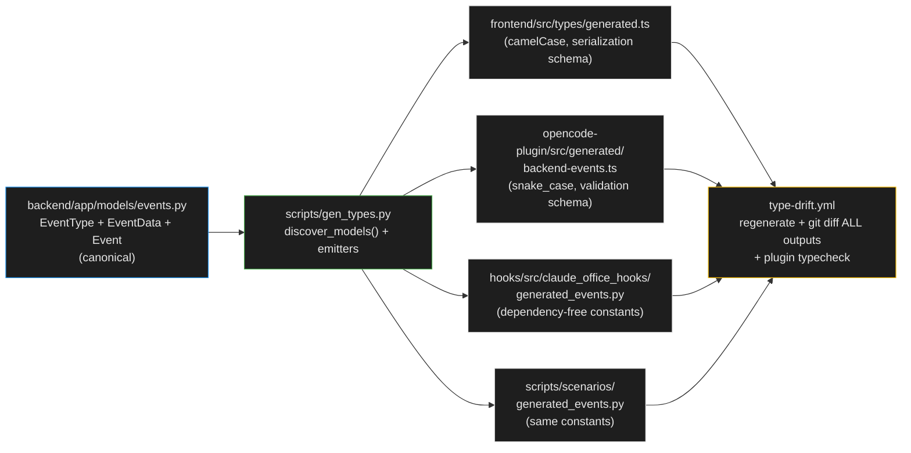

# ENH-007: Unified Event-Contract Codegen for All Producers

> Status: Proposed | Date: 2026-07-06 | Related audit findings: ARC-010, ARC-019, SEC-005 (plugin API-key support rides along)

## Overview

The backend's 23-value `EventType` enum and 40-field `EventData` model are the canonical event contract, but only the frontend consumes a *generated* copy — both event producers (the Python hooks and the OpenCode plugin) re-express the contract by hand and have already drifted. This plan extends `scripts/gen_types.py` into a multi-target emitter (frontend TS, plugin TS, hooks Python constants, scenario-script constants), replaces its hand-curated model registry with introspection-based discovery, adds contract tests that validate producer output against the generated contract, and widens the existing type-drift CI gate to cover every generated artifact.

## Motivation

The contract is duplicated by hand in four places, and two of them are verifiably wrong today:

- **Plugin union has drifted (ARC-010, verified).** `backend/app/models/events.py:17-42` defines 23 `EventType` values. `opencode-plugin/src/index.ts:45-65` hand-writes a 20-value union — missing `task_created`, `task_completed`, `teammate_idle`. Its `EventData` interface at `index.ts:67-93` carries only 23 of the backend's 40 fields (missing `floor_id`, `room_id`, `team_name`, `teammate_name`, `task_id`, `task_subject`, `background_task_*`, `transcript_path`, `agent_transcript_path`, and more).
- **Hooks mapper uses bare string literals.** `hooks/src/claude_office_hooks/event_mapper.py` writes event types as raw strings: `"context_compaction"` (line 101), `"subagent_start"` (line 116), `"subagent_stop"` (line 182), `"subagent_info"` (line 214), `"background_task_notification"` (line 275), plus the string comparisons in `map_event()` (lines 372-407). Nothing ties these to the backend enum.
- **A latent contract violation already exists.** `event_mapper.py:186` sets `data["result"] = tool_response.get("content", [])` — `result` is **not** a field of `EventData` (`backend/app/models/events.py:45-91`), so Pydantic silently discards it on ingestion. The sync-subagent result summary has been dropped on the floor this whole time; no test can catch it because no contract test exists (`hooks/tests/test_event_mapper.py` asserts only against its own string literals).
- **The generator itself has silent-omission risk (ARC-019).** `scripts/gen_types.py:39-60` uses a hand-curated `MODELS` list; a forgotten model is simply never exported and `type-drift.yml` cannot notice.
- **The CI gate covers only one of the duplicates.** `.github/workflows/type-drift.yml:39-45` regenerates and diffs only `frontend/src/types/generated.ts`.
- **SEC-005 rider.** The plugin's `sendEvent()` (`opencode-plugin/src/index.ts:148-174`) sends no `X-API-Key` header, while the hooks do (`hooks/src/claude_office_hooks/main.py:80-84`). With an explicit `CLAUDE_OFFICE_API_KEY` set on the backend, every plugin event silently 401s.

## Current State

- **Canonical source**: `backend/app/models/events.py` — `EventType(StrEnum)` (23 values), `EventData(BaseModel)` (40 optional snake_case fields), `Event(BaseModel)` (`event_type`, `session_id`, `timestamp`, `data`).
- **Generator**: `scripts/gen_types.py` runs from `backend/` (`make gen-types`, root `Makefile:62-63`), builds one combined JSON schema via `models_json_schema([(m, "serialization") for m in MODELS], by_alias=True)` (camelCase for the frontend), and shells out to `bunx json2ts` (devDependency `json-schema-to-typescript` in `frontend/package.json:41`, cwd = `frontend/`) to write `frontend/src/types/generated.ts`. The `EventType` union in `generated.ts` (lines ~116-139) is complete and correct — proof the pipeline works.
- **Producers hand-roll the wire format**: both producers POST **snake_case** JSON (the Python field names), so the camelCase frontend output is not reusable for them. The plugin builds payloads through `makeEvent()` (`index.ts:257-268`) typed against its local `EventType`/`EventData`/`BackendEvent`; the hooks build a plain `dict` in `map_event()`.
- **Hooks constraints**: `hooks/pyproject.toml` declares a single runtime dependency (`defusedxml`) and the CLI must never crash or print (`main.py:1-18`). The hooks package can never import the backend or Pydantic — any shared contract artifact must be a dependency-free generated module.
- **Simulation scripts**: `scripts/scenarios/_base.py:100-117` (`send_event`) also passes bare event-type strings (e.g. `self.send_event("context_compaction", tokens)`).
- **CI**: `type-drift.yml` triggers on `backend/app/models/**`, `frontend/src/types/generated.ts`, `scripts/gen_types.py`; installs backend (uv) + frontend (bun), runs `make gen-types`, and fails on `git diff frontend/src/types/generated.ts`. Action refs are floating majors (`actions/checkout@v5`, `astral-sh/setup-uv@v5`, `oven-sh/setup-bun@v2`).

## Proposed Design

One generator, four deterministic outputs, one CI gate:



### 1. Model auto-discovery (ARC-019)

Replace the hand-curated `MODELS` list (`gen_types.py:39-60`) with introspection over the `app.models` package. Enums (`EventType`, `BubbleType`, …) and referenced models ride along in the JSON schema automatically, exactly as today. TypedDicts (`ConversationEntry`, `HistoryEntry`) are not `BaseModel` subclasses and are skipped by the `issubclass` check, preserving the current intentional exclusion (see comment at `gen_types.py:36-38`).

```python
EXCLUDED_MODELS: frozenset[str] = frozenset()  # deliberate opt-outs, by class name

def discover_models() -> list[type[BaseModel]]:
    """Collect every BaseModel subclass defined under app.models (ARC-019)."""
    found: set[type[BaseModel]] = set()
    for mod_info in pkgutil.iter_modules(app.models.__path__):
        module = importlib.import_module(f"app.models.{mod_info.name}")
        for name, obj in inspect.getmembers(module, inspect.isclass):
            if (
                issubclass(obj, BaseModel)
                and obj is not BaseModel
                and obj.__module__.startswith("app.models")   # skip re-exports of pydantic etc.
                and name not in EXCLUDED_MODELS
            ):
                found.add(obj)
    return sorted(found, key=lambda m: m.__name__)  # deterministic output ordering
```

Sorting makes output order independent of import order; the one-time reordering of `generated.ts` is committed with the phase.

### 2. Plugin TypeScript emitter (snake_case)

Producers speak the *validation* wire format (snake_case, pre-alias). Emit a second schema and reuse the existing `json2ts` toolchain:

```python
def emit_plugin_types(json2ts: Callable[[Path, Path], None]) -> Path:
    """Emit snake_case producer types for the OpenCode plugin."""
    _, schema = models_json_schema(
        [(Event, "validation")],           # Event pulls in EventData + EventType via $refs
        title="Claude Office Event Contract",
        by_alias=False,                    # producers POST snake_case JSON
    )
    schema_path = SCRIPTS_DIR / ".gen_plugin_schema.json"
    schema_path.write_text(json.dumps(schema, indent=2), encoding="utf-8")
    out = REPO_ROOT / "opencode-plugin" / "src" / "generated" / "backend-events.ts"
    json2ts(schema_path, out)              # same bunx json2ts invocation, cwd=frontend/
    return out
```

The generated file provides `Event`, `EventData`, and `EventType` with all 23 values. `opencode-plugin/src/index.ts` deletes its local `EventType`/`EventData`/`BackendEvent` (lines 45-100) and imports instead:

```ts
import type {
  Event as BackendEvent,
  EventData,
  EventType,
} from "./generated/backend-events";
```

`makeEvent()`/`sendEvent()` keep their signatures (`Partial<EventData>` still works — all generated `EventData` fields are optional because every backend field has a default). Missing enum members become available immediately, and any future removal/rename fails `tsc`.

### 3. Hooks constants emitter (dependency-free)

The hooks package cannot depend on the backend, so emit a plain-Python module directly from the enum and model:

```python
def emit_hooks_constants(out: Path) -> None:
    lines = [
        '"""AUTO-GENERATED by scripts/gen_types.py -- DO NOT EDIT.',
        "",
        "Canonical source: backend/app/models/events.py. Regenerate: make gen-types.",
        '"""',
        "",
        "from typing import Final",
        "",
    ]
    for member in EventType:                      # e.g. SUBAGENT_START: Final = "subagent_start"
        lines.append(f'{member.name}: Final = "{member.value}"')
    values = ",\n    ".join(f'"{m.value}"' for m in EventType)
    fields = ",\n    ".join(f'"{name}"' for name in EventData.model_fields)
    lines += [
        "",
        f"EVENT_TYPES: Final[frozenset[str]] = frozenset({{\n    {values},\n}})",
        "",
        f"EVENT_DATA_FIELDS: Final[frozenset[str]] = frozenset({{\n    {fields},\n}})",
        "",
    ]
    out.write_text("\n".join(lines), encoding="utf-8")
```

`event_mapper.py` replaces every literal with the constants (`payload["event_type"] = SUBAGENT_START`, `if event_type == PRE_TOOL_USE:` …). The same file is emitted to `scripts/scenarios/generated_events.py` so simulation scenarios stop hand-typing event strings.

### 4. Contract tests

A new `hooks/tests/test_event_contract.py` drives `map_event()` with one representative raw payload per hook branch and asserts the output stays inside the generated contract — no backend import needed, and the generated module is itself drift-checked against the backend by CI, closing the loop:

```python
@pytest.mark.parametrize(("hook_event", "raw"), REPRESENTATIVE_PAYLOADS.items())
def test_mapper_output_stays_inside_backend_contract(hook_event: str, raw: dict) -> None:
    payload = map_event(hook_event, raw, "sess-1")
    assert payload is not None
    assert payload["event_type"] in EVENT_TYPES
    unknown = set(payload["data"]) - EVENT_DATA_FIELDS
    assert not unknown, f"fields the backend will silently drop: {unknown}"
```

This test fails today on the `result` field (`event_mapper.py:186`). The fix: replace `data["result"] = tool_response.get("content", [])` with `data["result_summary"] = _truncate(str(content), 200)` — `result_summary` is a real `EventData` field (`events.py:60`) and matches the plugin's existing behavior (`index.ts:669`). This is a behavior *improvement*: the value is currently discarded by the backend, so nothing downstream can regress.

### 5. CI gate

Extend `type-drift.yml` (keep the filename so any existing required-check reference survives): add the three new generated paths to `on.*.paths` and the drift diff, add `hooks/src/**` and `opencode-plugin/src/**` triggers, install and typecheck the plugin so a contract change that breaks plugin code fails here even before ENH-008's full gate lands, and pin action refs to exact tags (all verified to exist on 2026-07-06 via `gh api repos/<owner>/<repo>/releases/latest`):

```yaml
    steps:
      - uses: actions/checkout@v7.0.0        # verified 2026-07-06
      - uses: astral-sh/setup-uv@v8.3.0      # verified 2026-07-06
        with:
          python-version: "3.13"
      - uses: oven-sh/setup-bun@v2.2.0       # verified 2026-07-06
      - run: cd backend && uv sync
      - run: cd frontend && bun install
      - run: cd opencode-plugin && bun install
      - run: make gen-types
      - name: Check for contract drift
        run: |
          git diff --exit-code \
            frontend/src/types/generated.ts \
            opencode-plugin/src/generated/backend-events.ts \
            hooks/src/claude_office_hooks/generated_events.py \
            scripts/scenarios/generated_events.py
      - name: Plugin compiles against the contract
        run: cd opencode-plugin && bun run typecheck
```

### 6. SEC-005 rider: plugin API-key support

In `opencode-plugin/src/index.ts`, read the key once and attach it in `sendEvent()`:

```ts
const API_KEY = process.env.CLAUDE_OFFICE_API_KEY ?? "";
// in sendEvent():
headers: {
  "Content-Type": "application/json",
  ...(API_KEY ? { "X-API-Key": API_KEY } : {}),
},
```

The plugin only *reads* an existing user-provided env var — it never generates, stores, or rewrites keys. Document the variable in `opencode-plugin/README.md` (clears DOC-012's "silent 401" limitation).

## Implementation Phases

Each phase is independently landable and touches ≤5 files. Phase order: 1 → 2 → 3 → 4 → 5 (2 and 3 are independent of each other once 1 lands).

### Phase 1 — Generator refactor + model auto-discovery

Tasks:
- Restructure `scripts/gen_types.py` into named emitters: `discover_models()`, `emit_frontend_types()` (current behavior), and a shared `run_json2ts(schema_path, out_path)` helper; replace the `MODELS` list with `discover_models()` + `EXCLUDED_MODELS` frozenset.
- Regenerate and commit `frontend/src/types/generated.ts` (one-time reordering from deterministic sort; content must be semantically identical — review the diff for *additions*, which would be models the old list had silently omitted).

Files: `scripts/gen_types.py`, `frontend/src/types/generated.ts`.

Verify:
```bash
make gen-types && make gen-types && git diff --exit-code frontend/src/types/generated.ts  # idempotent
cd frontend && make typecheck && make test
cd backend && make checkall
```

### Phase 2 — Hooks constants module + mapper migration + contract test

Tasks:
- Add `emit_hooks_constants()` to `gen_types.py`; emit `hooks/src/claude_office_hooks/generated_events.py`.
- Migrate `hooks/src/claude_office_hooks/event_mapper.py` from string literals to the generated constants (assignment sites at lines 101, 116, 182, 214, 275 and the `map_event` comparison chain at lines 372-407).
- Fix the `result` contract violation at `event_mapper.py:186` → `result_summary` (truncated to 200 chars).
- Add `hooks/tests/test_event_contract.py` (parametrized payloads covering every mapper branch, including the remapping branches: pre_compact→context_compaction, Task/Agent pre→subagent_start, sync post→subagent_stop, task-notification prompt→background_task_notification).
- Update `hooks/tests/test_event_mapper.py` assertions that reference the old `result` key.

Files: `scripts/gen_types.py`, `hooks/src/claude_office_hooks/generated_events.py` (generated), `hooks/src/claude_office_hooks/event_mapper.py`, `hooks/tests/test_event_contract.py` (new), `hooks/tests/test_event_mapper.py`.

Verify:
```bash
make gen-types && git status --porcelain hooks/   # generated file committed, no residual diff
cd hooks && uv run ruff check . && uv run ruff format --check . && uv run pyright . && uv run pytest
```

### Phase 3 — Plugin generated types + migration + API-key rider

Tasks:
- Add `emit_plugin_types()` to `gen_types.py`; emit `opencode-plugin/src/generated/backend-events.ts` (validation-mode schema, `by_alias=False`).
- In `opencode-plugin/src/index.ts`: delete the hand-written `EventType`/`EventData`/`BackendEvent` (lines 45-100), import from `./generated/backend-events`, and adapt any nullability mismatches surfaced by `tsc` (generated fields are `T | null` optionals; current code uses `T | undefined` — assignments remain compatible, only reads may need `?? undefined`).
- Add `X-API-Key` support to `sendEvent()` from `process.env.CLAUDE_OFFICE_API_KEY` (read-only; never generated or persisted).
- Document `CLAUDE_OFFICE_API_KEY` in `opencode-plugin/README.md`.

Files: `scripts/gen_types.py`, `opencode-plugin/src/generated/backend-events.ts` (generated), `opencode-plugin/src/index.ts`, `opencode-plugin/README.md`.

Verify:
```bash
make gen-types
cd opencode-plugin && bun install && bun run typecheck && bun run build
# manual smoke: CLAUDE_OFFICE_DEBUG=1 opencode session with backend running; confirm events arrive;
# then export CLAUDE_OFFICE_API_KEY on both sides and confirm no 401s in backend logs
```

### Phase 4 — CI gate extension

Tasks:
- Update `.github/workflows/type-drift.yml` per the skeleton above: pinned action tags, plugin install, multi-file drift diff, plugin typecheck step, expanded `paths` triggers (`hooks/src/claude_office_hooks/generated_events.py`, `opencode-plugin/src/generated/**`, `opencode-plugin/src/index.ts`, `scripts/scenarios/generated_events.py`).

Files: `.github/workflows/type-drift.yml`.

Verify:
```bash
# refs resolve (rerun before committing):
gh api repos/actions/checkout/git/ref/tags/v7.0.0 -q .ref
gh api repos/astral-sh/setup-uv/git/ref/tags/v8.3.0 -q .ref
gh api repos/oven-sh/setup-bun/git/ref/tags/v2.2.0 -q .ref
# negative test on a branch: add a dummy EventType member WITHOUT regenerating; push; workflow must fail.
# then run `make gen-types`, commit, workflow must pass. Revert the dummy member.
```

### Phase 5 — Scenario-script constants

Tasks:
- Emit the same constants module to `scripts/scenarios/generated_events.py` from `gen_types.py`.
- In `scripts/scenarios/_base.py`, import `EVENT_TYPES` and guard `send_event()` (`_base.py:100`) with a hard failure on unknown types (simulation is dev tooling — loud is correct): `if event_type not in EVENT_TYPES: raise ValueError(...)`. Replace known literals (e.g. `"context_compaction"`) with the generated constants.

Files: `scripts/gen_types.py`, `scripts/scenarios/generated_events.py` (generated), `scripts/scenarios/_base.py`.

Verify:
```bash
make gen-types && git diff --exit-code scripts/scenarios/generated_events.py
make simulate   # against a running backend (make dev-tmux), scenario completes without ValueError
```

## Testing Strategy

- **Hooks contract test** (`hooks/tests/test_event_contract.py`): every `map_event()` branch produces `event_type ∈ EVENT_TYPES` and `data` keys ⊆ `EVENT_DATA_FIELDS`. Known first failure: the `result` field — fixed in the same phase.
- **Hooks regression**: existing `test_event_mapper.py` suite continues to pass with constants substituted (values are identical strings).
- **Plugin compile-time contract**: `tsc --noEmit` is the contract test — every `makeEvent()` call site is typed against the generated union; run in Phase 4's workflow and locally via `bun run typecheck`.
- **Generator determinism**: CI implicitly asserts idempotency (regenerate + `git diff --exit-code`); locally, run `make gen-types` twice.
- **Discovery completeness**: the Phase 1 diff review is the audit — any model appearing in `generated.ts` that wasn't there before was a silent omission (exactly the ARC-019 failure mode).
- **CI assertions**: multi-file drift diff + plugin typecheck in `type-drift.yml` (Phase 4 negative test documented above).

## Files to Create / Modify

| Path | Change |
|------|--------|
| `scripts/gen_types.py` | Refactor into emitters; add `discover_models()`, `emit_hooks_constants()`, `emit_plugin_types()`, scenario copy |
| `frontend/src/types/generated.ts` | Regenerated (deterministic ordering; content-equal) |
| `hooks/src/claude_office_hooks/generated_events.py` | **New** (generated) — event-type constants, `EVENT_TYPES`, `EVENT_DATA_FIELDS` |
| `hooks/src/claude_office_hooks/event_mapper.py` | Literals → generated constants; `result` → `result_summary` fix |
| `hooks/tests/test_event_contract.py` | **New** — producer-output contract test |
| `hooks/tests/test_event_mapper.py` | Update `result`-key assertions |
| `opencode-plugin/src/generated/backend-events.ts` | **New** (generated) — snake_case `Event`/`EventData`/`EventType` |
| `opencode-plugin/src/index.ts` | Delete hand-written types (lines 45-100); import generated; add `X-API-Key` header |
| `opencode-plugin/README.md` | Document `CLAUDE_OFFICE_API_KEY` (DOC-012) |
| `scripts/scenarios/generated_events.py` | **New** (generated) — same constants for simulation scenarios |
| `scripts/scenarios/_base.py` | Import constants; validate `event_type` in `send_event()` |
| `.github/workflows/type-drift.yml` | Multi-artifact drift diff; plugin typecheck; pinned action tags; expanded path triggers |

## Risks & Mitigations

- **json2ts output shape shifts for the plugin** (nullable unions, naming): mitigated by Phase 3 doing the migration in the same change as the emission, gated by `tsc` — no window where plugin code and generated types disagree.
- **`result` → `result_summary` changes the wire payload**: the old field was silently dropped by Pydantic, so the backend-visible change is purely additive (a field that was always `None` now gets populated). Contract test + existing backend suite cover it.
- **Auto-discovery exports a model that was deliberately omitted**: `EXCLUDED_MODELS` provides the opt-out; the Phase 1 diff review catches surprises before merge.
- **Generated Python file must never break the hooks' "never crash" guarantee**: the module contains only string constants and frozensets — no imports beyond `typing.Final`, no I/O. `pyright` strict mode runs over it in hooks CI.
- **Two builders forget `make gen-types` and race**: unchanged from today's frontend flow; the widened CI diff is precisely the safety net.
- **Action tag pins go stale**: pins are exact and verified; bumping them is a deliberate, reviewable diff rather than a silent float.

## Acceptance Criteria

- [ ] `scripts/gen_types.py` contains no hand-curated model list; `discover_models()` + `EXCLUDED_MODELS` drive the schema.
- [ ] `make gen-types` emits all four artifacts and is idempotent (second run produces zero diff).
- [ ] `opencode-plugin/src/index.ts` contains no hand-written `EventType`/`EventData`/`BackendEvent`; `grep -n '"session_start"' opencode-plugin/src/index.ts` matches nothing in a type position; `bun run typecheck` passes.
- [ ] All 23 backend event types are present in `opencode-plugin/src/generated/backend-events.ts`, including `task_created`, `task_completed`, `teammate_idle`.
- [ ] `hooks/src/claude_office_hooks/event_mapper.py` contains no bare event-type string literals (grep for `"subagent_start"` etc. returns only the generated module).
- [ ] `hooks/tests/test_event_contract.py` passes, and fails if a new field is added to a mapper payload without existing in `EventData`.
- [ ] `map_event()` no longer emits the unknown `result` key; `result_summary` is populated for sync subagent stops.
- [ ] `type-drift.yml` fails on a branch where `EventType` gains a member without regeneration, and passes after `make gen-types` (verified per Phase 4).
- [ ] Plugin sends `X-API-Key` when `CLAUDE_OFFICE_API_KEY` is set; sends no header otherwise; no key material is generated or written anywhere.
- [ ] `scripts/scenarios/_base.py` rejects unknown event types at send time.

## Estimated Effort

| Phase | Effort |
|-------|--------|
| 1 — Generator refactor + discovery | M |
| 2 — Hooks constants + contract test | M |
| 3 — Plugin generated types + key rider | M |
| 4 — CI gate extension | S |
| 5 — Scenario constants | S |
