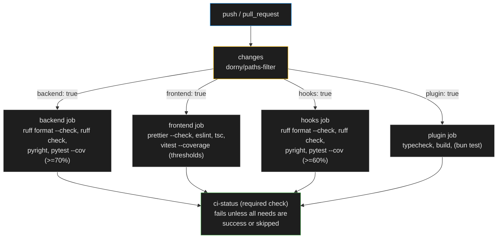

# ENH-008: Full CI Quality Gate with Coverage Reporting

> Status: Proposed | Date: 2026-07-06 | Related audit findings: ARC-001, DOC-001 (builds on their remediation)

## Overview

Today no GitHub Actions workflow runs a single test, lint, or typecheck for any component, and the local `make checkall` neither runs tests nor covers `hooks/` or `opencode-plugin/` at all. This plan stands up the ARC-001 baseline where it is still missing (component Makefiles, tests in `checkall`), then extends it into a proper quality gate: one path-filtered CI workflow running format-check, lint, typecheck, and tests per component (backend, frontend, hooks, opencode-plugin), coverage collection with enforced thresholds that ratchet upward, uv/bun caching, and a single aggregate status check suitable for branch protection.

## Motivation

All claims verified directly against the working tree on 2026-07-06:

- **No correctness CI exists (ARC-001).** `.github/workflows/` contains exactly two workflows: `type-drift.yml` (regenerates `frontend/src/types/generated.ts` and diffs it) and `frontend-audit.yml` (a `bun audit` vulnerability scan). Neither runs `pytest`, `ruff`, `pyright`, `vitest`, `eslint`, or `tsc` over source. The audit documents two shipped defects this already caused: a confirmed ImportError in `scripts/scenarios/teams.py` (ARC-009) and the OpenCode plugin's drifted event union (ARC-010).
- **`checkall` does not run tests (DOC-001).** Root `Makefile:60` reads `checkall: fmt lint typecheck` — no `test`, contradicting README, CONTRIBUTING, and CLAUDE.md. (`backend/Makefile:21` *does* include `test` in its own `checkall`, and `frontend/Makefile:36-38` runs tests after build — but the root target chains `fmt lint typecheck` only.)
- **Two of four components are invisible to every quality target.** Root `Makefile:44-58` `lint`/`fmt`/`test`/`typecheck` invoke only `make -C backend` and `make -C frontend`. `hooks/` and `opencode-plugin/` have no Makefile at all (verified by `ls`), despite hooks having a real pytest suite (`hooks/tests/`) and strict pyright config (`hooks/pyproject.toml:37-42`), and the plugin having `typecheck`/`build` scripts (`opencode-plugin/package.json:14-19`).
- **CI-unsafe format targets.** Every `fmt` target is mutating (`ruff format .`, `prettier --write .` via `frontend/package.json:13`). There is no `--check` variant anywhere, so a CI job cannot verify formatting without rewriting the tree.
- **Coverage exists in dependencies but is never enforced.** `backend/pyproject.toml:26,79` already carries `pytest-cov>=7.1.0`, unused by any target. `hooks/pyproject.toml:44-47` has only `pytest`. `frontend/package.json` has `vitest ^4.1.9` but no coverage provider, and `frontend/vitest.config.ts` (12 lines, verified) configures only a path alias — no coverage block.
- **The plugin's "lint" is a lie.** `opencode-plugin/package.json:17-18`: `"lint": "tsc --noEmit"` is byte-identical to `"typecheck"` (QA-002); no ESLint runs.

## Current State

- **Local verification chain**: root `Makefile` → `make -C backend` / `make -C frontend` only. `backend/Makefile`: `test`=pytest, `lint`=ruff check, `fmt`=ruff format, `typecheck`=pyright, `checkall: fmt lint typecheck test`. `frontend/Makefile`: delegates to bun/npm scripts (`eslint --max-warnings=0`, `tsc --noEmit`, `vitest run`, `prettier --write`), `checkall: fmt lint typecheck build` then `test`.
- **Workflows**: `type-drift.yml` (uses `actions/checkout@v5`, `astral-sh/setup-uv@v5`, `oven-sh/setup-bun@v2` — floating majors) and `frontend-audit.yml` (informational `bun audit` + blocking `--audit-level=critical`). Both are narrow, path-triggered, and stay as-is; this plan adds the missing correctness gate rather than reworking them.
- **Toolchains**: backend/hooks are uv projects (Python 3.13, ruff + pyright strict); frontend/plugin use bun (with npm fallback via the `PKG_MGR` detection at root `Makefile:11-12` and `frontend/Makefile:6`).
- **Audit-reported coverage baseline**: backend >70% (23 test files, ~317 test functions), hooks moderate (`event_mapper` covered, `main.py` transport not), frontend <10% (466 test lines vs ~28.4k LOC), plugin 0.
- **ARC-001 remediation relationship**: the audit's Phase 2 plans a baseline CI (`Makefile`, new `hooks/Makefile` + `opencode-plugin/Makefile`, a workflow running `make checkall`). **This plan is written to be self-sufficient**: Phase 1 below *is* that baseline. If the ARC-001/DOC-001 remediation lands first, Phase 1 collapses to a verification pass and the remaining phases apply unchanged on top.

## Proposed Design

One always-running `ci.yml` with a `changes` detection job, four conditional component jobs, and one aggregate `ci-status` job that is the sole required check. Job-level `if:` skips (unlike workflow-level `paths:` filtering) report as *skipped*, which branch protection treats as passing — this is what makes path filtering compatible with a required status check.



### Action pinning

Exact tags, all verified to exist on 2026-07-06 via `gh api repos/<owner>/<repo>/releases/latest`:

| Action | Pin | Note |
|--------|-----|------|
| `actions/checkout` | `v7.0.0` | |
| `astral-sh/setup-uv` | `v8.3.0` | built-in cache (`enable-cache: true`) |
| `oven-sh/setup-bun` | `v2.2.0` | |
| `actions/cache` | `v6.1.0` | bun install cache |
| `dorny/paths-filter` | `v4.0.2` | third-party — pin by **commit SHA** of this tag |

Re-verify each ref resolves immediately before committing (`gh api repos/<owner>/<repo>/git/ref/tags/<tag> -q .ref`); for `dorny/paths-filter`, resolve the SHA with `gh api repos/dorny/paths-filter/git/ref/tags/v4.0.2 -q .object.sha` and use `dorny/paths-filter@<sha> # v4.0.2`.

### Workflow skeleton

```yaml
name: CI

on:
  push:
    branches: [main]
  pull_request:

concurrency:
  group: ci-${{ github.workflow }}-${{ github.ref }}
  cancel-in-progress: ${{ github.event_name == 'pull_request' }}

jobs:
  changes:
    runs-on: ubuntu-latest
    timeout-minutes: 5
    permissions:
      pull-requests: read
    outputs:
      backend: ${{ steps.filter.outputs.backend }}
      frontend: ${{ steps.filter.outputs.frontend }}
      hooks: ${{ steps.filter.outputs.hooks }}
      plugin: ${{ steps.filter.outputs.plugin }}
    steps:
      - uses: actions/checkout@v7.0.0
      - uses: dorny/paths-filter@<sha>  # v4.0.2
        id: filter
        with:
          filters: |
            backend:
              - 'backend/**'
              - 'scripts/**'
              - '.github/workflows/ci.yml'
            frontend:
              - 'frontend/**'
              - '.github/workflows/ci.yml'
            hooks:
              - 'hooks/**'
              - '.github/workflows/ci.yml'
            plugin:
              - 'opencode-plugin/**'
              - '.github/workflows/ci.yml'

  backend:
    needs: changes
    if: needs.changes.outputs.backend == 'true'
    runs-on: ubuntu-latest
    timeout-minutes: 15
    steps:
      - uses: actions/checkout@v7.0.0
      - uses: astral-sh/setup-uv@v8.3.0
        with:
          python-version: "3.13"
          enable-cache: true
          cache-suffix: backend
      - run: cd backend && uv sync
      - run: cd backend && uv run ruff format --check .
      - run: cd backend && uv run ruff check .
      - run: cd backend && uv run pyright .
      - name: Tests with coverage floor
        run: |
          cd backend && uv run pytest \
            --cov=app --cov-report=term --cov-fail-under=70 \
            | tee -a "$GITHUB_STEP_SUMMARY"

  # frontend / hooks / plugin jobs follow the same shape (see Phases 2-3)

  ci-status:
    needs: [backend, frontend, hooks, plugin]
    if: always()
    runs-on: ubuntu-latest
    timeout-minutes: 5
    steps:
      - name: All jobs succeeded or were skipped
        run: |
          echo '${{ toJSON(needs) }}' | jq -e \
            'to_entries | all(.value.result == "success" or .value.result == "skipped")'
```

The frontend job caches bun's global install cache:

```yaml
      - uses: oven-sh/setup-bun@v2.2.0
      - uses: actions/cache@v6.1.0
        with:
          path: ~/.bun/install/cache
          key: bun-${{ runner.os }}-${{ hashFiles('frontend/bun.lock') }}
```

### Makefile alignment (ARC-001 + DOC-001 baseline)

New `hooks/Makefile` (mirrors `backend/Makefile`, plus the non-mutating check variant):

```make
.PHONY: build test lint fmt fmt-check typecheck checkall
build:
	uv build
test:
	uv run pytest
lint:
	uv run ruff check .
fmt:
	uv run ruff format .
fmt-check:
	uv run ruff format --check .
typecheck:
	uv run pyright .
checkall: fmt lint typecheck test
```

New `opencode-plugin/Makefile` (standard targets; `fmt` is an explicit no-op until QA-002 adds prettier/ESLint, `test` guards on a test dir so it turns on automatically when ENH-010/QA-002 lands):

```make
.PHONY: build test lint fmt fmt-check typecheck checkall
PKG_MGR := $(shell command -v bun >/dev/null 2>&1 && echo "bun" || echo "npm")
build:
	$(PKG_MGR) run build
test:
	@if [ -d tests ] || ls src/*.test.ts >/dev/null 2>&1; then bun test; else echo "opencode-plugin: no tests yet (QA-002/ENH-010)"; fi
lint:
	$(PKG_MGR) run lint
fmt:
	@echo "opencode-plugin: no formatter configured (QA-002)"
fmt-check:
	@echo "opencode-plugin: no formatter configured (QA-002)"
typecheck:
	$(PKG_MGR) run typecheck
checkall: lint typecheck build test
```

Root `Makefile` changes: extend `lint`/`fmt`/`test`/`typecheck` with `make -C hooks …` and `make -C opencode-plugin …`; add a root `fmt-check` chain; change line 60 to `checkall: fmt lint typecheck test` (the DOC-001 decision, matching the documented behavior and the owner's global standard). Frontend gains `"format:check": "prettier --check ."` in `package.json` and a `fmt-check` target in `frontend/Makefile`.

CI deliberately invokes the underlying tools (or `fmt-check`-style targets) rather than `make checkall`, because `checkall` runs the *mutating* `fmt` — correct locally, wrong in CI.

### Coverage thresholds and the ratchet

| Component | Tool | Initial floor | Rationale (audit baseline) |
|-----------|------|---------------|----------------------------|
| backend | `pytest --cov=app --cov-fail-under=70` | 70% | audit: backend already >70% |
| hooks | `pytest --cov=claude_office_hooks --cov-fail-under=60` | 60% — **measure first**, set to measured − 5pts if lower | `event_mapper` covered; `main.py` transport not |
| frontend | vitest `coverage.thresholds` in `vitest.config.ts` | lines/statements 5% | audit: <10% overall; ENH-010 raises it |
| opencode-plugin | none yet | n/a | QA-002/ENH-010 introduce tests first |

Ratchet policy (documented in CONTRIBUTING): whenever measured coverage exceeds the floor by ≥5 points, raise the floor to measured − 2. Floors only go up.

## Implementation Phases

Each phase is independently landable and touches ≤5 files. Order: 1 → 2 → 3a/3b (parallel) → 4.

### Phase 1 — Local baseline: Makefiles + checkall alignment (ARC-001/DOC-001)

*Skip-check first*: if the ARC-001 remediation already landed (`hooks/Makefile` exists and root `checkall` includes `test`), reduce this phase to running its Verify block.

Tasks:
- Create `hooks/Makefile` and `opencode-plugin/Makefile` per the sketches above.
- Root `Makefile`: add hooks + plugin lines to `lint`, `fmt`, `test`, `typecheck`; add `fmt-check` target chaining all four; change `checkall` to `fmt lint typecheck test`; add the new targets to `.PHONY`.
- `frontend/Makefile`: add `fmt-check:` → `$(PKG_MGR) run format:check`.
- `frontend/package.json`: add `"format:check": "prettier --check ."`.

Files (5): `Makefile`, `hooks/Makefile` (new), `opencode-plugin/Makefile` (new), `frontend/Makefile`, `frontend/package.json`.

Verify:
```bash
make checkall                      # all four components; includes tests; exits 0
make -C hooks checkall && make -C opencode-plugin checkall
make fmt-check                     # passes on a clean tree; mutates nothing (git status clean after)
```
Note: if `make checkall` fails because of the pre-existing `scripts/scenarios/teams.py` ImportError or other latent defects, fix ARC-009 first per the audit's Phase 2 bundling — this plan assumes that remediation; do not weaken the gate to accommodate broken code.

### Phase 2 — `ci.yml`: path-filtered component matrix + aggregate gate

Tasks:
- Create `.github/workflows/ci.yml` per the skeleton: `changes`, `backend`, `frontend`, `hooks`, `plugin`, `ci-status` jobs; pinned actions (resolve the `dorny/paths-filter` SHA at implementation time); uv built-in caching (`cache-suffix` per Python job) and `actions/cache` for bun; `timeout-minutes` on every job; frontend job runs `bun run format:check`, `bun run lint`, `bun run typecheck`, `bun run test` and `bun run build`; hooks job mirrors backend (no coverage flags yet); plugin job runs `bun install`, `bun run typecheck`, `bun run build`.

Files (1): `.github/workflows/ci.yml` (new).

Verify:
```bash
gh api repos/dorny/paths-filter/git/ref/tags/v4.0.2 -q .object.sha   # ref exists; use this SHA
gh api repos/actions/checkout/git/ref/tags/v7.0.0 -q .ref
gh api repos/astral-sh/setup-uv/git/ref/tags/v8.3.0 -q .ref
gh api repos/oven-sh/setup-bun/git/ref/tags/v2.2.0 -q .ref
gh api repos/actions/cache/git/ref/tags/v6.1.0 -q .ref
# push a branch touching all four components -> all jobs run, ci-status green:
gh run watch
# open a docs-only PR -> component jobs skipped, ci-status still green
# negative test: branch with a deliberate backend test failure -> backend job red, ci-status red
```

### Phase 3a — Coverage enforcement: backend + hooks

Tasks:
- `hooks/pyproject.toml`: add `pytest-cov` to the dev dependency group; re-lock (`cd hooks && uv lock`).
- Measure hooks coverage (`cd hooks && uv run pytest --cov=claude_office_hooks --cov-report=term`); pick the floor per the table.
- `.github/workflows/ci.yml`: add `--cov=app --cov-report=term --cov-fail-under=70` to the backend test step and the hooks equivalent with its floor; `tee` terminal reports into `$GITHUB_STEP_SUMMARY`.

Files (3): `hooks/pyproject.toml`, `hooks/uv.lock`, `.github/workflows/ci.yml`.

Verify:
```bash
cd backend && uv run pytest --cov=app --cov-fail-under=70          # passes locally
cd hooks && uv run pytest --cov=claude_office_hooks --cov-fail-under=<floor>
# CI: push branch, both jobs green, coverage tables visible in run summary
```

### Phase 3b — Coverage enforcement: frontend

Tasks:
- `frontend/package.json`: add `@vitest/coverage-v8` (match installed vitest major: `^4.x`) to devDependencies and a `"test:coverage": "vitest run --coverage"` script; re-lock (`bun install`).
- `frontend/vitest.config.ts`: add a `test.coverage` block — `provider: "v8"`, `include: ["src/**"]`, `thresholds: { lines: 5, statements: 5 }` (initial floor per table), reporters `["text", "json-summary"]`.
- `.github/workflows/ci.yml`: switch the frontend test step to `bun run test:coverage` and append the text summary to `$GITHUB_STEP_SUMMARY`.

Files (4): `frontend/package.json`, `frontend/bun.lock`, `frontend/vitest.config.ts`, `.github/workflows/ci.yml`.

Verify:
```bash
cd frontend && bun install && bun run test:coverage     # passes; prints coverage table
# negative test: temporarily set thresholds.lines: 99 -> command exits non-zero; revert
```

### Phase 4 — Required status check + documentation alignment

Tasks:
- Make `ci-status` a required check on `main` (**outward-facing repo-settings change — confirm with the owner before applying**):
  ```bash
  gh api -X PUT repos/paulrobello/claude-office/branches/main/protection \
    -F 'required_status_checks[strict]=false' \
    -F 'required_status_checks[contexts][]=ci-status' \
    -F enforce_admins=false \
    -F 'required_pull_request_reviews=null' -F 'restrictions=null'
  ```
  (Adjust to preserve any existing protection settings — read them first with `gh api repos/paulrobello/claude-office/branches/main/protection`.)
- `README.md`: add the CI badge; ensure the Available Commands section matches the new `checkall` behavior (closes the DOC-001 doc side).
- `CONTRIBUTING.md`: PR checklist references `make checkall` (now truthful); document the coverage ratchet policy.
- `CLAUDE.md`: update the Commands section comment for `make checkall` ("Lint, typecheck, test all components" — now accurate for all four).

Files (3 + settings): `README.md`, `CONTRIBUTING.md`, `CLAUDE.md`.

Verify:
```bash
gh api repos/paulrobello/claude-office/branches/main/protection -q '.required_status_checks.contexts'  # contains ci-status
# open a PR with a failing test -> merge button blocked; fix -> mergeable
```

## Testing Strategy

- **The gate is the test.** Negative tests are mandatory before declaring each phase done: a deliberately failing backend test, a formatting violation (`ruff format`-able file), a `tsc` error in the plugin, and a coverage floor set above measured — each must turn `ci-status` red on a scratch branch.
- **Skip semantics**: a docs-only PR must show component jobs as *skipped* and `ci-status` as *success* — this is the assertion that path filtering and the required check compose correctly.
- **No new unit tests are required by this plan** (it adds infrastructure, not logic); the frontend/plugin test build-out is ENH-010's scope. The hooks/plugin Makefiles make those future suites automatically enforced the moment they exist (`bun test` guard in the plugin Makefile).
- **Existing workflows unaffected**: `type-drift.yml` and `frontend-audit.yml` keep their triggers; verify both still run green after `ci.yml` lands (no job-name collisions).

## Files to Create / Modify

| Path | Change |
|------|--------|
| `Makefile` | hooks + plugin in `lint`/`fmt`/`test`/`typecheck`; new `fmt-check`; `checkall` gains `test` |
| `hooks/Makefile` | **New** — standard targets (`build test lint fmt fmt-check typecheck checkall`) |
| `opencode-plugin/Makefile` | **New** — standard targets; guarded `test`; no-op `fmt` until QA-002 |
| `frontend/Makefile` | Add `fmt-check` target |
| `frontend/package.json` | Add `format:check` script; add `@vitest/coverage-v8`, `test:coverage` (Phase 3b) |
| `frontend/bun.lock` | Re-locked after devDependency addition |
| `frontend/vitest.config.ts` | Add coverage provider + thresholds |
| `hooks/pyproject.toml` | Add `pytest-cov` to dev group |
| `hooks/uv.lock` | Re-locked |
| `.github/workflows/ci.yml` | **New** — path-filtered matrix, coverage, caching, `ci-status` aggregate |
| `README.md` | CI badge; command docs truthful |
| `CONTRIBUTING.md` | PR checklist + ratchet policy |
| `CLAUDE.md` | `checkall` description accurate |

## Risks & Mitigations

- **Required check + path filtering deadlock** (workflow-level `paths:` would leave the check permanently "expected" on filtered PRs): avoided by design — the workflow always runs; only *jobs* skip, and `ci-status` runs `if: always()` and treats `skipped` as passing.
- **`ci-status` false-green when an upstream job is cancelled**: the `jq` predicate accepts only `success`/`skipped`; `cancelled` and `failure` both fail the gate.
- **Third-party action supply chain (`dorny/paths-filter`)**: pinned by commit SHA with the tag in a comment; first-party `actions/*` and vendor actions pinned to exact verified tags. Re-verify every ref resolves before committing (commands in Phase 2).
- **CI turns red on day one due to pre-existing defects** (e.g. ARC-009's broken scenario module if a `scripts/` check is added later, or a hooks pyright strict failure never before enforced): Phase 1's Verify runs everything locally first; fix findings under their own audit IDs rather than weakening the gate.
- **Coverage floors flake near the boundary**: floors are set with headroom (measured − buffer) and only ratchet upward deliberately; coverage floors live in exactly one place per component (CI flag for Python, `vitest.config.ts` for frontend).
- **Runtime cost**: path filtering means a typical single-component PR runs one component job; caching (uv built-in, bun cache) keeps full runs fast; `concurrency` cancels superseded PR runs.
- **Branch-protection change is outward-facing**: gated on explicit owner confirmation in Phase 4; existing protection settings are read and preserved before the PUT.

## Acceptance Criteria

- [ ] `make checkall` from the repo root runs format, lint, typecheck, **and tests** for backend, frontend, hooks, and opencode-plugin, and exits 0 on a clean tree.
- [ ] `hooks/Makefile` and `opencode-plugin/Makefile` exist with the standard targets (`build`, `test`, `lint`, `fmt`, `typecheck`, `checkall`).
- [ ] `.github/workflows/ci.yml` exists; every action ref is an exact tag (or SHA for third-party) verified to resolve.
- [ ] A PR touching only `backend/` runs the backend job and skips frontend/hooks/plugin jobs; `ci-status` is green.
- [ ] A docs-only PR skips all component jobs; `ci-status` is green.
- [ ] A deliberately failing test, a formatting violation, and a type error each turn `ci-status` red (verified on scratch branches).
- [ ] Backend CI enforces `--cov-fail-under=70`; hooks enforces its measured floor; frontend vitest enforces `coverage.thresholds`; coverage tables appear in the run summary.
- [ ] `ci-status` is a required status check on `main` (owner-approved), and a red `ci-status` blocks merging.
- [ ] README, CONTRIBUTING, and CLAUDE.md describe `checkall` behavior that matches the Makefiles (DOC-001 closed).
- [ ] `type-drift.yml` and `frontend-audit.yml` continue to pass unchanged.

## Estimated Effort

| Phase | Effort |
|-------|--------|
| 1 — Makefiles + checkall alignment | S |
| 2 — `ci.yml` matrix + aggregate gate | M |
| 3a — Backend/hooks coverage | S |
| 3b — Frontend coverage | S |
| 4 — Required check + docs | S |
