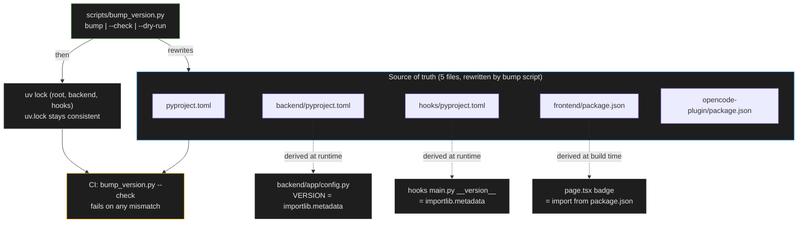

# ENH-009: Version Bump Automation

> Status: Proposed | Date: 2026-07-06 | Related audit findings: ARC-021/QA-010, DOC-007

## Overview

The project's version string lives in 8 locations that are synchronized entirely by hand — and one of them (`backend/app/config.py`) has already drifted eight minor versions behind because it is missing from the documented sync table. This plan derives the runtime-reported versions (backend `Settings.VERSION`, hooks `__version__`, frontend header badge) from package metadata so they can never drift again, adds a `make bump-version VERSION=x.y.z` target that atomically rewrites the remaining five source-of-truth files and re-locks the three `uv.lock` files, and adds a CI consistency check that fails when any location disagrees.

## Motivation

All version locations enumerated and verified on 2026-07-06 (repo at v0.22.0):

| # | Location | Verified value |
|---|----------|----------------|
| 1 | `pyproject.toml:3` | `0.22.0` |
| 2 | `backend/pyproject.toml:3` | `0.22.0` |
| 3 | `hooks/pyproject.toml:3` | `0.22.0` |
| 4 | `hooks/src/claude_office_hooks/main.py:36` (`__version__`) | `0.22.0` |
| 5 | `frontend/package.json:3` | `0.22.0` |
| 6 | `frontend/src/app/page.tsx:424` (header badge JSX text) | `v0.22.0` |
| 7 | `opencode-plugin/package.json:3` | `0.22.0` |
| 8 | `backend/app/config.py:13` (`VERSION`, surfaced via OpenAPI `/docs`) | **`0.14.0` — stale (DOC-007)** |

- **The drift is real and recurrent.** `config.py`'s `VERSION` was fixed once before (v0.15.0 per the audit) and drifted again because CLAUDE.md's Version Management table documents only locations 1–7. A procedure that depends on a human remembering an undocumented eighth location is structurally guaranteed to regress (DOC-007's exact finding).
- **Lockfiles amplify the pain.** `uv.lock` embeds the project's own version: verified `uv.lock:72-73` contains `name = "claude-office"` / `version = "0.22.0"` (same for `backend/uv.lock` and `hooks/uv.lock`). Bumping a `pyproject.toml` without re-locking leaves a dirty or stale lockfile — the repo's current `git status` shows exactly this kind of `uv.lock` drift as a standing annoyance. The root `Makefile`'s `uv-lock` target (lines 174-176) covers only backend and hooks, not the root project. (Verified: neither `frontend/bun.lock` nor `opencode-plugin/bun.lock` embeds the package version, so bun needs no re-lock step.)
- **No automation, no check.** There is no bump script, no `make` target, and nothing in CI compares the locations (ARC-021/QA-010). Release commits are hand-rolled (`b17c2c4 chore(release): bump version to 0.22.0`).

## Current State

- **Backend**: `backend/app/config.py:13` hardcodes `VERSION: str = "0.14.0"` inside the `Settings(BaseSettings)` class; FastAPI surfaces it in the OpenAPI docs. The installed package name is `claude-office-visualizer` (`backend/pyproject.toml:2`), installed editable via `uv sync`.
- **Hooks**: `hooks/src/claude_office_hooks/main.py:36` hardcodes `__version__ = "0.22.0"` inside the module's giant `try:` block (the "never crash Claude Code" guard, lines 24-36); it feeds `--version` output (lines 98-116). Package name `claude-office-hooks` (`hooks/pyproject.toml:2`), installed via the `claude-office-hook` console script.
- **Frontend**: `frontend/src/app/page.tsx:422-426` renders the literal badge text `v0.22.0`. `frontend/package.json:3` holds the real version, and `frontend/tsconfig.json:12` already has `"resolveJsonModule": true` (verified), so the badge can import it directly.
- **CLAUDE.md** documents a 7-row Version Management table (missing `config.py`) instructing manual sync.
- **CI**: no workflow compares versions; `.github/workflows/` has only `type-drift.yml` and `frontend-audit.yml` (ENH-008 adds `ci.yml`).

## Proposed Design

Shrink the hand-maintained set from 8 locations to 5 by deriving the three runtime-reported values, then automate the remaining 5 with an atomic, check-capable script.



### 1. Derive runtime versions (eliminates locations 4, 6, 8)

**Backend** (`backend/app/config.py`) — module-level helper, `Settings` default becomes a factory (env override via `BaseSettings` remains possible, which is acceptable and documented):

```python
from importlib import metadata
from pydantic import Field

def _package_version() -> str:
    try:
        return metadata.version("claude-office-visualizer")
    except metadata.PackageNotFoundError:  # running outside an installed env
        return "0.0.0-dev"

class Settings(BaseSettings):
    PROJECT_NAME: str = "Claude Office Visualizer"
    VERSION: str = Field(default_factory=_package_version)
    ...
```

**Hooks** (`hooks/src/claude_office_hooks/main.py:36`, inside the existing `try:` block so the never-crash guarantee holds):

```python
    from importlib import metadata

    try:
        __version__ = metadata.version("claude-office-hooks")
    except metadata.PackageNotFoundError:
        __version__ = "0.0.0-dev"
```

**Frontend badge** (`frontend/src/app/page.tsx` — `resolveJsonModule` already enabled):

```tsx
import pkg from "../../package.json";
// badge JSX (replaces the literal at line 424):
v{pkg.version}
```

### 2. `scripts/bump_version.py` — stdlib-only, atomic, check-capable

Interface:

```
usage: bump_version.py [-h] [--check] [--dry-run] [new_version]

  new_version   target version, strict x.y.z (e.g. 0.23.0)
  --check       verify all locations (incl. uv.lock project entries) agree; exit 1 on mismatch
  --dry-run     print the would-be changes without writing
```

Core structure:

```python
REPO = Path(__file__).resolve().parent.parent
SEMVER = re.compile(r"^\d+\.\d+\.\d+$")

@dataclass(frozen=True)
class VersionLocation:
    path: Path                 # relative to REPO — hard allowlist, nothing else is ever touched
    pattern: re.Pattern[str]   # must match EXACTLY once, else abort before any write
    template: str

LOCATIONS = (
    VersionLocation(Path("pyproject.toml"),
        re.compile(r'(?m)^version = "([^"]+)"$'), 'version = "{v}"'),
    VersionLocation(Path("backend/pyproject.toml"),
        re.compile(r'(?m)^version = "([^"]+)"$'), 'version = "{v}"'),
    VersionLocation(Path("hooks/pyproject.toml"),
        re.compile(r'(?m)^version = "([^"]+)"$'), 'version = "{v}"'),
    VersionLocation(Path("frontend/package.json"),
        re.compile(r'(?m)^  "version": "([^"]+)",$'), '  "version": "{v}",'),
    VersionLocation(Path("opencode-plugin/package.json"),
        re.compile(r'(?m)^  "version": "([^"]+)",$'), '  "version": "{v}",'),
)

# --check additionally parses the three uv.lock files with tomllib and compares the
# [[package]] entries for claude-office / claude-office-visualizer / claude-office-hooks,
# catching a forgotten re-lock.
```

Behavior contract:
- **All-or-nothing**: read all files, compute all replacements in memory, validate every result re-parses (`tomllib.loads` for TOML, `json.loads` for JSON), *then* write. Any failure aborts with no file modified.
- **Exactly-one-match rule**: each pattern must match exactly once per file (anchored: `target-version = "py313"` cannot match the TOML pattern; dependency pins like `"next": "16.2.9"` sit at 4-space indent and cannot match the 2-space-anchored JSON pattern — both verified against current file contents).
- **Idempotent**: bumping to the current version rewrites nothing (byte-identical output short-circuits), so re-runs are safe.
- **Security scope (hard requirement)**: the script touches *only* the five allowlisted files above. It never reads or writes `.env` files, `~/.claude/claude-office-config.env`, `settings.json`, lockfiles (those are re-locked by `uv` itself via the make target), or any token/key material, and performs no git operations and no network I/O.

### 3. `make bump-version` — bundles the re-lock so uv.lock never drifts

```make
bump-version:			# Bump all version locations: make bump-version VERSION=x.y.z
ifndef VERSION
	$(error VERSION is required: make bump-version VERSION=x.y.z)
endif
	uv run --no-project python scripts/bump_version.py $(VERSION)
	uv lock
	cd backend && uv lock
	cd hooks && uv lock
	uv run --no-project python scripts/bump_version.py --check
	@echo "Bumped to $(VERSION). Next: update CHANGELOG.md, then commit:"
	@echo "  git commit -am 'chore(release): bump version to $(VERSION)'"
```

The target intentionally does **not** commit or tag — that stays with the user, matching existing release habits. The CHANGELOG reminder is printed, not automated.

### 4. CI consistency check

A small standalone workflow (independent of ENH-008's `ci.yml`; fold the step into that workflow instead if it has already landed). The script is stdlib-only, so plain `python3` on the runner suffices — no uv sync. Action pinned to an exact tag verified to exist on 2026-07-06 via `gh api repos/actions/checkout/releases/latest` (re-verify the ref resolves before committing):

```yaml
name: Version Consistency

on:
  workflow_dispatch:
  push:
    branches: [main]
    paths: ['pyproject.toml', 'backend/pyproject.toml', 'hooks/pyproject.toml',
            'frontend/package.json', 'opencode-plugin/package.json',
            'uv.lock', 'backend/uv.lock', 'hooks/uv.lock',
            'scripts/bump_version.py', '.github/workflows/version-check.yml']
  pull_request:
    paths: ['pyproject.toml', 'backend/pyproject.toml', 'hooks/pyproject.toml',
            'frontend/package.json', 'opencode-plugin/package.json',
            'uv.lock', 'backend/uv.lock', 'hooks/uv.lock',
            'scripts/bump_version.py', '.github/workflows/version-check.yml']

jobs:
  check:
    runs-on: ubuntu-latest
    timeout-minutes: 5
    steps:
      - uses: actions/checkout@v7.0.0   # verified 2026-07-06
      - run: python3 scripts/bump_version.py --check
```

### 5. Documentation

Rewrite CLAUDE.md's Version Management table: five source-of-truth rows (the files the script rewrites), a "derived automatically" list (backend `VERSION`, hooks `__version__`, frontend badge), and `make bump-version VERSION=x.y.z` as the one documented procedure. This closes DOC-007's root cause: the procedure no longer depends on a complete hand-maintained list.

## Implementation Phases

Each phase is independently landable and touches ≤5 files. Order: 1 → 2 → 3 → 4 (1 and 2 are independent of each other).

### Phase 1 — Derive backend and hooks runtime versions (fixes the live 0.14.0 drift)

Tasks:
- `backend/app/config.py`: replace `VERSION: str = "0.14.0"` with the `_package_version()` factory (sketch above).
- `hooks/src/claude_office_hooks/main.py`: replace the hardcoded `__version__` at line 36 with the metadata lookup + fallback, inside the existing `try:` block.
- New `backend/tests/test_version.py`: assert `get_settings().VERSION == importlib.metadata.version("claude-office-visualizer")` and that it is not `"0.14.0"`.
- New `hooks/tests/test_version.py`: import `main` (respecting its stdout/stderr-swap import side effects — import inside the test after stashing streams, or match the pattern existing hook tests use) and assert `__version__` matches `importlib.metadata.version("claude-office-hooks")`.

Files (4): `backend/app/config.py`, `hooks/src/claude_office_hooks/main.py`, `backend/tests/test_version.py` (new), `hooks/tests/test_version.py` (new).

Verify:
```bash
cd backend && make checkall
cd hooks && uv run pytest && uv run pyright . && uv run ruff check .
cd backend && uv run python -c "from app.config import get_settings; print(get_settings().VERSION)"   # -> 0.22.0
cd hooks && uv run claude-office-hook --version    # -> claude-office-hook 0.22.0
# OpenAPI surface: make backend, then curl -s localhost:8000/api/v1/openapi.json | jq .info.version  -> "0.22.0"
```

### Phase 2 — Derive the frontend badge

Tasks:
- `frontend/src/app/page.tsx`: add `import pkg from "../../package.json";` and replace the literal `v0.22.0` at line 424 with `v{pkg.version}`.

Files (1): `frontend/src/app/page.tsx`.

Verify:
```bash
cd frontend && make checkall           # tsc accepts the JSON import (resolveJsonModule verified true)
grep -n "0\.22\.0" frontend/src/app/page.tsx   # no matches
# visual: make dev-tmux, open http://localhost:3000, header badge shows v0.22.0
```

### Phase 3 — Bump script + make target

Tasks:
- New `scripts/bump_version.py` per the design (stdlib only: `argparse`, `re`, `json`, `tomllib`, `pathlib`, `dataclasses`, `sys`).
- Root `Makefile`: add `bump-version` target (sketch above) and add it to `.PHONY`; extend the existing `uv-lock` target (lines 174-176) to also lock the root project (`uv lock` in repo root) so ad-hoc use stays consistent too.

Files (2): `scripts/bump_version.py` (new), `Makefile`.

Verify:
```bash
uv run --no-project python scripts/bump_version.py --check          # passes on clean tree
uv run --no-project python scripts/bump_version.py --dry-run 0.23.0 # lists exactly 5 files, no writes (git status clean)
make bump-version VERSION=0.22.0                                    # idempotent: git status shows no changes
# full round-trip on a scratch branch:
make bump-version VERSION=0.22.1 && git diff --stat    # exactly 5 files + 3 uv.lock files changed
git checkout -- .
# negative: hand-edit one pyproject to 9.9.9 -> --check exits 1 naming the mismatched file; restore
# guard: bump_version.py rejects "0.23", "v0.23.0", "0.23.0-rc1" (strict x.y.z)
```

### Phase 4 — CI check + documentation

Tasks:
- New `.github/workflows/version-check.yml` per the skeleton (or, if ENH-008's `ci.yml` already exists, add the `--check` step there instead and skip the new file).
- `CLAUDE.md`: replace the Version Management table with the new source-of-truth/derived split and the `make bump-version` procedure.

Files (2): `.github/workflows/version-check.yml` (new), `CLAUDE.md`.

Verify:
```bash
gh api repos/actions/checkout/git/ref/tags/v7.0.0 -q .ref   # ref resolves before committing
# push branch -> workflow green
# negative test on a scratch branch: set opencode-plugin/package.json to 9.9.9, push -> workflow red; revert
```

## Testing Strategy

- **Unit-level**: `backend/tests/test_version.py` and `hooks/tests/test_version.py` (Phase 1) pin the runtime values to package metadata forever — any future hardcoding reintroduction fails the suite.
- **Script-level**: the script's `--check` mode *is* its test, exercised three ways: locally on a clean tree (pass), in the Phase 3 negative test (deliberate mismatch → exit 1 with the offending file named), and continuously in CI. The idempotency check (`make bump-version VERSION=<current>` produces zero diff) guards the regex/templating logic.
- **Lockfile coverage**: `--check` parses the three `uv.lock` files' project entries, so a bump that skips re-locking fails CI — the exact drift class the repo suffers from today.
- **CI assertions**: `version-check.yml` runs on every PR touching any version-bearing file and on `main` pushes; Phase 4's negative test proves it bites.
- **No secrets regression risk**: the script has no code path that opens any file outside its five-path allowlist; the Phase 3 review checklist includes confirming no reads of `.env*`, `claude-office-config.env`, or `settings.json`.

## Files to Create / Modify

| Path | Change |
|------|--------|
| `backend/app/config.py` | `VERSION` derived via `importlib.metadata` (fixes stale 0.14.0, DOC-007) |
| `hooks/src/claude_office_hooks/main.py` | `__version__` derived via `importlib.metadata` with safe fallback |
| `frontend/src/app/page.tsx` | Header badge renders `v{pkg.version}` from `package.json` import |
| `backend/tests/test_version.py` | **New** — VERSION matches package metadata |
| `hooks/tests/test_version.py` | **New** — `__version__` matches package metadata |
| `scripts/bump_version.py` | **New** — stdlib-only atomic bump / `--check` / `--dry-run` |
| `Makefile` | New `bump-version` target (script + 3× `uv lock` + `--check`); root added to `uv-lock` |
| `.github/workflows/version-check.yml` | **New** — CI consistency gate (or step in ENH-008's `ci.yml`) |
| `CLAUDE.md` | Version Management table rewritten around the new procedure |
| `uv.lock`, `backend/uv.lock`, `hooks/uv.lock` | Re-locked whenever a bump runs (automated by the make target) |

## Risks & Mitigations

- **Regex over- or under-match** (e.g. a future second `version = "…"` line in a pyproject): the exactly-one-match rule aborts before any write, and post-replacement `tomllib`/`json` re-parsing catches structural damage. Verified today: `target-version = "py313"` and 4-space-indented dependency pins cannot match the anchored patterns.
- **`importlib.metadata` misses when not installed** (script run outside `uv sync`'d env, exotic packaging): explicit `PackageNotFoundError` fallback to `"0.0.0-dev"` — visibly wrong rather than silently stale, and the hooks lookup lives inside the existing never-crash `try:` block so Claude Code is never blocked.
- **`BaseSettings` allows a `VERSION` env override**: pre-existing behavior of the Settings class, now merely inherited by the factory default; documented in CLAUDE.md. Anyone setting `VERSION=` in the environment is doing so deliberately.
- **`package.json` import bloats the frontend bundle**: Next.js inlines only what the module graph needs; `frontend/package.json` is already public in the repo, so no information is disclosed. If bundle inspection shows the whole file inlined, switch to a `NEXT_PUBLIC_APP_VERSION` define in `next.config.ts` — same source of truth.
- **Bump script touching something it shouldn't**: hard path allowlist, no globbing, no git, no network, no env/secret file access — enforced by design and by the Phase 3 review checklist (per the project's security rule that version tooling must never generate or rewrite tokens/keys).
- **Contributor bumps by hand and forgets a file or a re-lock**: that is now a CI failure with an actionable message (`run: make bump-version VERSION=x.y.z`), not a silent drift.
- **Prerelease/tag formats**: deliberately out of scope — strict `x.y.z` matches every version this repo has ever shipped; loosen the regex only if a real need appears.

## Acceptance Criteria

- [ ] `backend/app/config.py` contains no hardcoded version; `GET /api/v1/openapi.json` reports the current package version (not 0.14.0).
- [ ] `claude-office-hook --version` reports the version from package metadata; no hardcoded `__version__` literal remains in `hooks/src/`.
- [ ] `frontend/src/app/page.tsx` contains no hardcoded version string; the rendered badge matches `frontend/package.json`.
- [ ] `make bump-version VERSION=x.y.z` rewrites exactly five files, re-locks root/backend/hooks `uv.lock`, and finishes with a passing self-`--check`.
- [ ] Running the bump twice with the same version is a no-op (`git status` clean after the second run).
- [ ] `scripts/bump_version.py --check` exits 1 and names the offending file when any of the five sources or three `uv.lock` project entries disagree.
- [ ] The script performs no git/network operations and touches no file outside its allowlist (code-review verified; no reads of `.env*`, `claude-office-config.env`, or `settings.json`).
- [ ] CI fails on a branch with a deliberately mismatched version and passes after `make bump-version` (negative test executed and reverted).
- [ ] CLAUDE.md documents the new procedure; the old 7-row manual table is gone.
- [ ] `backend/tests/test_version.py` and `hooks/tests/test_version.py` pass in `make checkall`.

## Estimated Effort

| Phase | Effort |
|-------|--------|
| 1 — Derive backend + hooks versions | S |
| 2 — Derive frontend badge | S |
| 3 — Bump script + make target | M |
| 4 — CI check + docs | S |
