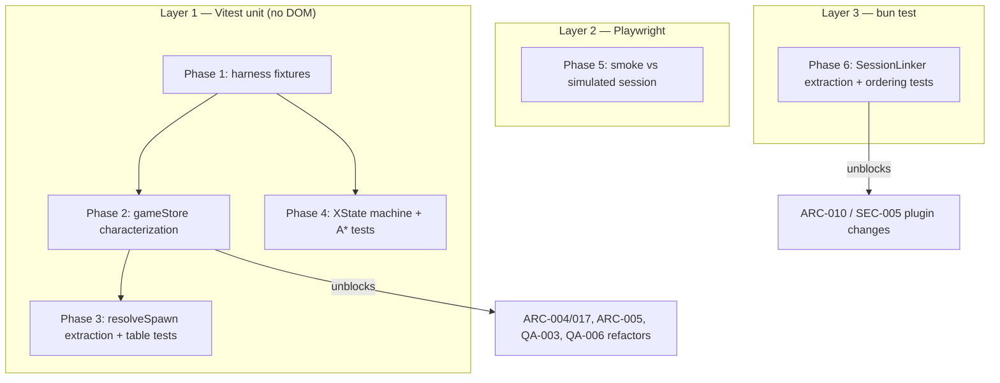

# ENH-010: Frontend Test Infrastructure Build-Out

> Status: Proposed | Date: 2026-07-06 | Related audit findings: QA-001/ARC-007 (frontend coverage gap), QA-002 (opencode-plugin has zero tests), QA-005 (spawn-decision extraction), QA-006 (double-`set()` dequeue — characterize before fixing)

## Overview

Stand up the test harness the frontend's complexity demands: characterization tests for `gameStore` queue/agent actions (the explicit prerequisite for the audit's Phase 2 refactors ARC-004/017, ARC-005, QA-003, QA-009), XState machine tests driven through the injected `AgentMachineActions` interface, pure-function tests for the `handleStateUpdate` spawn-decision table and the A* pathfinding stack, a Playwright smoke test that loads a simulated session end-to-end, and a bun-test scaffold for the OpenCode plugin's session-linking state machine. The deliverable is not coverage numbers — it is a regression safety net under exactly the code that has historically broken (queue-slot collisions, agent-stuck-at-A0).

## Motivation

Verified state of the frontend test surface as of 2026-07-06:

- **6 test files for ~28,400 LOC.** `frontend/tests/` contains only `smoke.test.ts`, `cron.test.ts`, `i18n.test.ts`, `overviewStore.test.ts`, `commandCenterPath.test.ts`; the sole co-located test is `frontend/src/systems/exitAnimation.test.ts` (36 lines). None touch `gameStore`, the machines, or pathfinding.
- **`frontend/src/stores/gameStore.ts` is 1,196 lines with zero tests.** The queue actions (`enqueueArrival` at lines 548-568, `enqueueDeparture` 570-590, `dequeueArrival` 592-610, `dequeueDeparture` 612-630, `advanceQueue` 632-648, `syncQueues` 650-680) are the exact code the audit orders characterized before any refactor (AUDIT.md File Conflict Map: "Order: QA-001 tests → QA-006 → ARC-004/017 → ARC-005 → QA-003"). `dequeueArrival`/`dequeueDeparture` each issue **two separate `set()` calls** (lines 597+607 and 617+627) — the QA-006 transient-inconsistency bug. Tests must lock in observable behavior first so the QA-006 fix is a visible, reviewed change.
- **`frontend/src/machines/agentMachine.ts` (443 lines) is designed for testability but untested.** `createAgentMachine(actions: AgentMachineActions)` takes a fully injected 12-callback interface (`agentMachineCommon.ts:83-104`) with no Pixi, DOM, or store dependency — the audit explicitly calls this out as the seam to test through (ARC-007 remedy).
- **`frontend/src/hooks/useWebSocketEvents.ts:73-277`** (`handleStateUpdate`) embeds a 4-branch + fallback spawn decision (lines 113-146: `arriving` → elevator; in arrival queue → queue slot + `skipArrival`; in departure queue → queue slot; has desk → desk; fallback → elevator) inline in a 579-line hook. It is untestable as written (QA-005).
- **`frontend/vitest.config.ts` is 12 lines** — only the `@` → `src` alias. No coverage config, no shared setup, no include patterns for a future `src/**/*.test.ts` + `tests/**` split.
- **`opencode-plugin/src/index.ts` (715 lines) has zero tests and `"lint": "tsc --noEmit"`** (`opencode-plugin/package.json`). Session-linking state lives in 7 module-level Map/Set structures (lines 185-230: `activeSessions`, `childToParent`, `childToAgent`, `pendingTaskCalls`, `childSessionToCallId`, `childSessionToParent`, `childStopped`) with order-dependent FIFO callID matching the code itself documents as approximate. QA-002's remedy — extract an injectable session-tracking class, then bun-test the documented orderings — is scoped here.

## Current State

- **Runner**: Vitest `^4.1.9` (`frontend/package.json`), invoked via `make -C frontend test` → `$(PKG_MGR) run test` → `vitest run`. `frontend/Makefile`'s `checkall` runs fmt/lint/typecheck/build then tests.
- **Config**: `frontend/vitest.config.ts` sets only `resolve.alias["@"]`. Tests run in the default node environment; the existing tests are pure-logic and need no DOM. `@happy-dom/global-registrator` is already a devDependency but unused by vitest config.
- **Store architecture**: `gameStore` is a single Zustand `create()` module singleton. Tests can drive it via `useGameStore.getState()` / `useGameStore.setState()` without React; `reset()` (line 264 of the interface) restores baseline state — the same pattern `frontend/tests/overviewStore.test.ts` and `exitAnimation.test.ts` already use.
- **Machine architecture**: `agentMachine.ts` composes shared actions/guards/delays from `agentMachineCommon.ts` (`buildSharedActions(actions)`, `sharedGuards`, `sharedDelays` — `BOSS_PAUSE: 100`, `ELEVATOR_PAUSE: 500`, `DOOR_CLOSE_DELAY: 520`, `CONVERSATION_TIMEOUT: 5000`). Machines are spawned by `agentMachineService.spawnAgent(agentId, name, desk, initialPosition, options)` (`agentMachineService.ts:95-106`), but `createActor(createAgentMachine(fakeActions))` works standalone.
- **Pathfinding**: `frontend/src/systems/astar.ts` exports `findPath` (line 126), `gridPathToWorld` (284), `findWorldPath` (299); grid comes from `systems/navigationGrid.ts` (`getNavigationGrid`, `TILE_SIZE`, `GRID_WIDTH`, `GRID_HEIGHT`). `findPath` accepts a `PathGrid`, so tests can pass a hand-built grid without the real office layout.
- **E2E**: No Playwright anywhere in the repo. A working simulation pipeline exists: `uv run python scripts/simulate_events.py basic --session <id>` POSTs a ~60 s scenario against the backend (`scripts/simulate_events.py:1-60`), and the Event Log / header are plain DOM (not canvas), so a smoke test can assert on them without reaching into Pixi.
- **Plugin**: built with `tsc`, run under bun at runtime; `bun test` is available but unconfigured. All state is module-level, so today the file cannot be tested without importing side effects.

## Proposed Design

Four independent test layers, ordered so that characterization lands before any code moves:



### Test-harness fixtures (Phase 1)

`frontend/tests/helpers/storeFixtures.ts`:

```ts
import { useGameStore } from "@/stores/gameStore";
import type { Agent as BackendAgent } from "@/types";

/** Full store reset between tests — wraps the store's own reset(). */
export function resetGameStore(): void {
  useGameStore.getState().reset();
}

/** Minimal valid backend agent for addAgent()/spawn-decision tests. */
export function makeBackendAgent(overrides: Partial<BackendAgent> = {}): BackendAgent {
  return { id: "agent-1", state: "working", name: "Tester", desk: 1, ...overrides } as BackendAgent;
}
```

`frontend/tests/helpers/machineFixtures.ts` — a recording implementation of the injected interface:

```ts
import type { AgentMachineActions } from "@/machines/agentMachineCommon";

export interface RecordedCall { name: keyof AgentMachineActions; args: unknown[] }

/** Records every callback the machine fires, in order. */
export function makeRecordingActions(): { actions: AgentMachineActions; calls: RecordedCall[] } {
  const calls: RecordedCall[] = [];
  const record = (name: keyof AgentMachineActions) =>
    (...args: unknown[]) => { calls.push({ name, args }); };
  return {
    calls,
    actions: {
      onStartWalking: record("onStartWalking"),
      onQueueJoined: record("onQueueJoined"),
      onQueueLeft: record("onQueueLeft"),
      onPhaseChanged: record("onPhaseChanged"),
      onShowBossBubble: record("onShowBossBubble"),
      onShowAgentBubble: record("onShowAgentBubble"),
      onClearBossBubble: record("onClearBossBubble"),
      onClearAgentBubble: record("onClearAgentBubble"),
      onSetBossInUse: record("onSetBossInUse"),
      onOpenElevator: record("onOpenElevator"),
      onCloseElevator: record("onCloseElevator"),
      onAgentRemoved: record("onAgentRemoved"),
    },
  };
}
```

### Spawn-decision extraction (Phase 3, surgical)

Per the QA-005 remedy, lift only the pure decision (currently `useWebSocketEvents.ts:93-146`) into `frontend/src/systems/spawnDecision.ts`; the hook keeps all side effects:

```ts
export interface SpawnPlan {
  spawnPosition: Position;
  skipArrival: boolean;
  queueType?: "arrival" | "departure";
  queueIndex?: number;
}

/** Pure: decides where/how a newly-seen backend agent enters the office. */
export function resolveSpawn(
  agent: { id: string; state: string; desk?: number | null },
  arrivalQueue: string[],
  departureQueue: string[],
  ports: {                       // injected so tests need no navigation grid
    getNextSpawnPosition: () => Position;
    getDeskPosition: (desk: number) => Position;
    getQueuePosition: (t: "arrival" | "departure", slot: number) => Position | null;
  },
): SpawnPlan
```

`handleStateUpdate` calls `resolveSpawn(backendAgent, state.arrivalQueue ?? [], state.departureQueue ?? [], realPorts)` and then performs `store.addAgent` + `agentMachineService.spawnAgent` exactly as before. Behavior-preserving; the diff is mechanical.

### Plugin session-linking extraction (Phase 6)

Per QA-002, move the 7 module-level structures into a class with constructor-injected transport (this also positions SEC-005's key support and ARC-010's contract work to target one shape):

```ts
// opencode-plugin/src/sessionTracker.ts
export type SendEvent = (event: BackendEvent) => Promise<void>;

export class SessionLinker {
  private activeSessions = new Set<string>();
  private childToParent = new Map<string, string>();
  private childToAgent = new Map<string, string>();
  private pendingTaskCalls = new Map<string, string[]>();
  private childSessionToCallId = new Map<string, string>();
  private childSessionToParent = new Map<string, string>();
  private childStopped = new Set<string>();

  constructor(private send: SendEvent, private makeEvent: MakeEvent) {}

  async onSessionCreated(session: SessionInfo): Promise<void> { /* index.ts:349-392 logic */ }
  async onSessionDeleted(session: SessionInfo): Promise<void> { /* index.ts:394-438 */ }
  async onSessionIdle(sessionID: string): Promise<void>       { /* index.ts:440-474 */ }
  async onSessionUpdated(session: SessionInfo): Promise<void> { /* index.ts:476-507 */ }
  registerPendingTaskCall(sessionID: string, callID: string): void  { /* index.ts:605-607 */ }
  resolvePendingTaskCall(sessionID: string, callID: string): void   { /* index.ts:653-662 */ }
}
```

`index.ts` instantiates one `SessionLinker(sendEvent, makeEvent)` inside the plugin factory and delegates the `session.*` branches to it. Tool/permission/compaction handlers stay in `index.ts` unchanged.

## Implementation Phases

Each phase lands and verifies independently; no phase touches more than 5 files.

### Phase 1 — Harness foundation (2 files + 1 config edit)

Tasks:
1. `frontend/vitest.config.ts` — add `test: { include: ["tests/**/*.test.ts", "src/**/*.test.ts"], coverage: { provider: "v8", reporter: ["text", "lcov"], include: ["src/**"] } }`. Do **not** add thresholds yet (ENH-008 ratchets them). Keep the existing alias.
2. Create `frontend/tests/helpers/storeFixtures.ts` (reset helper + `makeBackendAgent` factory, sketch above).
3. Create `frontend/tests/helpers/machineFixtures.ts` (`makeRecordingActions`, sketch above).

Verify: `make -C frontend test` — all 6 existing suites still pass and are still discovered (count unchanged); `make -C frontend typecheck` clean.

### Phase 2 — gameStore characterization tests (3 new files)

Characterization means: assert what the code **does today**, including warts, with comments marking known bugs so the later fix flips a documented expectation.

Tasks:
1. `frontend/tests/gameStore.queues.test.ts` — scenarios in Testing Strategy below.
2. `frontend/tests/gameStore.agents.test.ts` — `addAgent` (desk-count rounding, `gameStore.ts:430-437`), `removeAgent` (also strips from both queues, 439-457), the seven `updateAgentX` patch actions incl. the `updateAgentMeta` `||`-vs-`??` quirk at line 519 (QA-012: empty-string task cannot clear the previous task — characterize, don't fix).
3. `frontend/tests/gameStore.bubblesAndResets.test.ts` — bubble queue behavior and the three reset variants.

Verify: `make -C frontend test`; every new test passes against unmodified `gameStore.ts` (zero source changes in this phase — confirm with `git diff --stat frontend/src` empty).

### Phase 3 — Spawn-decision extraction + table tests (3 files)

Tasks:
1. Create `frontend/src/systems/spawnDecision.ts` with `resolveSpawn()` (sketch above) — logic moved verbatim from `useWebSocketEvents.ts:93-146`.
2. Edit `frontend/src/hooks/useWebSocketEvents.ts` to call `resolveSpawn()`; delete the inlined branch block; no other hook changes.
3. Create `frontend/tests/spawnDecision.test.ts` — full decision table (below).

Verify: `make -C frontend checkall` (build + tests); manual spot-check: `make dev-tmux`, run `uv run python scripts/simulate_events.py basic`, confirm agents still spawn from the elevator and mid-session reconnect (browser refresh mid-scenario) restores agents at desks/queues.

### Phase 4 — XState machine + A* tests (2 new files)

Tasks:
1. `frontend/tests/agentMachine.test.ts` — drive `createActor(createAgentMachine(actions))` with `makeRecordingActions()` and `vi.useFakeTimers()` (XState v5's default clock is `setTimeout`-based, so fake timers advance the `after` delays: 800 ms conversation beat, `BOSS_PAUSE` 100, `ELEVATOR_PAUSE` 500, `DOOR_CLOSE_DELAY` 520, `CONVERSATION_TIMEOUT` 5000).
2. `frontend/tests/astar.test.ts` — pure `findPath`/`gridPathToWorld`/`findWorldPath` tests with hand-built `PathGrid`s.

Verify: `make -C frontend test`; assert no test relies on real time (suite completes in <5 s).

### Phase 5 — Playwright smoke against a simulated session (5 files)

Tasks:
1. `frontend/package.json` — add `@playwright/test` devDependency and `"test:e2e": "playwright test"` script.
2. Create `frontend/playwright.config.ts` — project `chromium` with `channel: "chrome"` (per repo convention: Playwright with Chrome for web tests), `webServer: [{ command: "make -C ../backend dev", url: "http://localhost:8000/api/v1/status", reuseExistingServer: true }, { command: "make dev", url: "http://localhost:3000", reuseExistingServer: true }]`, `testDir: "e2e"`.
3. Create `frontend/e2e/office-smoke.spec.ts` — see Testing Strategy.
4. `frontend/Makefile` — add `test-e2e:` target (`$(PKG_MGR) run test:e2e`); do **not** add it to `checkall` (E2E is opt-in until ENH-008's CI matrix wires it).
5. `frontend/.gitignore` (or root) — add `playwright-report/`, `test-results/`.

Verify: `make -C frontend test-e2e` passes locally with no servers pre-running (webServer boots them) AND with `make dev-tmux` already running (reuseExistingServer). Screenshot artifact produced on failure.

### Phase 6 — OpenCode plugin bun-test scaffold (5 files)

Tasks:
1. Create `opencode-plugin/src/sessionTracker.ts` — `SessionLinker` class (sketch above); logic moved verbatim from `index.ts` module scope.
2. Edit `opencode-plugin/src/index.ts` — instantiate `SessionLinker`, delegate the four `session.*` event branches and the two pending-task-call touchpoints in `tool.execute.before/after`; delete the module-level Maps/Sets.
3. Create `opencode-plugin/tests/sessionTracker.test.ts` — bun tests (`import { describe, it, expect } from "bun:test"`) with a fake `send` capturing `BackendEvent[]`; scenarios below.
4. `opencode-plugin/package.json` — add `"test": "bun test"`; keep `lint`/`typecheck` as-is (real ESLint is QA-002's remainder, out of scope here).
5. `opencode-plugin/tsconfig.json` — ensure `tests/` excluded from the `dist` build (add `"exclude": ["tests"]` if absent).

Verify: `cd opencode-plugin && bun run typecheck && bun test && bun run build`; then `./install.sh` and a manual OpenCode session with `CLAUDE_OFFICE_DEBUG=1` confirming the same event sequence in the backend log as before the refactor (start → tool events → stop, no duplicate `subagent_start`).

## Testing Strategy

### gameStore queue characterization (`gameStore.queues.test.ts`) — BEFORE refactors

| # | Scenario | Locks in |
|---|----------|----------|
| Q1 | `enqueueArrival` on empty queue sets `arrivalQueue=[id]` and patches the agent to `queueType:"arrival", queueIndex:0` in the **same** `set()` | lines 548-568 |
| Q2 | `enqueueArrival` of an already-queued id is a no-op (dedupe guard, line 550) | |
| Q3 | `enqueueArrival` of an id with no agent in the Map still appends to the queue (line 567 fallthrough) | orphan-id tolerance |
| Q4 | Same three cases for `enqueueDeparture` (570-590) — asserts the two actions are behavioral duplicates (pre-QA-003 evidence) | |
| Q5 | `dequeueArrival` returns the front id, remaining agents get reindexed `queueIndex` 0..n-1 | 592-610 |
| Q6 | **QA-006 transient**: subscribe via `useGameStore.subscribe`; assert exactly **two** notifications per dequeue and that after the first, `arrivalQueue` is shifted while agents still hold stale `queueIndex`. Comment: `// KNOWN BUG QA-006 — flip to single notification when fixed` | 597 + 607 |
| Q7 | `dequeueArrival` on empty queue returns `undefined`, no `set()` | |
| Q8 | `advanceQueue("arrival"/"departure")` reindexes without popping | 632-648 |
| Q9 | `syncQueues` overwrites `queueType/queueIndex` for members of both queues, leaves non-members untouched | 650-680 |
| Q10 | `removeAgent` removes from Map **and** filters both queues | 439-457 |

### gameStore agents/bubbles/resets

- `gameStore.agents.test.ts`: desk-count grows in steps of 4 (`Math.ceil((n+1)/4)*4`, line 431-434); each `updateAgentX` action patches only its field; all no-op on unknown id; `updateAgentMeta` QA-012 characterization (empty-string `currentTask` preserved via `||`).
- `gameStore.bubblesAndResets.test.ts`: `enqueueBubble` FIFO per entity; `{immediate: true}` jumps the queue; `advanceBubble` pops; `hasBubbleText`/`isBubbleQueueEmpty`/`getCurrentBubble` consistency; `clearBubbles`. Resets: table-drive `reset` vs `resetForReplay` vs `resetForSessionSwitch` over a fully-populated store and snapshot which fields each clears/preserves (locks in the "three subtly different reset functions" the audit flags in ARC-005 before slicing).

### Spawn-decision table (`spawnDecision.test.ts`)

| Case | agent.state | in arrivalQueue | in departureQueue | desk | Expected plan |
|------|-------------|-----------------|-------------------|------|---------------|
| 1 | `arriving` | any | any | any | elevator spawn, `skipArrival=false`, no queueType |
| 2 | `waiting` | yes (index i) | no | any | `getQueuePosition("arrival", i+1)`, `skipArrival=true`, `queueType="arrival"`, `queueIndex=i` |
| 3 | as 2 but `getQueuePosition` returns null | | | | falls back to `getNextSpawnPosition()` |
| 4 | `waiting` | no | yes (index i) | any | `getQueuePosition("departure", i+1)`, `queueType="departure"` |
| 5 | as 4 but null slot | | | 3 | falls back to `getDeskPosition(3)` (note asymmetry vs case 3 — characterize) |
| 6 | `working` | no | no | 5 | `getDeskPosition(5)`, `skipArrival=true`, no queueType |
| 7 | `working` | no | no | null | elevator fallback, `skipArrival=false` |
| 8 | `arriving` while ALSO listed in arrivalQueue | yes | no | any | elevator wins (branch order, line 113) — regression guard for the A0-stuck bug class |

### XState machine flows (`agentMachine.test.ts`)

1. **Full arrival**: `SPAWN` → assert `onPhaseChanged("arriving")`, `onOpenElevator`, `onStartWalking(..., "to_arrival_queue")`; `ARRIVED_AT_QUEUE` → `onCloseElevator` + `onQueueJoined`; `QUEUE_POSITION_CHANGED {newIndex: 0}` then `BOSS_AVAILABLE` → guard `isAtFrontOfQueue` passes, `onSetBossInUse("arrival")` + `onQueueLeft`; `ARRIVED_AT_READY` → conversing (`onClearBossBubble`, `onShowBossBubble("Here's your task, ...")`); `BUBBLE_DISPLAYED` + advance 800 ms → `onShowAgentBubble`; `ARRIVED_AT_BOSS` + advance 100 ms → walking_to_desk (`onSetBossInUse(null)`); `ARRIVED_AT_DESK` → snapshot matches `idle`, `onPhaseChanged("idle")`.
2. **Guard negative**: `BOSS_AVAILABLE` with `queueIndex !== 0` does **not** transition (agent stays `in_queue`, no `claimBoss`).
3. **Full departure**: from `idle`, `REMOVE` → departure chain through `showFarewellBubble`, `onOpenElevator`, `ELEVATOR_DOOR_CLOSING`, advance 520 ms → final `removed` state, `onAgentRemoved(agentId)` fired exactly once.
4. **Conversation safety net**: enter `conversing`, never send `BUBBLE_DISPLAYED`, advance 5000 ms (`CONVERSATION_TIMEOUT`) → machine still reaches `walking_to_boss` (regression guard for the freeze the comments at `agentMachine.ts:170-175, 305-310` describe).
5. **Mid-session spawns**: `SPAWN_AT_DESK` lands in `idle` with `queueIndex:-1`; `SPAWN_IN_ARRIVAL_QUEUE {queueIndex: 2}` lands in `arrival.in_queue` with context intact; `SPAWN_IN_DEPARTURE_QUEUE` likewise.

### A* (`astar.test.ts`)

Straight-line path on an open grid; wall detour (assert path avoids blocked cells); no-path returns null/empty (characterize the actual contract from `findPath`'s signature); start==goal; diagonal cost preference (path length uses `SQRT2` diagonals over manhattan dog-legs); `gridPathToWorld` maps grid coords to tile-centered world positions using `TILE_SIZE`.

### Playwright smoke (`office-smoke.spec.ts`)

1. Navigate to `http://localhost:3000`; wait for the connection indicator / header to render.
2. `expect(page.locator("canvas"))` visible (Pixi mounted).
3. Run `uv run python scripts/simulate_events.py basic --session pw_smoke_<runid>` via `child_process` from the test (backend must be up — guaranteed by `webServer`).
4. Select/confirm the simulated session (session appears in the UI), then assert **DOM** side panels reflect activity: Event Log receives entries (e.g. text matching `session_start` / tool names), since panels are DOM components not canvas (ARC-028).
5. Collect `page.on("console")` and fail on any `error`-level message.

### Plugin session-linking orderings (`sessionTracker.test.ts`)

| # | Ordering | Expected emissions |
|---|----------|--------------------|
| P1 | main `session.created` → `session.idle` → `session.deleted` | `session_start`, `stop`, `session_end` |
| P2 | duplicate `session.created` for same id | second is silent |
| P3 | Task flow: `registerPendingTaskCall(parent, c1)` → child `session.created {parentID}` | **no** `subagent_start` from the tracker (suppressed; tool hook already sent it); child linked to `c1` |
| P4 | P3 then child `session.updated {title}` | one `agent_update` on parent with `agent_id: subagent_c1`, `agent_name: title` |
| P5 | P3 then child `session.deleted` | no `subagent_stop` (tool.execute.after owns it); tracking maps empty afterward (assert via exposed size or behavior: a later idle for that id emits main-session `stop`) |
| P6 | FIFO: register c1 then c2; childA created links c1, childB links c2 | order preserved |
| P7 | `resolvePendingTaskCall` when child never appeared | pending list cleaned; subsequent unrelated child `session.created {parentID}` becomes an @mention `subagent_start` (not wrongly linked) |
| P8 | @mention flow: child created (no pending) → `subagent_start` on parent; `session.idle` → `subagent_stop` once; `session.deleted` → **no second** `subagent_stop` | dedupe via `childStopped` |
| P9 | @mention: `session.deleted` arrives without prior idle | single `subagent_stop` with `reason: "deleted"` |
| P10 | @mention rename: `session.updated {title}` before idle → idle's `subagent_stop` carries the updated `agent_name` | |

## Files to Create / Modify

| Path | Change |
|------|--------|
| `frontend/vitest.config.ts` | Add `test.include` + v8 coverage config |
| `frontend/tests/helpers/storeFixtures.ts` | New — store reset + backend-agent factory |
| `frontend/tests/helpers/machineFixtures.ts` | New — recording `AgentMachineActions` |
| `frontend/tests/gameStore.queues.test.ts` | New — queue characterization (Q1-Q10) |
| `frontend/tests/gameStore.agents.test.ts` | New — agent CRUD/patch characterization |
| `frontend/tests/gameStore.bubblesAndResets.test.ts` | New — bubbles + 3 reset variants |
| `frontend/src/systems/spawnDecision.ts` | New — pure `resolveSpawn()` extracted from hook |
| `frontend/src/hooks/useWebSocketEvents.ts` | Replace inline branch (lines 93-146) with `resolveSpawn()` call |
| `frontend/tests/spawnDecision.test.ts` | New — 8-case decision table |
| `frontend/tests/agentMachine.test.ts` | New — arrival/departure/mid-spawn/timeout flows |
| `frontend/tests/astar.test.ts` | New — pathfinding pure tests |
| `frontend/package.json` | Add `@playwright/test`, `test:e2e` script |
| `frontend/playwright.config.ts` | New — chromium/chrome, dual webServer |
| `frontend/e2e/office-smoke.spec.ts` | New — simulated-session smoke |
| `frontend/Makefile` | Add `test-e2e` target |
| `frontend/.gitignore` | Ignore Playwright artifacts |
| `opencode-plugin/src/sessionTracker.ts` | New — `SessionLinker` class |
| `opencode-plugin/src/index.ts` | Delegate session.* handling to `SessionLinker`; remove module-level state |
| `opencode-plugin/tests/sessionTracker.test.ts` | New — P1-P10 ordering tests (bun:test) |
| `opencode-plugin/package.json` | Add `test` script |
| `opencode-plugin/tsconfig.json` | Exclude `tests/` from build if needed |

## Risks & Mitigations

- **Characterization tests freeze bugs as "correct".** Mitigation: every known-bug assertion (QA-006 double-set, QA-012 `||`) carries a `// KNOWN BUG <id>` comment and the plan for the follow-up fix names the exact test to flip — the tests are the change-detector, not an endorsement.
- **XState fake timers vs real clock.** If a future XState version swaps its clock implementation, `after` transitions won't advance under `vi.useFakeTimers`. Mitigation: one canary test asserts a 100 ms delay fires only after `vi.advanceTimersByTime(100)`; failure mode is loud, not flaky.
- **Playwright smoke flakiness (canvas app, timing-based simulation).** Mitigation: assert only on DOM panels and connection state, never on sprite positions; generous per-assertion timeouts; keep out of `checkall` until ENH-008 CI stabilizes it.
- **Phase 6 refactors a 715-line file with no prior tests** — the one place we must change code to test it. Mitigation: verbatim logic moves (no behavior edits), `bun run typecheck` + manual OpenCode session diff of debug logs before/after, and the P1-P10 suite written against the extracted class immediately.
- **`resolveSpawn` extraction could subtly reorder branch precedence.** Mitigation: case 8 in the decision table pins branch order; Phase 3 verify includes a live mid-session-reconnect check.

## Acceptance Criteria

- [ ] `make -C frontend test` runs all pre-existing suites plus ≥6 new unit suites, green.
- [ ] `gameStore` queue actions (`enqueueArrival`, `enqueueDeparture`, `dequeueArrival`, `dequeueDeparture`, `advanceQueue`, `syncQueues`, `removeAgent`) each have ≥1 characterization test; the QA-006 two-notification transient is explicitly asserted and comment-tagged.
- [ ] The three reset variants have a table-driven test documenting field-by-field behavior differences.
- [ ] `resolveSpawn()` exists as a pure function; `useWebSocketEvents.ts` no longer contains the inline 4-branch block; all 8 decision-table cases pass.
- [ ] `createAgentMachine` arrival flow, departure flow, front-of-queue guard, conversation-timeout safety net, and all three mid-session `SPAWN_*` variants are covered via the injected `AgentMachineActions` recorder — zero mocking of XState internals.
- [ ] A* tests cover open-path, detour, no-path, and diagonal-cost cases without importing the real office grid.
- [ ] `make -C frontend test-e2e` boots backend + frontend, drives `simulate_events.py basic`, and passes; failure captures a screenshot.
- [ ] `SessionLinker` is constructor-injected (no module-level session state remains in `index.ts`); `cd opencode-plugin && bun test` passes P1-P10; `bun run build` output unchanged in shape (plugin still loads in OpenCode).
- [ ] No production behavior change outside the two sanctioned extractions (Phases 3 and 6): `git diff` for all other phases touches only `frontend/tests/`, config, and Makefiles.

## Estimated Effort

| Phase | Scope | Effort |
|-------|-------|--------|
| 1 — Harness foundation | config + 2 fixture modules | S |
| 2 — gameStore characterization | 3 test files, ~30 scenarios | M |
| 3 — resolveSpawn extraction + table | 1 extraction + 8-case table | M |
| 4 — XState + A* tests | 2 test files, fake timers | M |
| 5 — Playwright smoke | dep + config + 1 spec + Make target | M |
| 6 — Plugin SessionLinker + bun tests | 1 extraction + 10 ordering tests | L |
