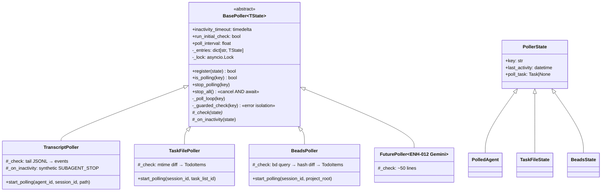

# ENH-011: Generic Async Poller Framework

> Status: Proposed | Date: 2026-07-06 | Related audit findings: ARC-013 (poller copy-paste, no shared abstraction), with touchpoints on ARC-016's "config via raw `os.environ`" pattern (the beads interval instance only)

## Overview

Extract a generic `BasePoller[TState]` that owns registration, locking, task lifecycle, inactivity timeout, error isolation, and configurable intervals in one place, with `_check(state)` as the sole abstract method. Migrate the three existing pollers — `transcript_poller.py`, `task_file_poller.py`, `beads_poller.py` — onto it without changing their public APIs, fixing the verified lifecycle drift (no poller awaits cancelled tasks in `stop_all`; one holds the lock across `await`; one reads raw `os.environ`) as a side effect of centralization. A fourth poller (Gemini transcripts per ENH-012, or any future source) then becomes a ~50-line subclass.

## Motivation

The three pollers are structural copy-paste with **inconsistent drift**, all verified in source on 2026-07-06:

- **`stop_all` never awaits cancelled tasks — in all three.** `transcript_poller.py:103-109`, `task_file_poller.py:158-164`, `beads_poller.py:208-213` each do `task.cancel()` in a loop then `self._sessions.clear()` (or `_agents.clear()`) and return. The cancelled coroutines are left running their `except asyncio.CancelledError` teardown after the registry is already empty; on interpreter shutdown this produces "Task was destroyed but it is pending" warnings and makes tests racy. By contrast each poller's *singular* `stop_polling` **does** await (`transcript_poller.py:97-101`).
- **Lock discipline differs between pollers.** `TranscriptPoller.stop_polling` pops the entry under the lock, then cancels/awaits **outside** it (`transcript_poller.py:93-101`) — correct. `TaskFilePoller.stop_polling` cancels and awaits **while holding `self._lock`** (`task_file_poller.py:148-156`), as does `BeadsPoller` (`beads_poller.py:199-206`); if a poll loop ever needed the lock during cancellation teardown this would deadlock, and it serializes stop against every other operation.
- **Configuration is inconsistent.** `beads_poller.py:41-47` reads `BEADS_POLL_INTERVAL` from raw `os.environ` on every loop iteration, while the rest of the backend uses `pydantic-settings` via `app.config.get_settings()` (e.g. `ZOMBIE_SUBAGENT_TIMEOUT_SECONDS`, read at `transcript_poller.py:26-28`). The transcript and task-file intervals are non-configurable module constants (`POLL_INTERVAL_SECONDS = 1.0` at `transcript_poller.py:19` and `task_file_poller.py:58`), which tests must `patch()` (`backend/tests/test_transcript_poller.py:34`).
- **Threading strategy differs for no reason.** Transcript uses `asyncio.to_thread` (`transcript_poller.py:213`); beads uses the older `loop.run_in_executor(None, ...)` (`beads_poller.py:240-241`).
- **The skeleton itself is triplicated (~120 lines × 3):** a `@dataclass` state record with `last_activity`/`poll_task`, a `dict[str, State]` + `asyncio.Lock`, `start_polling` (dup-check, insert, `asyncio.create_task(name=...)`), `is_polling`, `stop_polling`, `stop_all`, a `_poll_loop` (re-fetch entry under lock → inactivity check → `sleep` → check), and a module-level singleton triple (`_x_poller` global, `get_x_poller()`, `init_x_poller(callback)`) — `transcript_poller.py:383-395`, `task_file_poller.py:319-333`, `beads_poller.py:275-287`.
- **Callback typing drifted too:** `TranscriptPoller.__init__` takes `event_callback: Any` (`transcript_poller.py:49`) while the other two take a properly typed `Callable[[str, list[TodoItem]], Coroutine[Any, Any, None]]`.

Every future poller (ENH-012's Gemini transcript ingestion is already on the roadmap) re-forks this skeleton and re-rolls the dice on which drift it inherits.

## Current State

How the subsystem works today (verified):

- **Wiring**: `EventProcessor` lazily initializes each poller behind a boolean flag — `_ensure_transcript_poller` / `_ensure_task_file_poller` / `_ensure_beads_poller` (`backend/app/core/event_processor.py:182-198`) call `init_x_poller(callback)` with a bound-method callback (`self._handle_polled_event`, `self._handle_task_file_update`, `self._handle_beads_update`). Nothing outside the poller modules calls `stop_all` in app code (grep confirms call sites only inside the poller modules and tests) — the drift is latent, but any future lifespan-shutdown hook inherits it.
- **Per-key model**: transcript keys by `agent_id` (state: `PolledAgent` with `file_position`, `active_tool_ids`, dedup hashes — `transcript_poller.py:31-43`); task-file and beads key by `session_id` (states: `TaskFileState` with `last_modified` mtime map — `task_file_poller.py:63-71`; `BeadsState` with `last_hash`, `has_seen_success` — `beads_poller.py:159-168`).
- **Loop shape**: all three re-fetch their state under the lock each iteration and exit silently if the key vanished; all three time out on inactivity (`INACTIVITY_TIMEOUT`: 10 min transcript / 30 min task-file / 60 min beads); task-file and beads run an initial check before entering the loop (`task_file_poller.py:169-170`, `beads_poller.py:216-217`), transcript does not; transcript alone has a **zombie-detection** branch that builds a synthetic `SUBAGENT_STOP` event, breaks out of the loop, and dispatches it after releasing the lock (`transcript_poller.py:120-169`), with the 10-minute hard timeout as fallback only if zombie dispatch itself failed.
- **Error posture**: expected per-check errors are handled locally (`OSError` at `transcript_poller.py:224`, `task_file_poller.py:237`; bd subprocess failures wrapped in `BeadsQueryResult` at `beads_poller.py:75-105`); callback exceptions are caught and logged per invocation; but an **unexpected** exception in the loop body hits the outer `except Exception: logger.exception(...)` and permanently kills that key's polling (`transcript_poller.py:174-175`, `task_file_poller.py:189-190`, `beads_poller.py:230-231`).
- **Tests**: `backend/tests/test_transcript_poller.py` (patches `POLL_INTERVAL_SECONDS`, real temp files), `test_task_file_poller.py` (overrides `_get_task_dir` via method assignment, line 64), `test_beads_poller.py` (unit-tests the pure helpers `has_beads`/`_convert_issue_to_todo`/`_compute_issues_hash`/`_get_poll_interval` plus poller behavior with mocked `_run_bd_query`). All use `pytest.mark.asyncio`.

## Proposed Design

One new module, `backend/app/core/base_poller.py`, and three mechanical migrations. Public APIs (`init_x_poller`, `get_x_poller`, `start_polling(...)` signatures, callback signatures) are preserved so `event_processor.py` is **not touched**.

### `BasePoller[TState]`

```python
"""backend/app/core/base_poller.py"""
import asyncio
import contextlib
import logging
from abc import ABC, abstractmethod
from dataclasses import dataclass, field
from datetime import UTC, datetime, timedelta
from typing import Generic, TypeVar

logger = logging.getLogger(__name__)


@dataclass
class PollerState:
    """Base per-key state; subclass state dataclasses extend this."""
    key: str                     # agent_id or session_id
    last_activity: datetime = field(default_factory=lambda: datetime.now(UTC))
    poll_task: asyncio.Task[None] | None = None


TState = TypeVar("TState", bound=PollerState)


class BasePoller(ABC, Generic[TState]):
    """Owns registration, locking, lifecycle, timeouts, and error isolation.

    Subclasses implement ``_check(state)`` and may override the three hooks:
    ``poll_interval``, ``run_initial_check``, and ``_on_inactivity``.
    """

    # --- Tunables (overridable as class attrs or properties) ---
    inactivity_timeout: timedelta = timedelta(minutes=30)
    run_initial_check: bool = False
    task_name_prefix: str = "poll"

    @property
    def poll_interval(self) -> float:          # override to read Settings
        return 1.0

    def __init__(self) -> None:
        self._entries: dict[str, TState] = {}
        self._lock = asyncio.Lock()

    # --- Lifecycle (final; subclasses do not reimplement) ---
    async def register(self, state: TState) -> bool:
        """Insert *state* and spawn its poll task. False if key already polled."""
        async with self._lock:
            if state.key in self._entries:
                return False
            self._entries[state.key] = state
            state.poll_task = asyncio.create_task(
                self._poll_loop(state.key), name=f"{self.task_name_prefix}_{state.key}"
            )
            return True

    async def is_polling(self, key: str) -> bool: ...

    async def stop_polling(self, key: str) -> None:
        """Pop under lock; cancel + await OUTSIDE the lock (transcript-poller pattern)."""
        async with self._lock:
            state = self._entries.pop(key, None)
        if state and state.poll_task:
            state.poll_task.cancel()
            with contextlib.suppress(asyncio.CancelledError):
                await state.poll_task

    async def stop_all(self) -> None:
        """Cancel AND await every task — fixes the shared drift (ARC-013)."""
        async with self._lock:
            states = list(self._entries.values())
            self._entries.clear()
        for state in states:
            if state.poll_task:
                state.poll_task.cancel()
        for state in states:
            if state.poll_task:
                with contextlib.suppress(asyncio.CancelledError):
                    await state.poll_task

    # --- The loop (final) ---
    async def _poll_loop(self, key: str) -> None:
        try:
            if self.run_initial_check:
                await self._guarded_check(key)
            while True:
                async with self._lock:
                    state = self._entries.get(key)
                    if state is None:
                        return
                    expired = datetime.now(UTC) - state.last_activity > self.inactivity_timeout
                if expired:
                    await self._on_inactivity(state)
                    await self.stop_polling(key)
                    return
                await asyncio.sleep(self.poll_interval)
                await self._guarded_check(key)
        except asyncio.CancelledError:
            logger.debug(f"Poll loop for {key} cancelled")
            raise

    async def _guarded_check(self, key: str) -> None:
        """Error isolation: an unexpected _check failure logs and continues polling."""
        async with self._lock:
            state = self._entries.get(key)
        if state is None:
            return
        try:
            await self._check(state)
        except asyncio.CancelledError:
            raise
        except Exception:
            logger.exception(f"Error in {type(self).__name__} check for {key}")

    # --- Subclass surface ---
    @abstractmethod
    async def _check(self, state: TState) -> None:
        """Perform one poll iteration (read files / run bd / parse transcript)."""

    async def _on_inactivity(self, state: TState) -> None:
        """Hook fired once when *state* exceeds inactivity_timeout. Default: no-op."""
```

### Singleton helper

Replaces the triplicated `_x_poller` / `get_x_poller` / `init_x_poller` boilerplate while keeping module-level functions as thin delegates (so import sites are untouched):

```python
class SingletonHolder(Generic[TPoller]):
    def __init__(self) -> None:
        self._instance: TPoller | None = None
    def get(self) -> TPoller | None:
        return self._instance
    def init(self, instance: TPoller) -> TPoller:
        self._instance = instance
        return self._instance
```

Each poller module keeps e.g. `get_beads_poller()` / `init_beads_poller(cb)` delegating to a module-level `_holder = SingletonHolder[BeadsPoller]()`.

### Subclass mapping

| Concern | TranscriptPoller | TaskFilePoller | BeadsPoller |
|---|---|---|---|
| State dataclass | `PolledAgent(PollerState)` — keeps `session_id`, `transcript_path`, `file_position`, `active_tool_ids`, hashes | `TaskFileState(PollerState)` — keeps `task_dir`, `last_modified` | `BeadsState(PollerState)` — keeps `project_root`, `last_hash`, `has_seen_success` |
| Key | `agent_id` → `state.key` | `session_id` → `state.key` | `session_id` → `state.key` |
| `poll_interval` | `settings.TRANSCRIPT_POLL_INTERVAL` (new, default 1.0) | `settings.TASK_FILE_POLL_INTERVAL` (new, default 1.0) | `settings.BEADS_POLL_INTERVAL` (new, default 3.0 — replaces raw `os.environ` read) |
| `inactivity_timeout` | property returning `_zombie_timeout()` (configured zombie threshold) | `timedelta(minutes=30)` | `timedelta(minutes=60)` |
| `run_initial_check` | `False` (preserves current behavior) | `True` | `True` |
| `_check(state)` | `_read_new_content` + parse + dispatch events (unchanged logic) | `_check_for_changes` body (unchanged) | bd query via `asyncio.to_thread` (migrated from `run_in_executor`) + hash-diff + callback |
| `_on_inactivity(state)` | build + dispatch synthetic `SUBAGENT_STOP` (`_build_zombie_stop_event`, current lines 177-187) with warning log | default no-op (debug log preserved via base) | default no-op |
| `start_polling(...)` facade | unchanged signature; does path translation + safety check, builds `PolledAgent`, calls `register()` | unchanged signature; resolves task dir, builds `TaskFileState`, calls `register()` | unchanged signature; builds `BeadsState`, calls `register()` |

Note on transcript timeouts: today the zombie branch (`transcript_poller.py:127-139`) fires at the configurable zombie threshold and the 10-minute `INACTIVITY_TIMEOUT` exists only as a fallback "if the zombie callback also failed" (`transcript_poller.py:141-146`). In the migrated design `_on_inactivity` dispatches the zombie event and the base **always** stops the loop afterward, so the separate hard fallback becomes unnecessary — a small, documented behavioral simplification (the loop can no longer linger up to 10 minutes after a failed zombie dispatch).

### Flow after migration



### Deliberate behavior changes (all documented, all tested)

1. `stop_all` awaits cancelled tasks (was: cancel-and-forget in all three).
2. `stop_polling` never awaits while holding the lock (was: task-file and beads did).
3. An unexpected exception inside a check no longer kills the key's polling permanently — it is logged via `logger.exception` and polling continues next interval (was: loop death). Expected-error handling inside each `_check` is unchanged.
4. `BEADS_POLL_INTERVAL` moves from raw `os.environ` into `Settings` (still env-overridable via pydantic-settings; same variable name, same default 3.0).
5. Beads' `run_in_executor` becomes `asyncio.to_thread` (same thread-pool semantics, matches house style per ARC-003 remedy pattern).

Everything else — event shapes, callback contracts, dedup/hashing logic, path-safety checks, logging messages at the check level — is a verbatim move.

## Implementation Phases

Each phase is independently landable; none touches more than 5 files; `event_processor.py` is never modified.

### Phase 1 — Base framework + its own test suite (3 files)

Tasks:
1. Create `backend/app/core/base_poller.py` — `PollerState`, `BasePoller[TState]`, `SingletonHolder` (sketches above), full docstrings including the five documented behavior changes.
2. Edit `backend/app/config.py` — add `TRANSCRIPT_POLL_INTERVAL: float = 1.0`, `TASK_FILE_POLL_INTERVAL: float = 1.0`, `BEADS_POLL_INTERVAL: float = 3.0` to `Settings` (pydantic-settings picks up env vars automatically; keep names matching the existing env var for beads).
3. Create `backend/tests/test_base_poller.py` — tests against a minimal `FakePoller(BasePoller[PollerState])` subclass (see Testing Strategy).

Verify: `cd backend && uv run pytest tests/test_base_poller.py -v` green; `make -C backend checkall` (ruff + pyright + full suite) green — proves no existing module is affected.

### Phase 2 — Migrate TaskFilePoller (2 files)

The simplest poller goes first to shake out the base-class ergonomics.

Tasks:
1. Rewrite `backend/app/core/task_file_poller.py`: `TaskFileState` extends `PollerState` (drop its own `last_activity`/`poll_task` fields); `TaskFilePoller(BasePoller[TaskFileState])` with `run_initial_check = True`, `poll_interval` from settings, `_check` = current `_check_for_changes` body minus the lifecycle scaffolding; keep `start_polling(session_id, task_list_id=None)`, `_get_task_dir`, `_read_task_files`, `_convert_task_to_todo` and both singleton functions (now via `SingletonHolder`). Delete the module's `POLL_INTERVAL_SECONDS`/`INACTIVITY_TIMEOUT` constants in favor of class attrs.
2. Update `backend/tests/test_task_file_poller.py`: the `_get_task_dir` override trick (line 64) still works; add a `stop_all`-awaits assertion; adjust any constant patches to class attributes.

Verify: `cd backend && uv run pytest tests/test_task_file_poller.py tests/test_base_poller.py -v`; then full `uv run pytest` (task-persistence and simulation suites exercise the poller indirectly).

### Phase 3 — Migrate BeadsPoller (2 files)

Tasks:
1. Rewrite `backend/app/core/beads_poller.py`: `BeadsState(PollerState)`; `BeadsPoller(BasePoller[BeadsState])`; delete `_get_poll_interval()` and the `os` import (interval now `get_settings().BEADS_POLL_INTERVAL`); replace `loop.run_in_executor(None, _run_bd_query, ...)` with `asyncio.to_thread(_run_bd_query, ...)`; keep pure helpers `has_beads`, `_run_bd_query`, `_compute_issues_hash`, `_convert_issue_to_todo`, the first-failure WARNING/subsequent-DEBUG logic, and the singleton functions.
2. Update `backend/tests/test_beads_poller.py`: remove `_get_poll_interval` tests, replace with a Settings-based interval test (`monkeypatch.setenv("BEADS_POLL_INTERVAL", ...)` + `get_settings.cache_clear()` if settings are cached); keep every pure-helper test unchanged; add `stop_all`-awaits assertion.

Verify: `cd backend && uv run pytest tests/test_beads_poller.py -v`; `BEADS_POLL_INTERVAL=0.5 uv run pytest tests/test_beads_poller.py -v` (env override still honored through Settings); full suite green.

### Phase 4 — Migrate TranscriptPoller (2 files)

The most complex migration (zombie logic, per-agent keying, untyped callback).

Tasks:
1. Rewrite `backend/app/core/transcript_poller.py`: `PolledAgent(PollerState)` (`agent_id` becomes `key`; retain a `agent_id` property alias if internal parse helpers read it); `TranscriptPoller(BasePoller[PolledAgent])` with `inactivity_timeout` as a property returning `_zombie_timeout()`, `_on_inactivity` = build + dispatch `_build_zombie_stop_event` with the existing WARNING log, `_check` = `_read_new_content` + `_parse_content` + per-event callback dispatch with the existing per-event `try/except`. Type the callback as `Callable[[Event], Coroutine[Any, Any, None]]` (fixes the `Any`). Keep `start_polling(agent_id, session_id, transcript_path)` with its path-translation and `is_safe_transcript_path` guard; keep event-construction helpers verbatim; remove the now-redundant `INACTIVITY_TIMEOUT` hard fallback with an explanatory note.
2. Update `backend/tests/test_transcript_poller.py`: replace `patch("...POLL_INTERVAL_SECONDS", ...)` with patching the class `poll_interval` (or a settings monkeypatch); add zombie-path test asserting `_on_inactivity` emits exactly one synthetic `SUBAGENT_STOP` and the loop stops; add `stop_all`-awaits assertion; all existing parse tests unchanged.

Verify: `cd backend && uv run pytest tests/test_transcript_poller.py tests/test_subagent_linking.py -v` (subagent-linking suite covers the zombie/stop pipeline downstream); full `make -C backend checkall`.

### Phase 5 — Live verification + documentation (2 files)

Tasks:
1. End-to-end check: `make dev-tmux`, run `uv run python scripts/simulate_events.py complex` (spawns subagents → exercises transcript poller) and open a session in a repo with `~/.claude/tasks/` activity and a `.beads/` directory if available; confirm via backend logs (`tmux capture-pane -t claude-office-dev:backend -p`) that all three pollers start, deliver updates, and stop without "Task was destroyed but it is pending" warnings on Ctrl-C shutdown.
2. Update `backend/README.md`: document `BasePoller` in the core-module list and add the three `*_POLL_INTERVAL` settings to the env-var table (coordinates with DOC-006; if DOC-006 already landed, just add rows).

Verify: `make -C backend checkall` green; log capture shows zero pending-task warnings across two start/stop cycles.

## Testing Strategy

New `backend/tests/test_base_poller.py` (Phase 1), against a `FakePoller` whose `_check` appends to a list / can be told to raise:

1. **register/is_polling/stop round-trip** — register returns True, duplicate register returns False, `is_polling` flips, `stop_polling` idempotent (double-stop safe, mirroring `test_transcript_poller.py::test_start_and_stop_polling`).
2. **`stop_all` awaits** — register two keys with a slow `_check`; call `stop_all`; assert both `poll_task.done()` is True immediately after return and no `asyncio.all_tasks()` residue matching the task-name prefix.
3. **Error isolation** — `_check` raises `RuntimeError` on call 1, succeeds on call 2; assert the loop survives (call 2 happens) and `logger.exception` fired once (caplog).
4. **Inactivity hook** — `inactivity_timeout=0.05`, `_check` never updates `last_activity`; assert `_on_inactivity` fires exactly once, then the key is deregistered.
5. **`run_initial_check`** — True runs `_check` before the first sleep; False does not (assert call count at t≈0).
6. **CancelledError propagation** — cancelling mid-`_check` does not trigger the error-isolation logger (cancellation is re-raised, not swallowed).
7. **Lock non-retention** — `stop_polling` completes while another coroutine holds a competing operation (no deadlock under `asyncio.wait_for(..., 1.0)`).

Updated per-poller suites (Phases 2-4): all existing behavioral tests pass with at most mechanical edits (constant-patch targets); each gains (a) a `stop_all`-awaits test and (b) an interval-from-Settings test. Transcript additionally gains the explicit zombie-emission test (currently only implied via inactivity timing). Pure-helper tests (`has_beads`, `_convert_issue_to_todo`, `_compute_issues_hash`, task sorting, JSONL parsing) are untouched — they are the regression anchor proving `_check` logic moved verbatim.

Regression gate for the whole enhancement: `cd backend && uv run pytest` (all 23 files, ~317 tests) green after every phase — the poller callbacks feed `test_task_persistence.py`, `test_subagent_linking.py`, and `test_simulation_pipeline.py`, which act as integration coverage.

## Files to Create / Modify

| Path | Change |
|------|--------|
| `backend/app/core/base_poller.py` | New — `PollerState`, `BasePoller[TState]`, `SingletonHolder` |
| `backend/app/config.py` | Add `TRANSCRIPT_POLL_INTERVAL`, `TASK_FILE_POLL_INTERVAL`, `BEADS_POLL_INTERVAL` to `Settings` |
| `backend/tests/test_base_poller.py` | New — 7 framework tests via `FakePoller` |
| `backend/app/core/task_file_poller.py` | Migrate to `BasePoller[TaskFileState]`; delete lifecycle scaffolding |
| `backend/tests/test_task_file_poller.py` | Mechanical updates + stop_all/interval tests |
| `backend/app/core/beads_poller.py` | Migrate; Settings-based interval; `asyncio.to_thread` |
| `backend/tests/test_beads_poller.py` | Replace `_get_poll_interval` tests; add stop_all/interval tests |
| `backend/app/core/transcript_poller.py` | Migrate; zombie logic via `_on_inactivity`; typed callback |
| `backend/tests/test_transcript_poller.py` | Mechanical updates + zombie/stop_all tests |
| `backend/README.md` | Document BasePoller + new settings rows |

(Not modified: `backend/app/core/event_processor.py` — public poller APIs are preserved.)

## Risks & Mitigations

- **Transcript zombie semantics are load-bearing** (orphaned-agent cleanup depends on the synthetic `SUBAGENT_STOP`). Mitigation: dedicated zombie test in Phase 4 plus the existing `test_subagent_linking.py` suite as a downstream check; the migration is sequenced last, after the framework is proven on two simpler pollers.
- **Behavior change #3 (survive unexpected `_check` errors) could mask a persistent failure** by logging every interval forever. Mitigation: `logger.exception` retains full tracebacks; beads' first-WARNING/then-DEBUG pattern stays in its `_check`; if noise becomes real, a max-consecutive-failures knob is a 5-line follow-up — deliberately not built now (no speculative config).
- **`Settings` caching vs env overrides in tests** — if `get_settings()` is `lru_cache`d, `monkeypatch.setenv` alone won't take effect. Mitigation: Phase 1 test suite includes the interval-override test, forcing the correct cache-clearing idiom to be established once and copied.
- **Generic typing under pyright strict** (`BasePoller[TState]` with dataclass inheritance) can produce variance complaints. Mitigation: `TState` is bound to `PollerState` and used invariantly; Phase 1's `make -C backend checkall` gates this before any migration starts.
- **Subtle lock-scope regressions** during verbatim moves. Mitigation: lifecycle code exists in exactly one place after Phase 1 — reviewed once, tested seven ways — and the per-poller diffs shrink to state + `_check`, which hold no locks.

## Acceptance Criteria

- [ ] `backend/app/core/base_poller.py` exists; `grep -c "async def _poll_loop" backend/app/core/*.py` returns exactly 1.
- [ ] All three pollers subclass `BasePoller`; none defines its own `_lock`, `stop_all`, `is_polling`, or poll-loop.
- [ ] `stop_all` on every poller awaits its cancelled tasks (asserted by tests in all four suites).
- [ ] No poller awaits a task while holding its registry lock.
- [ ] `grep -rn "os.environ" backend/app/core/beads_poller.py` returns nothing; `BEADS_POLL_INTERVAL=0.5` env override still works via `Settings`.
- [ ] `TranscriptPoller`'s zombie path emits exactly one synthetic `SUBAGENT_STOP` and stops polling (dedicated test).
- [ ] An injected `RuntimeError` in a `_check` does not permanently stop that key's polling (base test #3).
- [ ] `backend/app/core/event_processor.py` is byte-identical to pre-enhancement (`git diff` empty for that file).
- [ ] Full backend suite green: `make -C backend checkall` (ruff, pyright, all ~317 tests).
- [ ] Clean shutdown: two `make dev-tmux` start/Ctrl-C cycles with active pollers produce zero "Task was destroyed but it is pending" log lines.
- [ ] `backend/README.md` lists `base_poller.py` and the three interval settings.

## Estimated Effort

| Phase | Scope | Effort |
|-------|-------|--------|
| 1 — Base framework + tests | 1 new module, Settings rows, 7 tests | M |
| 2 — TaskFilePoller migration | rewrite + test updates | S |
| 3 — BeadsPoller migration | rewrite + Settings interval + test updates | S |
| 4 — TranscriptPoller migration | rewrite incl. zombie hook + test updates | M |
| 5 — Live verification + docs | tmux E2E + README | S |
