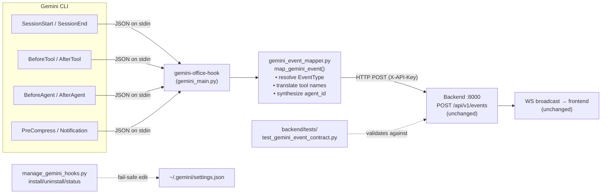

# ENH-012: Gemini CLI Integration (Third Event Producer)

> Status: Proposed | Date: 2026-07-06 | Related audit findings: DOC-014 (research artifacts pending an implementation decision: `GEMINI_UPDATE.md`, `docs/research/google-gemini-cli-hooks.md`); coordinates with ARC-010/ENH-007 (event-contract drift across producers) and ARC-008 (installer safety lessons)

## Overview

Turn the repo's completed Gemini CLI research into a third event producer alongside the Claude Code hooks (Python CLI) and the OpenCode plugin (TypeScript): a `gemini-office-hook` console entry point in the existing `hooks/` package that maps Gemini CLI's 11 lifecycle hook events onto the office event contract and POSTs them to `POST /api/v1/events`. The backend and frontend require **zero changes** — the `Event`/`EventData` model is already producer-agnostic — so the deliverable is a mapper, an entry point, a fail-safe installer for `~/.gemini/settings.json`, tests (including a producer-contract test against the backend Pydantic model, so this producer starts life drift-proof per ARC-010), and docs. This broadens the product from "Claude Code visualizer" to "coding-agent office."

Scope note: the research's Phase 2 ideas (new `llm_call_*`/`tool_selection` EventTypes, Gemini transcript polling) are explicitly **deferred** — they change the backend contract and belong to follow-up ENHs (see Deferred Work).

## Motivation

- **The research is done and rotting at the repo root.** `GEMINI_UPDATE.md` (1,003 lines, "Status: Research complete, pending implementation decision", dated 2026-04-11) and `docs/research/google-gemini-cli-hooks.md` (767 lines, confidence: high, 19 primary sources) fully specify the hook contract, the event mapping, and a phased plan — but no code exists: `grep -ri gemini hooks/src/` returns nothing, and there is no `gemini-plugin/` or `gemini-extension/` directory. DOC-014 flags `GEMINI_UPDATE.md` as root clutter precisely because it never became an implementation.
- **Coverage is high enough to be worth it.** The research maps 7 of the hook-sourced office events fully and 4 partially onto Gemini CLI's 11 hooks — "~85% event coverage" (`GEMINI_UPDATE.md` § Event Mapping → Mapping Summary), versus ~25% for Codex CLI which the research recommends skipping (§ Comparison table).
- **The producer pattern is proven twice.** The Claude Code producer (`hooks/src/claude_office_hooks/main.py`: stdin JSON → `map_event()` → HTTP POST with 0.5 s timeout, never blocks the host CLI) and the OpenCode producer (`opencode-plugin/src/index.ts`: same `BackendEvent` shape, fire-and-forget `sendEvent`) both converge on `POST /api/v1/events`. Gemini CLI uses the same JSON-over-stdin/stdout hook transport as Claude Code (`docs/research/google-gemini-cli-hooks.md` § Communication Contract), so the Python hooks package is the natural home — most of `main.py`'s hardening (config loading, debug logger, API-key header from `config.get_api_key()`, the Windows-safe `_open_request` opener at `main.py:42-71`) is directly reusable.
- **ARC-010 is the cautionary tale.** The OpenCode plugin hand-copied the event union and silently drifted (3 of 23 event types missing, `opencode-plugin/src/index.ts:45-65`). A new producer must ship **with** a contract test validating its output against `backend/app/models/events.py` from day one.
- **Backend readiness verified**: `Event` requires only `event_type` (23-value `StrEnum`), `session_id` (regex `[a-zA-Z0-9_-]{1,128}`, `events.py:102-107`) and an `EventData` of all-optional fields — Gemini's UUID session IDs and field subset fit without model changes (`GEMINI_UPDATE.md` § Shared Backend Contract shows the exact payload parity).

## Current State

- **Claude Code producer (the template to mirror)**: `hooks/src/claude_office_hooks/main.py` (190 lines) suppresses stdout/stderr before any fallible import (Claude Code treats stdout as conversation input), reads the raw hook JSON from the real stdin, delegates to `map_event(event_type, raw_data, session_id, strip_prefixes)` (`event_mapper.py:310-412`), and POSTs with `X-API-Key` when configured. `event_mapper.py` builds a base `data` dict (`project_name`, `project_dir` from `CLAUDE_PROJECT_DIR`, `working_dir` from `cwd`, `transcript_path`, passthrough `tool_use_id`, optional `task_list_id`) then applies per-event handlers, including the two remap patterns Gemini will imitate: `PreToolUse(Task|Agent)` → `subagent_start` with `agent_id = f"subagent_{tool_use_id}"` (`event_mapper.py:115-135`) and `pre_compact` → `context_compaction` (`event_mapper.py:99-102`). Entry point registered as `claude-office-hook = "claude_office_hooks.main:main"` (`hooks/pyproject.toml:11-12`). Tests exist in `hooks/tests/test_event_mapper.py`.
- **Installer prior art (and its known bug)**: `hooks/manage_hooks.py` writes hook entries into `~/.claude/settings.json`; ARC-008 documents that it can silently wipe user settings on a JSON parse error and writes in place with no backup. The Gemini installer must be built fail-safe from the start (abort on `JSONDecodeError`, temp-file + `os.replace()`, `.bak` before first mutation) — whether or not the ARC-008 remediation has landed for the Claude installer.
- **OpenCode producer**: demonstrates the alternative install model (symlinked plugin, `opencode-plugin/install.sh`) and the env knobs users expect (`CLAUDE_OFFICE_API_URL`, `CLAUDE_OFFICE_DEBUG=1`). Not the transport model Gemini needs (Gemini hooks are `command`-type subprocesses, not an in-process plugin API — `docs/research/google-gemini-cli-hooks.md` § Hook Configuration Fields: "Currently only `command` supported").
- **What the research establishes about Gemini CLI** (v0.26.0+, research date 2026-04-11): 11 hook events in 4 categories (§ Hook Events); JSON-over-stdin with base fields `session_id`, `transcript_path`, `cwd`, `hook_event_name`, `timestamp` on every hook (§ Base Input Schema, corroborated by the `createBaseInput()` source excerpt at § Hook transcript_path); strict stdout discipline ("Golden Rule": stdout must be only JSON; pollution → CLI defaults to Allow and treats output as a `systemMessage`, § Communication Contract); exit 0 = success / 2 = block / other = warning; config at `.gemini/settings.json` (project) and `~/.gemini/settings.json` (user) with regex matchers for tool events and exact-string matchers for lifecycle events (§ Configuration); env vars `GEMINI_PROJECT_DIR`, `GEMINI_SESSION_ID`, `GEMINI_CWD`, plus `CLAUDE_PROJECT_DIR` compat alias (§ Environment Variables).
- **Staleness caveat**: the research is ~3 months old (2026-04-11) against a fast-moving CLI. Every payload-shape assumption below is tagged **[VERIFY]** and Phase 0 exists solely to re-validate them against current Gemini CLI docs and the local reference checkout at `~/Repos/gemini-cli` before any code is written. The backend enum has also grown since the research (19 → 23 values: `background_task_notification`, `task_created`, `task_completed`, `teammate_idle` — `events.py:17-42`); none of the four has a Gemini source, which is fine — producers emit subsets — but the mapping table below is stated against the current 23-value enum.

## Proposed Design

### Architecture

Extend the `hooks/` package (shared config/debug/transport plumbing) rather than creating a new top-level component. One new console script, `gemini-office-hook`, is registered in `~/.gemini/settings.json` for 8 hook events; it reads the hook JSON from stdin, maps it, POSTs it, and always exits 0 with clean stdout.



### Event mapping table

Sourced from `GEMINI_UPDATE.md` § "Event Mapping: Gemini CLI to Claude Office" (Direct Mapping Table + Subagent Handling Detail) and `docs/research/google-gemini-cli-hooks.md` § "Per-Event Input/Output Details". Payload fields listed are the ones the research documents on each hook's stdin.

| Gemini hook (stdin `hook_event_name`) | Condition | Office `EventType` | Payload fields used → `EventData` | Quality / notes |
|---|---|---|---|---|
| `SessionStart` | — | `session_start` | `source` (`startup`/`resume`/`clear`) → `summary="Session started (gemini/{source})"`; `transcript_path` passthrough | Full |
| `SessionEnd` | — | `session_end` | `reason` (`exit`/`clear`/`logout`/`prompt_input_exit`/`other`) → `reason` | Full; best-effort — CLI won't wait (research § SessionEnd), so missed ends are expected; backend zombie/session handling already tolerates this |
| `BeforeTool` | `tool_name` not subagent-like | `pre_tool_use` | `tool_name` (translated, below), `tool_input`, `agent_id="main"` | Full. **[VERIFY]** field casing `tool_name`/`tool_input` and presence of a per-call ID (research shows no `tool_use_id` on BeforeTool input — see gap G1) |
| `BeforeTool` | `tool_name == "activate_skill"` | `subagent_start` | `tool_input.skill_name` → `agent_name`/`agent_type`; `tool_input.prompt` → `task_description`; synthesized `agent_id` (below) | Partial (`GEMINI_UPDATE.md` § Subagent Handling Detail). **[VERIFY]** that `activate_skill`/`complete_task` are actually how current Gemini delegates subagent work — the research itself marks this inferred |
| `AfterTool` | `tool_name` not subagent-like | `post_tool_use` | `tool_name` (translated), `tool_input`, `tool_response.error` absent → `success=True` else `False` | Full. **[VERIFY]** `tool_response` shape (`llmContent`/`returnDisplay`/`error`) |
| `AfterTool` | `tool_name == "complete_task"` | `subagent_stop` | `tool_response.llmContent` (truncated) → `result_summary`; synthesized `agent_id` | Partial; no native agent_id (gap G2) |
| `BeforeAgent` | — | `user_prompt_submit` | `prompt` → `prompt` (truncated to 50 chars, mirroring `event_mapper.py:286-289`) + `summary` | Full |
| `AfterAgent` | — | `stop` | `prompt_response` ignored; no extra fields (mirrors Claude `stop`) | Full |
| `PreCompress` | — | `context_compaction` | `trigger` (`auto`/`manual`) → `summary="Context window compacting ({trigger})"` | Full (mirrors `_handle_pre_compact`, `event_mapper.py:99-102`) |
| `Notification` | `notification_type == "ToolPermission"` | `permission_request` | `message` → `summary`; `details` **[VERIFY]** for tool name | Partial — advisory only; phone rings, no blocking wait (`GEMINI_UPDATE.md` § Gaps) |
| `Notification` | otherwise | `notification` | `notification_type` → `notification_type`, `message` → `message` | Full |
| `BeforeModel` / `AfterModel` / `BeforeToolSelection` | — | *(none — return `None`, event skipped)* | — | Deferred: needs new EventTypes (`GEMINI_UPDATE.md` § Implementation Plan Phase 2) |

Not emitted by this producer (no Gemini source; other producers/backend synthesize them): `subagent_info`, `agent_update`, `cleanup`, `reporting`, `walking_to_desk`, `waiting`, `leaving`, `error`, `background_task_notification`, `task_created`, `task_completed`, `teammate_idle`.

**Tool-name translation** (verbatim from `GEMINI_UPDATE.md` § Tool Name Translation Table, so whiteboard stats aggregate across producers): `run_shell_command→Bash`, `read_file→Read`, `read_many_files→Read`, `write_file→Write`, `replace→Edit`, `grep_search→Grep`, `glob→Glob`, `list_directory→Glob`, `google_web_search→WebSearch`, `web_fetch→WebFetch`, `ask_user→AskUserQuestion`, `activate_skill→Skill`, `write_todos→TodoWrite`; unknown names (incl. `mcp_<server>_<tool>`) pass through untranslated.

**Known gaps carried into the design** (from `GEMINI_UPDATE.md` § Gaps and Limitations): (G1) the research does not document a per-invocation tool-call ID on `BeforeTool`/`AfterTool` stdin — **[VERIFY]**; if absent, synthesize `tool_use_id = f"{session_id[:8]}_{monotonic counter or hash(tool_name+timestamp)}"` and accept that pre/post pairing is approximate (the backend tolerates unmatched `tool_use_id`s). (G2) subagent start/stop cannot be matched by native ID; use the `activate_skill` synthesized id and emit `subagent_stop` with the most recent unstopped synthesized id per session — same FIFO approximation the OpenCode plugin documents (`opencode-plugin/src/index.ts:203-211`). (G3) advisory permission events cannot block.

### Mapper sketch

```python
# hooks/src/claude_office_hooks/gemini_event_mapper.py
"""Maps Gemini CLI hook payloads to the claude-office Event contract.

Pure module: no I/O, no stdout/stderr (transport lives in gemini_main.py).
"""
GEMINI_TO_CLAUDE_TOOL_MAP: dict[str, str] = {
    "run_shell_command": "Bash", "read_file": "Read", "read_many_files": "Read",
    "write_file": "Write", "replace": "Edit", "grep_search": "Grep",
    "glob": "Glob", "list_directory": "Glob", "google_web_search": "WebSearch",
    "web_fetch": "WebFetch", "ask_user": "AskUserQuestion",
    "activate_skill": "Skill", "write_todos": "TodoWrite",
}
SUBAGENT_START_TOOL = "activate_skill"   # [VERIFY against current Gemini CLI]
SUBAGENT_STOP_TOOL = "complete_task"     # [VERIFY]

def map_gemini_event(
    hook_event: str,            # from stdin hook_event_name (or argv fallback)
    raw_data: dict[str, Any],
    session_id_fallback: str,   # GEMINI_SESSION_ID
) -> dict[str, Any] | None:
    """Return a payload for POST /api/v1/events, or None to skip."""
    event_type = _resolve_event_type(hook_event, raw_data)
    if event_type is None:
        return None
    session_id = raw_data.get("session_id") or session_id_fallback or "unknown_session"
    data = _base_data(raw_data)              # project_name/dir, working_dir, transcript_path
    _apply_event_mapping(hook_event, event_type, raw_data, data)  # per-row logic from the table
    return {"event_type": event_type, "session_id": session_id,
            "timestamp": get_iso_timestamp(), "data": data}

def _base_data(raw_data: dict[str, Any]) -> dict[str, Any]:
    project_dir = os.environ.get("GEMINI_PROJECT_DIR", "")
    working_dir = raw_data.get("cwd", "") or os.environ.get("GEMINI_CWD", "")
    return {
        "project_name": Path(project_dir or working_dir).name or "unknown",
        "project_dir": project_dir,
        "working_dir": working_dir,
        "transcript_path": raw_data.get("transcript_path"),
    }
```

`_resolve_event_type` is the `match` statement already drafted in `GEMINI_UPDATE.md` § Implementation Plan Phase 1 — reuse it as written, extended with the `None`-return rows above.

### Entry point (`gemini_main.py`)

Mirrors `main.py`'s defense-in-depth with one deliberate difference: Gemini **parses stdout as JSON on exit 0** (research § Exit Codes), so instead of suppressing stdout we must emit either nothing or a single empty JSON object, and route every diagnostic to the shared file logger (`debug_logger.py`), never to stdout. Design: whole-module try/except; read stdin JSON; call `map_gemini_event`; reuse `send_event()`-equivalent POST (same `API_URL`, `TIMEOUT`, `get_api_key()` from `config.py`); print `{}` to real stdout **[VERIFY: confirm `{}` vs empty stdout is the cleanest no-op for advisory hooks — research says non-JSON pollution degrades to a user-visible `systemMessage`, which we must avoid]**; always `sys.exit(0)` so the hook can never block or warn. Accept the hook event via `hook_event_name` from stdin, with an optional positional argv override matching the Claude entry point's UX (`gemini-office-hook BeforeTool`).

### Installer (`manage_gemini_hooks.py` + `install-gemini.sh`)

Writes 8 hook registrations into `~/.gemini/settings.json` (path overridable — **[VERIFY]** whether current Gemini honors a `GEMINI_CONFIG_DIR`-style env var as the research's draft assumed, `GEMINI_UPDATE.md` § Hook installation script; otherwise hardcode `~/.gemini/`): `BeforeTool`/`AfterTool` with regex matcher `".*"`, `SessionStart`/`SessionEnd`/`BeforeAgent`/`AfterAgent`/`PreCompress`/`Notification` with wildcard matcher `""` (lifecycle matchers are exact-string, `""`/`"*"` = all — research § Matchers). Each entry: `{"name": "claude-office", "type": "command", "command": "gemini-office-hook", "timeout": 2000, "description": "Claude Office visualizer event"}`. Fail-safe by construction (ARC-008 lessons): abort with a clear error on `json.JSONDecodeError` (never write back a default), write via temp file in the same directory + `os.replace()`, create `settings.json.bak` before the first mutation, and make `uninstall` remove only entries whose `name == "claude-office"`. Subcommands: `install` / `uninstall` / `status`.

## Implementation Phases

Each phase is independently landable; none touches more than 5 files.

### Phase 0 — Verification spike (no product files; 1 new doc)

The research is 3 months stale. Before any code:

Tasks:
1. Against current Gemini CLI docs (`https://github.com/google-gemini/gemini-cli/tree/main/docs/hooks`) and the local checkout `~/Repos/gemini-cli` (update it: `git -C ~/Repos/gemini-cli pull`), re-verify every **[VERIFY]** tag: the 11 hook names; base stdin fields (`session_id`, `transcript_path`, `cwd`, `hook_event_name`, `timestamp`); `BeforeTool`/`AfterTool` extra fields and whether a tool-call ID exists (G1); `tool_response` shape; `SessionStart.source` / `SessionEnd.reason` / `PreCompress.trigger` / `Notification.{notification_type,message,details}` values; settings.json hooks schema and matcher semantics; env vars; whether empty stdout vs `{}` is warning-free on exit 0; and whether `activate_skill`/`complete_task` remain the subagent delegation surface (inspect `packages/core/src/hooks/` and subagent implementation in the checkout).
2. Empirically confirm with a throwaway logging hook: register `command: "cat >> /tmp/gemini-hook-dump.jsonl"` for `BeforeTool` in a scratch project's `.gemini/settings.json`, run one `gemini` turn, and capture a real payload.
3. Record deltas in `docs/research/google-gemini-cli-hooks-verification.md` (date-stamped table: assumption → confirmed/changed → impact on mapping table). If a hook name or field changed, update this plan's table before Phase 1.

Verify: the verification doc exists and every **[VERIFY]** tag in this plan has a confirmed/changed disposition; one captured real `BeforeTool` payload is included verbatim.

### Phase 1 — Event mapper + unit tests (2 files)

Tasks:
1. Create `hooks/src/claude_office_hooks/gemini_event_mapper.py` (sketch above; per-event handlers mirroring `event_mapper.py`'s structure: small `_handle_*` functions + one `map_gemini_event` dispatcher; module produces no output, same header contract as `event_mapper.py:6-7`).
2. Create `hooks/tests/test_gemini_event_mapper.py` — table-driven tests per mapping row (see Testing Strategy), using stdin fixtures shaped from the Phase 0 captured payloads.

Verify: `cd hooks && uv run pytest tests/test_gemini_event_mapper.py -v` green; `uv run ruff check . && uv run pyright` clean (hooks has no Makefile yet — ARC-001; use the raw commands, or `make -C hooks checkall` if the ARC-001 remediation has landed by then).

### Phase 2 — Entry point + transport (3 files)

Tasks:
1. Create `hooks/src/claude_office_hooks/gemini_main.py` (design above; reuse `config.API_URL`/`TIMEOUT`/`get_api_key`/`load_config` and `debug_logger`; factor nothing out of `main.py` yet — if `send_event`/`_open_request` are lifted into a shared `transport.py`, that refactor also touches `main.py` and stays within this phase's 5-file budget: `gemini_main.py`, `transport.py` (new), `main.py`, `pyproject.toml`, test file).
2. Edit `hooks/pyproject.toml` — add `gemini-office-hook = "claude_office_hooks.gemini_main:main"` to `[project.scripts]`.
3. Create `hooks/tests/test_gemini_main.py` — stdin-driven subprocess tests (below).

Verify: `cd hooks && uv sync && echo '{"session_id":"abc-123","hook_event_name":"BeforeAgent","prompt":"hi","cwd":"/tmp"}' | uv run gemini-office-hook` → exit code 0, stdout is `{}` (or empty per Phase 0 finding), nothing on stderr; with the backend running (`make backend`), the event appears in the backend log and the office UI shows the prompt bubble.

### Phase 3 — Installer (3 files)

Tasks:
1. Create `hooks/manage_gemini_hooks.py` — `install`/`uninstall`/`status` per the design above (fail-safe writes; registers all 8 events; idempotent re-install replaces rather than duplicates `name == "claude-office"` entries).
2. Create `hooks/install-gemini.sh` + extend `hooks/uninstall.sh` or add `uninstall-gemini.sh` (mirror `hooks/install.sh` UX: `uv sync`, then `uv run python manage_gemini_hooks.py install`, print status).
3. Create `hooks/tests/test_manage_gemini_hooks.py` — tmp-dir settings.json tests (below).

Verify: `cd hooks && uv run pytest tests/test_manage_gemini_hooks.py -v`; manual: point the installer at a scratch `settings.json` containing unrelated keys + a deliberately malformed variant — install succeeds/aborts respectively, unrelated keys survive byte-for-byte, `.bak` created, `uninstall` restores a hook-free file.

### Phase 4 — Producer contract test + live E2E (2 files)

Tasks:
1. Create `backend/tests/test_gemini_producer_contract.py` — inserts `hooks/src` into `sys.path` (the repo root layout makes this a stable relative path; no packaging changes), generates one payload per mapping-table row via `map_gemini_event`, and asserts `Event.model_validate(payload)` succeeds, `event_type` is a valid `EventType` member, and `session_id` passes the backend regex with a real Gemini-style UUID. This is the ARC-010 drift guard: if `EventData` drops/renames a field the mapper uses, this test fails in the backend suite. (If ENH-007's generated producer contract has landed by implementation time, additionally source the mapper's event-type strings from the generated Python constants module instead of literals, and note it in the test docstring.)
2. Live end-to-end: install into a scratch project, run a real Gemini CLI session (`gemini` in a test repo: prompt → a few tool calls → exit), and record the observed event sequence from backend logs into `docs/research/google-gemini-cli-hooks-verification.md` (appendix section). Confirm in the office UI: session appears, boss reacts to tools, prompt bubble shows, compaction fires if triggered (`/compress`), session ends.

Verify: `cd backend && uv run pytest tests/test_gemini_producer_contract.py -v` green inside the normal backend suite (`make -C backend checkall`); the E2E checklist in the verification doc is fully checked with one screenshot or log excerpt per row.

### Phase 5 — Documentation + repo hygiene (5 files)

Tasks:
1. `hooks/README.md` — add a "Gemini CLI" section: install/uninstall commands, the 8 registered hooks, env vars (`CLAUDE_OFFICE_API_URL` localhost policy — inherit the hooks package's current clamping behavior and note ARC-020's pending policy decision rather than deciding it here; `CLAUDE_OFFICE_API_KEY`, `CLAUDE_OFFICE_DEBUG`), and the coverage/limitations table (advisory permissions, inferred subagents, best-effort SessionEnd).
2. Root `README.md` — producers section now lists three producers (Claude Code hooks, OpenCode plugin, Gemini CLI hooks) with install pointers.
3. Root `Makefile` — add `gemini-hooks-install` / `gemini-hooks-uninstall` / `gemini-hooks-status` targets mirroring the existing `hooks-*` triplet.
4. `docs/README.md` — add the research + verification docs to the index (also satisfies DOC-015's Research-table item for these two files).
5. `GEMINI_UPDATE.md` — replace body with a pointer stub ("implemented as of vX.Y — see `hooks/README.md` § Gemini CLI and `docs/fable/ENH-012-...md`") or move it to `docs/research/` per DOC-014. `CHANGELOG.md` entry.

Verify: `make gemini-hooks-status` works end-to-end; all doc links resolve (relative-path check); `make checkall` green.

## Testing Strategy

- **`hooks/tests/test_gemini_event_mapper.py`** (Phase 1) — one test per mapping-table row plus edge cases, mirroring `test_event_mapper.py`'s style:
  - `SessionStart` each `source` value → `session_start` with source-labelled summary; `transcript_path` passthrough.
  - `SessionEnd` each documented `reason` → `session_end.data.reason`.
  - `BeforeTool` plain tool → `pre_tool_use`, `agent_id="main"`, translated `tool_name` (parameterized over all 13 translation-map entries + one unknown passthrough + one `mcp_server_tool` passthrough).
  - `BeforeTool(activate_skill)` → `subagent_start` with synthesized `agent_id`, `agent_name` from `skill_name`, `task_description` from `prompt`; missing `skill_name` → degraded-but-valid event.
  - `AfterTool` success and error variants → `post_tool_use.success` True/False; `AfterTool(complete_task)` → `subagent_stop` with truncated `result_summary` and FIFO-matched `agent_id` (two-skill sequence test pins the G2 approximation).
  - `BeforeAgent` → `user_prompt_submit` with 50-char truncation (49+`...` boundary case, mirroring `event_mapper.py:286-288`).
  - `AfterAgent` → `stop`; `PreCompress` both triggers → `context_compaction`; `Notification` ToolPermission → `permission_request`, other → `notification`.
  - `BeforeModel`/`AfterModel`/`BeforeToolSelection`/unknown hook name → `None` (skipped).
  - Session-id fallback chain: stdin `session_id` > `GEMINI_SESSION_ID` env > `"unknown_session"`; base-data derivation from `GEMINI_PROJECT_DIR`/`cwd`.
- **`hooks/tests/test_gemini_main.py`** (Phase 2) — subprocess-level: valid payload → exit 0 + clean stdout; malformed JSON on stdin → exit 0, no output, error in debug log; backend unreachable (URL pointed at a closed port) → exit 0 within timeout budget; `--version`; skipped event (BeforeModel) → exit 0, no POST (assert via a local `http.server` capture or mocked opener).
- **`hooks/tests/test_manage_gemini_hooks.py`** (Phase 3) — install into: missing file (creates valid config), existing config with unrelated keys (preserved exactly), config already containing our hooks (idempotent replace, no duplicates), **malformed JSON (aborts nonzero, file untouched — the ARC-008 regression test)**; `.bak` created once; uninstall removes only `name=="claude-office"` entries and leaves foreign hooks; `status` output for installed/not-installed.
- **`backend/tests/test_gemini_producer_contract.py`** (Phase 4) — every mapper output validates against `Event`/`EventType`/`EventData` (the drift guard); plus a completeness assertion that the set of event types the mapper can emit is a subset of `EventType` (fails loudly if the mapper invents a value).
- **Live E2E** (Phase 4) — real Gemini session checklist recorded in the verification doc; this is the only test of Gemini's actual payloads and cannot be replaced by fixtures.
- **Regression**: full `cd hooks && uv run pytest` and `make -C backend checkall` after every phase; the Claude Code producer's suites must remain untouched-and-green (shared `config.py`/`debug_logger.py` are consumed, and `transport.py` extraction in Phase 2, if taken, is covered by existing `main.py` behavior tests plus manual `claude-office-hook --version` smoke).

## Files to Create / Modify

| Path | Change |
|------|--------|
| `docs/research/google-gemini-cli-hooks-verification.md` | New — Phase 0 assumption-verification log + Phase 4 E2E appendix |
| `hooks/src/claude_office_hooks/gemini_event_mapper.py` | New — pure mapping module (table above) |
| `hooks/tests/test_gemini_event_mapper.py` | New — per-row + edge-case tests |
| `hooks/src/claude_office_hooks/gemini_main.py` | New — `gemini-office-hook` entry point |
| `hooks/src/claude_office_hooks/transport.py` | New (optional, Phase 2) — shared POST/opener lifted from `main.py` |
| `hooks/src/claude_office_hooks/main.py` | Only if transport extraction taken: delegate to `transport.py` |
| `hooks/pyproject.toml` | Add `gemini-office-hook` console script |
| `hooks/tests/test_gemini_main.py` | New — subprocess/transport tests |
| `hooks/manage_gemini_hooks.py` | New — fail-safe installer (install/uninstall/status) |
| `hooks/install-gemini.sh` | New — user-facing install script |
| `hooks/tests/test_manage_gemini_hooks.py` | New — installer safety tests incl. ARC-008 regression |
| `backend/tests/test_gemini_producer_contract.py` | New — producer→backend contract guard |
| `hooks/README.md` | Gemini CLI section |
| `README.md` | Three-producer overview |
| `Makefile` | `gemini-hooks-*` targets |
| `docs/README.md` | Index the research/verification docs |
| `GEMINI_UPDATE.md` | Stub/relocate per DOC-014 |
| `CHANGELOG.md` | Feature entry |

(Not modified: anything under `backend/app/`, `frontend/`, `opencode-plugin/` — producer-only change by design.)

## Risks & Mitigations

- **Research staleness / invented APIs.** Highest risk: hook names, payload fields, or the settings schema changed since 2026-04-11. Mitigation: Phase 0 is a hard gate — no mapper code until every **[VERIFY]** tag is confirmed against current docs and a captured real payload; the plan's mapping table is updated first if anything moved.
- **Subagent inference is approximate** (G1/G2: no per-call ID documented, no native agent_id; FIFO matching). Mitigation: same accepted-degradation strategy the OpenCode plugin ships with (documented in its source, `index.ts:203-211`); worst case is a mislabeled office employee, never a backend error; limitations documented in `hooks/README.md`. If Phase 0 finds Gemini has since added native subagent hooks, prefer them and simplify.
- **Stdout pollution breaks Gemini's JSON parsing** (unlike Claude Code, Gemini *reads* stdout). Mitigation: `gemini_main.py` writes exactly one `{}` (or nothing, per Phase 0 finding) via the real stdout handle and routes all logging to the debug file; subprocess tests assert byte-exact stdout.
- **Installer corrupts `~/.gemini/settings.json`** (the ARC-008 failure class, now on a second config file). Mitigation: fail-safe design from day one — abort on parse error, temp+`os.replace()`, `.bak`, name-scoped uninstall — each behavior pinned by a dedicated test.
- **Hook latency in Gemini's synchronous loop** (hooks block the agent loop; research § Overview). Mitigation: registered `timeout: 2000` ms; the POST reuses the hooks package's short `TIMEOUT` (0.5 s) and always exits 0, so worst case adds sub-second latency per event and can never block or warn.
- **Contract drift over time** (the ARC-010 class). Mitigation: `test_gemini_producer_contract.py` runs in the backend suite (CI-gated once ARC-001/ENH-008 land); adopting ENH-007's generated constants when available removes the last hand-written literals.
- **`session_id` format mismatch** — backend regex rejects anything outside `[a-zA-Z0-9_-]{1,128}`. Gemini UUIDs pass, but Phase 0 confirms the actual format; the mapper sanitizes (strip/replace disallowed chars) as a belt-and-braces fallback with a mapper test.

## Acceptance Criteria

- [ ] `docs/research/google-gemini-cli-hooks-verification.md` exists with a confirmed/changed disposition for every **[VERIFY]** item and at least one captured real hook payload.
- [ ] `uv run gemini-office-hook` is installed by `cd hooks && uv sync` and handles all 8 registered hook events; unknown/model events exit 0 silently without POSTing.
- [ ] Every mapping-table row has a passing unit test in `hooks/tests/test_gemini_event_mapper.py`, including all 13 tool-name translations and the subagent FIFO approximation.
- [ ] Subprocess tests prove: exit code is always 0, stdout is byte-exact (`{}` or empty per Phase 0), malformed stdin and unreachable backend are absorbed silently.
- [ ] `manage_gemini_hooks.py install` on a malformed `settings.json` aborts without writing; on a valid file it preserves unrelated keys byte-for-byte, creates a `.bak`, and is idempotent; `uninstall` removes only `claude-office` entries (all pinned by tests).
- [ ] `backend/tests/test_gemini_producer_contract.py` validates every emittable payload against the backend `Event` model and asserts the emitted-type set ⊆ `EventType`; runs green inside `make -C backend checkall`.
- [ ] Live E2E: a real Gemini CLI session renders in the office UI (session start, ≥3 tool events, prompt bubble, stop, session end), with the observed sequence logged in the verification doc.
- [ ] No files under `backend/app/`, `frontend/src/`, or `opencode-plugin/src/` are modified (`git diff --stat` scoped check).
- [ ] Docs updated: `hooks/README.md` Gemini section, root `README.md` producer list, `Makefile` targets, `docs/README.md` index, `GEMINI_UPDATE.md` stubbed/relocated, `CHANGELOG.md` entry.
- [ ] `make checkall` plus `cd hooks && uv run pytest && uv run ruff check . && uv run pyright` all green.

## Estimated Effort

| Phase | Scope | Effort |
|-------|-------|--------|
| 0 — Verification spike | docs/source re-validation + captured payloads | M |
| 1 — Mapper + tests | 1 module + table-driven suite | M |
| 2 — Entry point + transport | entry script, pyproject, subprocess tests (+optional transport extraction) | M |
| 3 — Installer | fail-safe settings editor + shell wrapper + tests | M |
| 4 — Contract test + live E2E | backend-suite guard + real-session checklist | S |
| 5 — Docs + hygiene | 5 doc/build files | S |

Deferred follow-ups (out of scope, candidates for future ENHs): model-event visualizations (`llm_call_start/chunk/end`, `tool_selection` — requires backend EventType + GameState changes, `GEMINI_UPDATE.md` § Implementation Plan Phase 2), Gemini transcript ingestion via a `BasePoller` subclass (pairs with ENH-011 and the ENH-003 offset-tailing pattern; format fully documented in `GEMINI_UPDATE.md` § Session Transcript Format), and Gemini extension packaging (`gemini extensions install` distribution, § Implementation Plan Phase 3).
