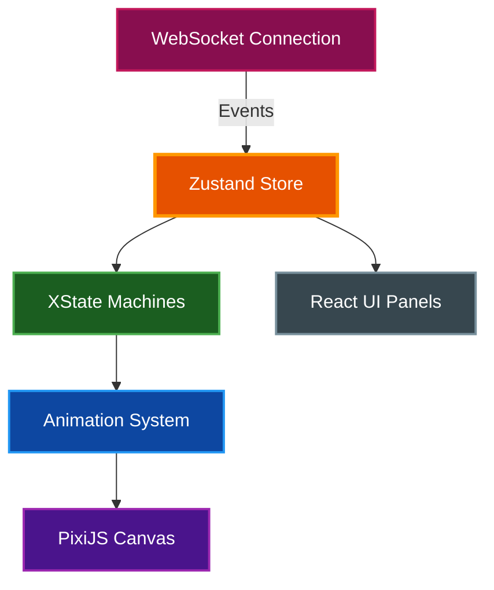

# Claude Office Visualizer Frontend

Next.js application that renders a real-time pixel art office simulation using PixiJS, visualizing Claude Code operations as animated office activities.

## Table of Contents

- [Overview](#overview)
- [Architecture](#architecture)
- [Prerequisites](#prerequisites)
- [Installation](#installation)
- [Running the Application](#running-the-application)
- [Project Structure](#project-structure)
- [Key Components](#key-components)
- [State Management](#state-management)
- [Debug Tools](#debug-tools)
- [Environment Variables](#environment-variables)
- [Testing](#testing)
- [Related Documentation](#related-documentation)

## Overview

The frontend provides an interactive visualization of Claude Code operations:

- **Real-time Rendering**: PixiJS-powered 2D canvas at 1280x1024 native resolution
- **Character Animation**: Boss and agent sprites with walk, idle, and typing animations
- **State Machines**: XState v5 manages agent lifecycle with explicit states and transitions
- **WebSocket Updates**: Live state synchronization with the backend
- **Session Browser**: Collapsible sidebar for session history and replay
- **Debug Tools**: Keyboard shortcuts for path visualization, queue slots, and time controls

## Architecture



### Data Flow

1. WebSocket receives state updates from backend
2. Zustand store updates with new state (agents, boss, context)
3. XState machines process agent lifecycle transitions
4. Animation system interpolates positions and timing
5. PixiJS canvas renders the current frame
6. React UI panels display session info, event log, git status

## Prerequisites

| Requirement    | Version    | Purpose              |
| -------------- | ---------- | -------------------- |
| Node.js or Bun | 20+ / 1.0+ | Runtime              |
| Backend server | Running    | WebSocket connection |

## Installation

```bash
# From the frontend directory
bun install
```

Or with npm:

```bash
npm install
```

## Running the Application

### Development Mode

```bash
# From the frontend directory
make dev
```

Or directly:

```bash
bun run dev
```

The application runs at [http://localhost:3000](http://localhost:3000).

> **Note:** The backend must be running at `localhost:8000` for WebSocket connectivity.

### Production Build

```bash
# Build for production
bun run build

# Start production server
bun run start
```

### Static Export

For deployment with the backend:

```bash
# From project root
make build-static
```

This exports the frontend and copies it to `backend/static/` for FastAPI serving.

## Project Structure

```
frontend/src/
├── app/            # Next.js App Router pages and layout
├── components/
│   ├── attention/  # Urgency toasts and fuzzy command bar
│   ├── command/    # Command Center (cross-session overview)
│   ├── debug/      # Sprite-debug tooling
│   ├── game/       # PixiJS office canvas, sprites, and decor
│   ├── layout/     # Header, sidebars, and mobile drawer
│   ├── navigation/ # Breadcrumb and view transitions
│   ├── overlay/    # Modals (settings, etc.)
│   ├── settings/   # Settings tabs (general, building, ...)
│   ├── tour/       # Onboarding tour overlay
│   └── views/      # Building and floor views
├── constants/      # Canvas dimensions, positions, quotes
├── hooks/          # WebSocket, floors, overview, sessions, i18n
├── i18n/           # Locale loader and translations (en, es, pt-BR)
├── machines/       # XState agent machines + queue manager
├── stores/         # Zustand stores (game, overview, preferences, attention, navigation, tour)
├── systems/        # Animation, pathfinding, queue positions, Command Center motion
├── types/          # TypeScript types incl. generated.ts (backend contract)
└── utils/          # API client, bubble text, cron helpers, event-type styles
```

## Key Components

### OfficeGame

The main canvas component that orchestrates all rendering:

- Floor, walls, and furniture drawing
- Character sprite management
- Speech bubble display
- Debug overlay rendering

### Agent State Machine

Agents follow a defined lifecycle through XState v5, implemented as a composition of sub-machines:

```
Arrival:  spawn → arriving → in_arrival_queue → walking_to_ready → conversing
          → walking_to_boss → at_boss → walking_to_desk → idle

Departure: idle → departing → in_departure_queue → walking_to_ready → conversing
           → walking_to_boss → at_boss → walking_to_elevator → in_elevator
           → waiting_for_door_close → elevator_closing → removed
```

The machine is split across:

- `agentMachine.ts` — Composition root with shared setup
- `agentArrivalMachine.ts` — Arrival flow states
- `agentDepartureMachine.ts` — Departure flow states
- `agentMachineCommon.ts` — Shared actions, guards, and delays

### Animation System

Single `requestAnimationFrame` loop manages:

- Position interpolation (200 pixels/second)
- Bubble timers (3 second minimum display)
- Queue advancement checks
- Path recalculation on collision

### Command Center

The cross-session overview (`components/command/`) renders every live session's boss as a peer in a single open-plan office with status columns (Needs-you, Working, Done, Ended). It is driven by a dedicated `/ws/overview` WebSocket (`hooks/useOverviewWebSocket.ts`) feeding the `overviewStore.ts` Zustand store, separate from the session-bound game store.

## State Management

### Zustand Store

The unified store (`stores/gameStore.ts`) contains:

| Category | State                                                           |
| -------- | --------------------------------------------------------------- |
| Agents   | `agents`, `arrivalQueue`, `departureQueue`                      |
| Boss     | `boss`, `compactionPhase`                                       |
| Office   | `sessionId`, `deskCount`, `elevatorState`, `todos`              |
| Context  | `contextUtilization`, `isCompacting`, `toolUsesSinceCompaction` |
| UI       | `isConnected`, `isReplaying`, `debugMode`                       |

### Selectors

Use primitive selectors to prevent unnecessary re-renders:

```typescript
const contextUtilization = useGameStore(selectContextUtilization);
const isCompacting = useGameStore(selectIsCompacting);
```

### Preferences Store

User preferences are stored in the backend and synced via `preferencesStore.ts`:

| Preference              | Values              | Default  | Description                              |
| ----------------------- | ------------------- | -------- | ---------------------------------------- |
| `clockType`             | `analog`, `digital` | `analog` | Wall clock display mode                  |
| `clockFormat`           | `12h`, `24h`        | `12h`    | Digital clock time format                |
| `autoFollowNewSessions` | `true`, `false`     | `true`   | Auto-follow new sessions in same project |
| `language`              | `en`, `es`, `pt-BR` | `en`     | UI language                              |

Click the wall clock to cycle through modes, or use the Settings modal to configure all preferences.

### Additional Stores

| Store      | File                 | Purpose                                                                               |
| ---------- | -------------------- | ------------------------------------------------------------------------------------- |
| Attention  | `attentionStore.ts`  | Tracks which session the user is currently following and manages auto-follow behavior |
| Navigation | `navigationStore.ts` | Manages floor navigation state for multi-floor building views                         |
| Tour       | `tourStore.ts`       | Controls the onboarding tour walkthrough state                                        |

### Internationalization

The frontend supports multiple languages via a lightweight i18n system in `frontend/src/i18n/`. English is the default and serves as the fallback for missing translation keys. The `useTranslation` hook provides a `t()` function with parameter interpolation and pluralization support.

To add a language, create a new file (e.g., `fr.ts`) with all `TranslationKey` entries, register it in `index.ts`, and add the locale to the `Locale` type.

## Debug Tools

Press `D` to toggle debug mode, then use additional shortcuts:

| Key | Action                                            |
| --- | ------------------------------------------------- |
| `D` | Toggle debug mode                                 |
| `P` | Show agent paths (waypoints as colored lines)     |
| `Q` | Show queue slot positions                         |
| `L` | Show phase labels above agents                    |
| `O` | Show obstacle grid                                |
| `T` | Fast-forward city time (24h cycle in ~12 seconds) |

Debug preferences persist to `localStorage`.

## Environment Variables

The frontend reads these at build time (Next.js `NEXT_PUBLIC_` convention):

| Variable                 | Default                 | Description                                             |
| ------------------------ | ----------------------- | ------------------------------------------------------- |
| `NEXT_PUBLIC_API_URL`    | `http://localhost:8000` | Backend HTTP API base URL                               |
| `NEXT_PUBLIC_WS_URL`     | `ws://<hostname>:8000`  | Backend WebSocket base URL (session and overview feeds) |
| `NEXT_PUBLIC_I18N_DEBUG` | (unset)                 | Set to `true` to log i18n lookup misses                 |

## Testing

```bash
make test        # vitest run (unit tests in tests/ and src/**/*.test.ts)
make typecheck   # tsc --noEmit
make lint        # eslint --max-warnings=0
make checkall    # fmt + lint + typecheck + build + test
```

Unit tests use [Vitest](https://vitest.dev/) with the `@ → src` alias configured in `vitest.config.ts`. Tests live in `tests/` plus colocated `*.test.ts` files.

### Code Quality

```bash
# Format code
make fmt

# Lint with auto-fix
bun run lint --fix
```

## Related Documentation

- [Project README](../README.md) - Project overview
- [Architecture](../docs/architecture/ARCHITECTURE.md) - System design details
- [Quick Start](../docs/guides/quickstart.md) - Getting started guide
- [PRD](../PRD.md) - Original product requirements (historical snapshot)
